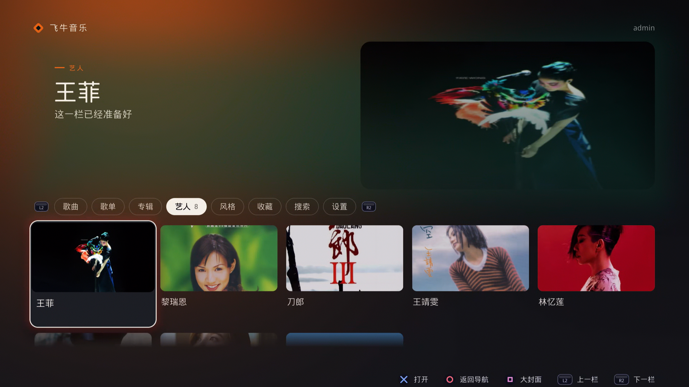

<div align="center">

# 飞牛音乐 · PS5 版

**把飞牛 fnOS NAS 上的音乐库，搬到 PS5 主界面里播放。**

PS5 原生自制软件（homebrew），TITLE_ID `PPSA99101`，
界面基于 [ps5-homebrew-ui](https://github.com/blackbearreloaded/ps5-homebrew-ui) 绘制。



</div>

## 这是什么

一个跑在 PS5 上的音乐播放器，通过局域网连接你自己的飞牛 fnOS NAS，
读取上面的音乐库并播放。启动时自动登录一次拿到令牌，之后不再读配置文件；
账号密码只存在本机，退出登录即清除。

成品有三页，都是手绘的原生界面：

1. **主页** —— 分类栏 + 封面卡片，浏览整个音乐库
2. **播放页** —— 封面、进度条、当前曲目
3. **歌词页** —— 跟随播放滚动的歌词

## 功能

- **八个分类栏**：歌曲 / 歌单 / 专辑 / 艺人 / 风格 / 收藏 / 搜索 / 设置
- **封面浏览**：卡片式封面墙，可切换大封面模式
- **搜索**：在 NAS 音乐库里直接搜歌
- **收藏**：一键把当前曲目加入收藏
- **歌词页**：△ 随时呼出，跟随播放进度
- **设置页**：填服务器地址、账号、密码，登录 / 退出登录，查看本机编号
- **系统集成**：启动磁贴、图标与 4K 背景图，符合 PS5 展示素材规范

## 手柄操作

| 按键 | 作用 |
| --- | --- |
| × | 打开 / 播放 |
| ○ | 返回 / 逐级回退 |
| □ | 大封面 / 回主页 |
| △ | 歌词 |
| Options | 收藏 |
| 左摇杆 | 音量 |
| 右摇杆 | 快进 / 快退 |
| L1 / R1 | 上一曲 / 下一曲 |
| L2 / R2 | 上一栏 / 下一栏 |
| 触摸板键 | 调出系统键盘（搜索、账号输入） |

## 构建

需要 Linux 或 WSL（`clang-18`、`ninja`、`make`、`python3`），
详见[上游项目的构建文档](https://github.com/blackbearreloaded/ps5-homebrew-ui)。

```bash
make deps              # 首次：安装并校验工具链与 OpenGL SDK
make app               # 打包，产出 dist/PPSA99101
make test-unit         # 单元测试
make assets-check      # 校验展示素材（icon0.png、pic0/pic1.dds）
```

装到主机：把 `dist/PPSA99101` 拷到 `/data/homebrew/`，或
`make deploy PS5_HOST=<地址>`。

背景图 `sce_sys/pic0.dds` / `pic1.dds` 必须是 3840×2160 BC7 (DX10) 格式，
用 `tools/prepare-assets.sh` 配合 Windows 上的 `texconv` 生成：

```bash
tools/prepare-assets.sh --background 背景图.png --texconv /path/to/texconv.exe
```

## 目录速览

| 路径 | 内容 |
| --- | --- |
| `src/concepts/fnmusic.cpp` | 本应用的全部界面（三页 + 设置面板） |
| `src/fnos/` | 飞牛 fnOS 音乐 API 客户端（登录、列表、播放、流） |
| `assets/fnos.conf` | 默认服务器配置（示例地址，真实内网地址不入库） |
| `sce_sys/` | 图标 `icon0.png` 与背景 `pic0/pic1.dds` |
| `dist/PPSA99101/` | 打包产物（不入 git） |
| `docs/` | 界面框架的完整文档（渲染、动效、声音、组件） |

框架本身的架构与组件说明见
[docs/ARCHITECTURE.md](docs/ARCHITECTURE.md)、
[docs/COMPONENTS.md](docs/COMPONENTS.md)、
[docs/BUILDING_A_DESIGN.md](docs/BUILDING_A_DESIGN.md)。

## 致谢

- 界面框架：[ps5-homebrew-ui](https://github.com/blackbearreloaded/ps5-homebrew-ui) — BlackBearReloaded，GPL-3.0-or-later
- 构建链：[ps5-native-app-boilerplate](https://github.com/blackbearreloaded/ps5-native-app-boilerplate)、[ps5-opengl](https://github.com/blackbearreloaded/ps5-opengl)
- 音乐服务：飞牛 fnOS

开发者：Naye · QQ 群：310630593

<!-- bbr-footer:start -->
<!-- Generated by ps5-homebrew-dev-protocol/scripts/readme-footer. Edit the template there, not here. -->

## Credits

Built with the [PS5 Payload SDK](https://github.com/ps5-payload-dev/sdk) by John Törnblom (ps5-payload-dev).
Third-party components, authors and licenses are listed in
[THIRD_PARTY_NOTICES.md](THIRD_PARTY_NOTICES.md).

## License

Copyright © 2026 BlackBearReloaded. Licensed under GPL-3.0-or-later; see [LICENSE](LICENSE). Third-party components keep their own licenses.

## Disclaimer

- **No affiliation.** This is an independent homebrew project. It is not
  affiliated with, endorsed by, or sponsored by Sony Interactive Entertainment.
  "PlayStation", "PS5" and related marks are trademarks of Sony Interactive
  Entertainment Inc.
- **No proprietary material.** No Sony SDK, firmware, encryption keys or
  decrypted system modules are included.
- **No warranty.** This project is provided "as is", without warranty of any
  kind, to the extent permitted by law. See sections 15 and 16 of the GPL.
- **Use at your own risk.** Running homebrew requires a modified console, which
  may void its warranty, breach the platform's terms of service, or cause data
  loss.
- **Legal use only.** Use it only with hardware, accounts and content you own.
  This project does not support or enable piracy.

## AI assistance

This project was developed with AI assistance from OpenAI and/or Anthropic tools.
<!-- bbr-footer:end -->
