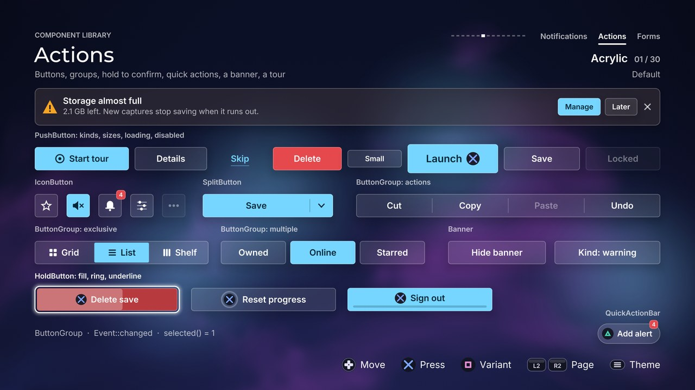

# Actions

[Back to the component guide](../COMPONENTS.md)



[Back to the component guide](../COMPONENTS.md)

Things the player presses, and messages that ask for an action. Headers are in
`src/ui/components/`: `button.hpp` (PushButton, IconButton and the shared
button faces), `button_group.hpp` (ButtonGroup, SplitButton),
`hold_button.hpp`, `quick_action.hpp` (QuickAction, QuickActionBar),
`banner.hpp` and `coach_mark.hpp`. The gallery page is
`src/concepts/components/actions_page.cpp`.

Four things are the same for all of them:

- **Every style struct derives from `ui::ComponentStyle`**, so each also has
  `theme`, `sounds` and `reduced_motion`. With `reduced_motion` nothing
  scales, slides or bounces.
- **A button is drawn the way the theme builds buttons.** The body comes from
  `Painter::button`: a hard shadow it presses into, a bevel that swaps its
  edges, a pen outline, frosted glass. The component only places the content.
- **Roles, not colours.** `ButtonRole` is `primary`, `secondary`, `ghost` or
  `danger`. Danger is the primary construction in `theme.danger`, so it works
  in every theme (a lit red edge in Hazard, a pale red wash under a red pen
  in Sketch).
- **Sizes.** `ButtonSize::small`, `medium` and `large` are 48, 64 and 80
  pixels tall with labels at 20, 24 and 28 and 18, 26 and 34 pixels of
  padding. A style's own `height`, `text_size` and `padding` override the
  size when they are above zero. A button is centred vertically in its bounds.

`ui::Button` is the enum of controller glyphs (`ui/glyphs.hpp`), which is why
the button component is called `PushButton`.

### Shared pieces (`button.hpp`)

| Name | What it is |
| --- | --- |
| `ButtonRole`, `ButtonSize`, `button_metrics(size, ...)` | The roles and sizes above |
| `draw_button_face(canvas, theme, rect, role, look, radius, on_page)` | The body of a button without a label, plus its focus ring. Returns a `ButtonFace`: where the content sits (hard, bevel and sketch themes move it when pressed), the ink colour and the opaque fill under it |
| `button_face(...)` | The same result with nothing drawn |
| `draw_button_ring(canvas, theme, rect, role, amount, radius, on_page)` | Only the focus ring of a button of that role, for components that glide one ring between several buttons. A ghost button in a hard-shadow theme gets a ring without the shadow's offset, and the dotted ring of a bevel theme takes the label's colour on a filled button |
| `button_paint(theme, role)` | The raw fill, edge, ink and stroke width of a role, for bodies of another shape (the joined ButtonGroup uses it) |
| `glyph_style_on(face, tinted)` | A controller glyph style that reads on that face: DualSense colours on a dark cap, or one colour (the ink) |

## PushButton

A button that owns its state: focus with an eased ring, a press that follows
the held button, loading, disabled. It holds an optional leading icon (a
slot), a label and an optional trailing controller glyph. Use it for any
single action on a screen; the screen moves the focus and calls `handle()` on
the button that has it.

```cpp
ui::PushButton save;
save.style.theme = theme;
save.label = "Save";
save.glyph = ui::Button::cross;            // optional trailing glyph
save.icon = [](ui::Canvas &canvas, const gfx::Rect &box, gfx::Color ink, float focus)
{ canvas.list.circle(box.cx(), box.cy(), box.w * 0.4f, ink); };
save.set_bounds({96, 400, 320, 64});
save.set_active(true);                     // it has the screen's focus

// every frame
if (save.handle(input, feedback) == ui::Event::activated)
{
    save.set_loading(true);                // a spinner replaces the icon, input is refused
    start_saving();
}
save.update(dt);
save.draw(canvas);
```

Calls: `set_bounds()`, `set_active(bool)`, `set_loading(bool)`,
`set_disabled(bool)`, `press()` (shows the press without input),
`preferred_width(fonts)`, `rect(fonts)` (where it is drawn).

| Knob | Default | Effect |
| --- | --- | --- |
| `role` | `primary` | `primary`, `secondary`, `ghost` or `danger` |
| `size` | `medium` | `small`, `medium` or `large` |
| `height`, `text_size`, `padding` | 0 | Override the size's numbers when above zero |
| `gap` | 12 | Between icon, label and glyph |
| `icon_size` | 0 | The icon slot and the spinner; 0 takes 1.15 text sizes |
| `glyph_size` | 0 | The trailing glyph; 0 takes 1.3 text sizes |
| `min_width` | 0 | A hugging button is never narrower |
| `full_width` | true | Fills its bounds; false makes it as wide as its content |
| `align` | `left` | Where a hugging button sits in its bounds |
| `justify` | `center` | `center`, `start`, or `between` (label at the start, glyph at the end) |
| `on_page` | true | A ghost button in the Classic and Pixel themes takes the page's text colour; false when it sits on a panel |
| `glyph_tinted` | true | The glyph keeps its DualSense colours; false draws it in the label's colour |
| `spinner` | `arc` | The `ui::SpinnerKind` shown while loading |
| `loading_hides_label` | false | Loading shows the spinner alone, centred |
| `press_scale` | 0.03 | How far a press shrinks it |
| `focus_scale` | 0 | How far the focus grows it |
| `rumble` | 0.3 | Strength of the pulse on activation |

**Slot.** `icon(canvas, box, ink, focus)` draws before the label in a square
of `icon_size`.

**Events.** `activated` on confirm; `refused` on confirm while disabled or
loading. Directions and back return `none`: moving is the screen's job.

**Cues.** `sounds.activate` and a short rumble; the soft refusal
(`sounds.refuse`, a light rumble and a shake).

## IconButton

A square or round button that is only an icon: a toolbar action, a favourite
star, a mute switch. It can carry a count badge, show its name in a
`ui::Tooltip` while it has the focus, and act as a toggle.

```cpp
ui::IconButton mute;
mute.style.theme = theme;
mute.style.toggle = true;
mute.tip = "Mute";
mute.icon = [](ui::Canvas &canvas, const gfx::Rect &box, gfx::Color ink, float focus, float on)
{ draw_speaker(canvas.list, box, ink, on); };
mute.set_bounds({96, 400, 64, 64});

if (mute.handle(input, feedback) == ui::Event::changed)
    set_muted(mute.on());
mute.update(dt);
mute.draw(canvas);
mute.draw_tooltip(canvas);     // after the things the label may cover
```

Calls: `set_bounds()`, `rect()`, `set_active(bool)`, `set_disabled(bool)`,
`set_badge(count)` (0 hides it), `set_on(bool, snap)`, `on()`,
`set_tip_bounds(rect)` (the area the tooltip stays inside).

| Knob | Default | Effect |
| --- | --- | --- |
| `role` | `secondary` | Its role at rest |
| `shape` | `square` | `square` keeps the theme's corners. `round` is a circle where the theme can draw one, an octagon in a cut-corner theme, and the theme's own corners in bevel, pixel and sketch themes |
| `size` | 0 | Side of the button; 0 takes the smaller side of the bounds |
| `icon_scale` | 0.46 | The icon box, as a share of the size |
| `on_page` | true | As for PushButton |
| `toggle` | false | Confirm flips it and returns `changed` |
| `on_role` | `primary` | Its role while it is on |
| `on_pressed` | true | Themes with real depth (hard, bevel, pixel) hold an "on" button pushed in |
| `badge_kind` | `danger` | The badge's `ui::Status` colour |
| `badge_height`, `badge_text` | 26, 16 | The badge's size |
| `badge_max` | 99 | Above it the badge shows "99+" |
| `badge_cutout` | 0 | A rim around the badge in the surface colour |
| `tip_placement` | `above` | Preferred side of the tooltip; it flips to stay inside its bounds |
| `tip_delay` | 0.35 | Seconds of focus before the tooltip shows |
| `tip_size` | 20 | Tooltip text size |
| `tip_inverted` | true | A bubble in the text colour; false is a themed surface |
| `press_scale` | 0.05 | How far a press shrinks it |
| `rumble` | 0.3 | Strength of the pulse on a press |

**Slot.** `icon(canvas, box, ink, focus, on)`; `on` is 0..1 for a toggle.
Without a slot a dot is drawn.

**Events.** `activated`, or `changed` in toggle mode; `refused` while disabled.

**Cues.** `sounds.activate`; `sounds.change` for a toggle, pitched a little
up for on and down for off; the soft refusal.

## ButtonGroup

A row or a column of buttons navigated as one component, with one focus ring
that glides. Three modes: `actions` (a toolbar), `exclusive` (one stays
selected, like radio buttons) and `multiple` (each toggles). Joined, the
buttons share one body with dividers; a selected one gets a plate (an inset
piece in round themes, edge to edge in square ones, a pushed-in bevel in the
Classic theme) and the focus is a ring inside the button it is on.

```cpp
ui::ButtonGroup view;
view.style.theme = theme;
view.style.mode = ui::GroupMode::exclusive;
view.style.joined = true;
view.set_items({{"Grid"}, {"List"}, {"Shelf"}});
view.set_selected(0);
view.set_bounds({96, 300, 540, 64});

const ui::Event event = view.handle(input, feedback);
if (event == ui::Event::changed)
    show(view.selected());
else if (view.exit() != Direction::none)
    move_focus(view.exit());        // an edge listed in style.exits
view.update(dt);
view.draw(canvas);
```

`GroupItem`: `label`, `disabled`, `selected`, `tag`. Calls: `set_items()`,
`item(i)`, `count()`, `set_bounds()`, `focus()`, `set_focus(i, snap)`,
`set_active(bool)`, `selected()`, `set_selected(i, snap)`, `is_selected(i)`,
`exit()`, `item_rect(i)`, `rect()`.

| Knob | Default | Effect |
| --- | --- | --- |
| `mode` | `actions` | `actions`, `exclusive` or `multiple` |
| `layout` | `row` | `row` (left and right move) or `column` (up and down) |
| `joined` | false | One body with dividers; false draws separate buttons |
| `gap` | 12 | Between separate buttons |
| `item_width` | 0 | Each button's width; 0 shares the bounds equally (a column: the full width) |
| `size` | `medium` | Button size |
| `height`, `text_size`, `padding` | 0 | Override the size's numbers when above zero |
| `icon_width` | 0 | Room reserved before each label for the `icon` slot |
| `role` | `secondary` | A button at rest |
| `selected_role` | `primary` | A selected button |
| `on_page` | true | As for PushButton |
| `wrap` | false | Past the last button comes the first |
| `allow_none` | false | Exclusive: confirm on the selected button clears it |
| `exits` | none | Edges that hand the focus on instead of refusing (`ui::EdgeExits`) |
| `pitch_by_position` | true | The move cue rises along the group |
| `press_scale` | 0.03 | Separate buttons shrink this much when pressed |

**Slot.** `icon(canvas, box, item, index, ink, focus)` draws in
`icon_width` pixels before each label.

**Events.** `moved`; `activated` (actions); `changed` (exclusive and
multiple); `refused` at an end and on a disabled button; `none` with `exit()`
set at an edge listed in `exits`, and for directions across the group.
Confirm on the already selected button of an exclusive group returns `none`.

**Cues.** `sounds.move` panned by position; `sounds.activate` with a rumble;
`sounds.change`; the soft refusal, silent on a held direction.

## SplitButton

A main action with a chevron part that opens a `ui::Menu` of alternatives:
"Save" and, behind the chevron, "Save as copy" and "Save and quit". Left and
right move between the two parts; a plate shows which part confirm will fire.

```cpp
ui::SplitButton save;
save.style.theme = theme;
save.label = "Save";
std::vector<ui::MenuItem> more(2);
more[0].label = "Save as copy";
more[1].label = "Save and quit";
save.set_alternatives(more);
save.set_bounds({96, 400, 360, 64});
save.set_menu_bounds(page_area);

// While save.menu_open() give it every input.
if (save.handle(input, feedback) == ui::Event::activated)
    run(save.choice());             // -1: the main action, else the alternative
save.update(dt);
save.draw(canvas);
save.draw_menu(canvas);             // last: the menu floats over the screen
```

Calls: `menu()` (the `ui::Menu`, for its style and items),
`set_alternatives()`, `set_bounds()`, `set_menu_bounds()`, `set_active(bool)`,
`part()`, `set_part()`, `menu_open()`, `dismiss()`, `choice()`, `exit()`,
`rect()`, `part_rect(part)`.

| Knob | Default | Effect |
| --- | --- | --- |
| `role` | `primary` | The button's role |
| `size` | `medium` | Button size |
| `height`, `text_size`, `padding` | 0 | Override the size's numbers when above zero |
| `chevron_width` | 0 | Width of the chevron part; 0 makes it as wide as the button is tall |
| `divider` | 0.56 | The line between the parts, as a share of the height |
| `menu_width` | 0 | 0 takes the button's width, at least 300 |
| `swap_on_choose` | false | A chosen alternative becomes the main action, and the old one takes its place in the menu |
| `exits` | none | Edges that hand the focus on |
| `press_scale` | 0.03 | How far a press shrinks it |

**Events.** `moved` between the parts and inside the menu; `activated` with
`choice()`; `cancelled` when back closed the menu; `refused` at an end, or on
the chevron when there are no alternatives. Opening the menu returns `none`.

**Cues.** `sounds.move`, `sounds.activate`; the menu plays `sounds.open` and
`sounds.close` (it takes the button's `sounds`).

The menu takes the button's theme, `reduced_motion` and `sounds` every frame;
set its other knobs through `menu().style`. In a theme whose surfaces are
translucent without being glass (Blueprint), `draw_menu()` first lays the page
colour under the menu, so its rows are not read through.

## HoldButton

Hold to confirm, for actions that should not happen by accident. While the
action is held the button fills over `hold_seconds`; letting go early drains
it back quickly; completing fires once. A tap replaces the label with the
`hint` text for a moment and is refused, so the player learns what the button
wants.

```cpp
ui::HoldButton erase;
erase.style.theme = theme;
erase.label = "Delete save";
erase.hint = "Hold to delete";
erase.set_bounds({96, 400, 400, 64});
erase.set_active(true);

// Every frame while it has the focus: the hold is read from input.is_held().
if (erase.handle(input, feedback) == ui::Event::activated)
    erase_save();
erase.update(dt);
erase.draw(canvas);
```

Calls: `set_bounds()`, `rect()`, `set_active(bool)`, `set_disabled(bool)`,
`progress()` (0..1), `holding()`, `hinting()`, `reset()`.

| Knob | Default | Effect |
| --- | --- | --- |
| `role` | `danger` | The button's role |
| `size` | `medium` | Button size |
| `variant` | `fill` | `fill` (a wash sweeps across the button), `ring` (a ring closes around the glyph) or `underline` (a line grows along the bottom) |
| `height`, `text_size`, `padding` | 0 | Override the size's numbers when above zero |
| `gap` | 12 | Between the glyph and the label |
| `glyph_size` | 0 | 0 takes 1.3 text sizes |
| `ring_width` | 4 | Ring variant: the ring's stroke |
| `line_height` | 6 | Underline variant: the line's thickness |
| `wash` | 0.3 | Fill variant: how strong the sweep is over the body |
| `action` | `confirm` | The input that is held |
| `glyph` | `cross` | The glyph that stands for it; `none` hides it |
| `glyph_tinted` | true | False draws the glyph in the label's colour |
| `hold_seconds` | 1.2 | How long a full hold takes |
| `drain_speed` | 3.5 | Letting go empties it this many times faster than it filled |
| `tap_seconds` | 0.22 | A release sooner than this is a tap: the hint shows |
| `hint_seconds` | 1.5 | How long the hint stays |
| `on_page` | true | As for PushButton |
| `complete_cue` | `launch` | The cue at the end of a hold |
| `ticks` | true | A tick at each quarter of the hold, rising in pitch |
| `rumble_from`, `rumble_to` | 0.08, 0.55 | Rumble ramps between these while holding |
| `rumble_done` | 0.8 | The pulse when it completes |
| `press_scale` | 0.03 | It sinks this much while held |

**Events.** `activated` once when a hold completes (the player must let go
before another hold starts); `refused` for a tap and for a press while
disabled.

**Cues.** `sounds.step` at each quarter; `complete_cue` with a strong rumble;
a rumble that ramps while holding; the soft refusal for a tap.

## QuickAction

A floating action bound to a face button instead of to the focus: a pill with
the controller glyph and a label, anchored in a corner of its bounds. It
answers its own action wherever the focus is, so call `handle()` every frame.
It can be disabled, hidden, carry a count badge, and fold to the glyph alone
after a few seconds.

```cpp
ui::QuickAction search;
search.style.theme = theme;
search.label = "Search";
search.glyph = ui::Button::triangle;
search.action = Action::north;
search.set_bounds(page_area);

if (search.handle(input, feedback) == ui::Event::activated)
    open_search();
search.update(dt);
search.draw(canvas);
```

Calls: `set_bounds()`, `set_enabled(bool)`, `set_visible(bool, snap)`,
`set_badge(count)`, `expand()`, `collapsed()`, `width(fonts)`, `rect(fonts)`.

| Knob | Default | Effect |
| --- | --- | --- |
| `anchor` | `bottom_right` | One of the six `ui::QuickAnchor` places (the same as a toast's) |
| `role` | `secondary` | The pill's role |
| `margin` | 0 | Distance from the edges of the bounds |
| `height` | 56 | The pill's height |
| `padding` | 12 | Before the glyph |
| `text_padding` | 22 | After the label |
| `gap` | 10 | Between the glyph and the label |
| `glyph_size` | 32 | Glyph height |
| `text_size` | 22 | Label size |
| `pill` | true | Fully round where the theme has round corners; other themes keep their own |
| `glyph_tinted` | true | False draws the glyph in the label's colour |
| `collapse_after` | 0 | Seconds until the label folds away; 0 never |
| `expand_on_press` | true | Pressing it unfolds the label again |
| `badge_kind`, `badge_height`, `badge_text`, `badge_max` | `danger`, 24, 15, 99 | The count badge |
| `press_scale` | 0.06 | How far a press shrinks it |
| `ripple` | 18 | How far the ring of light travels on a press; 0 for none |
| `rumble` | 0.3 | Strength of the pulse on a press |

**Events.** `activated` when its action is pressed; `refused` when it is
pressed while disabled; `none` for everything else and while hidden.

**Cues.** `sounds.activate` with a rumble; the soft refusal.

## QuickActionBar

Several quick actions kept together in one corner, side by side or stacked.
Its style is a `QuickActionStyle` plus two knobs, applied to every action.

```cpp
ui::QuickActionBar bar;
bar.style.theme = theme;
bar.set_actions({{"Search", ui::Button::triangle, Action::north},
                 {"Sort", ui::Button::square, Action::west}});
bar.set_bounds(page_area);
bar.at(0).set_badge(3);

if (bar.handle(input, feedback) == ui::Event::activated)
    run(bar.fired());
bar.update(dt);
bar.draw(canvas);
```

Calls: `set_actions()`, `count()`, `at(i)` (one action, for `set_enabled`,
`set_badge`, `expand`), `set_bounds()`, `set_visible()`, `fired()`,
`rect(fonts, i)`.

| Knob | Default | Effect |
| --- | --- | --- |
| `layout` | `row` | `row` or `column` |
| `spacing` | 12 | Between the actions |
| every `QuickActionStyle` knob | | As for QuickAction |

**Events and cues.** Those of the action that answered; `fired()` says which.

## Banner

A persistent inline message across the top of an area: a status icon, a title,
a body, up to two action buttons and an optional dismiss control. It slides
down when shown and pushes the content under it; ask `pushed(fonts)` how far.
While it has the focus, left and right move between its controls.

```cpp
ui::Banner banner;
banner.style.theme = theme;
banner.style.kind = ui::StatusKind::warning;
banner.title = "Storage almost full";
banner.body = "2.1 GB left. New captures stop saving when it runs out.";
banner.set_actions({"Manage", "Later"});
banner.set_bounds({96, 240, 1728, 0});      // x, y and width; the height is its own
banner.show(feedback);

if (banner_has_focus)
{
    const ui::Event event = banner.handle(input, feedback);
    if (event == ui::Event::activated)
        run(banner.choice());
}
banner.update(dt);
const float top = 240 + banner.pushed(fonts);   // the content starts under it
banner.draw(canvas);
```

Calls: `set_actions()`, `set_bounds()`, `show(feedback)`, `hide(feedback)`,
`set_shown(bool, snap)`, `is_shown()`, `visible()`, `set_active(bool)`,
`controls()`, `focus()`, `set_focus()`, `choice()`, `exit()`,
`height(fonts)`, `pushed(fonts)`, `rect(fonts)`, `control_rect(fonts, i)`.

**Looks.** `filled` is the status colour with text in the colour that reads
on it; its buttons are cut from that text colour (outlined at rest, solid
under the focus) because a themed button could vanish on a status colour.
`tinted` is the theme's surface washed with the status colour, `outlined` the
surface inside a stroke in the status colour, `accent` the surface with a bar
in the status colour at its leading edge. In these three the buttons are the
theme's own and the focus is a ring that glides between the controls. In a
glass theme the surface is frosted.

| Knob | Default | Effect |
| --- | --- | --- |
| `kind` | `info` | `ui::StatusKind`: the colour and the icon |
| `look` | `tinted` | `filled`, `tinted`, `outlined` or `accent` |
| `padding` | 22 | Between the panel's edge and its content |
| `gap` | 16 | Between the icon, the text and the controls |
| `icon_size` | 40 | 0 hides the icon |
| `min_height` | 84 | The panel is at least this tall |
| `radius` | -1 | Negative uses the theme's card radius |
| `bar_width` | 6 | Accent look: the bar |
| `tint` | 0.16 | Tinted look: how much status colour is in the surface |
| `title_size`, `body_size` | 24, 21 | Text sizes |
| `body_line` | 1.4 | Body line height, in body sizes |
| `body_lines` | 2 | The body wraps to this many lines, then ends in "..." |
| `button_height`, `button_text` | 48, 20 | The action buttons |
| `button_padding` | 20 | Left and right of a button's label |
| `button_width` | 0 | 0 makes each as wide as its label needs |
| `button_gap` | 12 | Between the controls |
| `action_role` | `secondary` | The action buttons' role |
| `emphasize_first` | true | The first action is `primary` |
| `close_size` | 44 | The dismiss control |
| `dismissable` | true | Shows the dismiss control |
| `back_dismisses` | true | Back hides a dismissable banner |
| `exits` | none | Edges that hand the focus on |
| `slide` | 1 | It arrives from this many of its own heights above |

**Events.** `moved` between controls; `activated` on an action (`choice()`
says which; the banner stays until you hide it); `cancelled` when it was
dismissed by its control or by back; `refused` at an end; `none` with
`exit()` set at an edge listed in `exits`.

**Cues.** `sounds.notify` when shown, `sounds.close` when hidden,
`sounds.move`, `sounds.activate` with a rumble, the soft refusal.

In a hard-shadow theme `pushed()` includes the shadow's offset. While it
slides the banner is clipped to its area, so it comes out from under the top
edge instead of over what is above it.

## CoachMark

A first-run tour that points at things. The screen dims except for a spotlight
on one control; a bubble beside it holds a title, a text, "2 of 4" and the
button hints. Confirm goes on, back goes to the previous step, and back on the
first step skips the tour. Between steps the spotlight and the bubble glide.
The bubble prefers the side the step names and flips to stay inside the
bounds.

```cpp
ui::CoachMark coach;
coach.style.theme = theme;
coach.start({{play_rect, "Play", "Starts where you left off."},
             {grid_rect, "Your library", "Everything you own.",
              ui::TooltipPlacement::above}},
            feedback);

if (coach.is_open())                    // it takes every input
{
    const ui::Event event = coach.handle(input, feedback);
    if (event == ui::Event::activated || event == ui::Event::cancelled)
        remember_tour_seen();
}
coach.update(dt);
coach.draw(canvas);                     // last, over the whole screen
```

In the gallery it is drawn in `Page::draw_modal`. `CoachStep`: `target` (a
rectangle on screen), `title`, `text` and `placement`. Calls: `set_bounds()`
(the area the dim covers), `start(steps, feedback)`, `stop(feedback)`,
`dismiss()`, `is_open()`, `visible()`, `step()`, `count()`,
`set_target(i, rect)` (a target moved), `spotlight()`, `bubble(fonts)`.

The dim is four rectangles around the hole, plus a small piece in each corner
of the hole so the spotlight has the theme's corners (round, cut or notched),
plus a ring in the focus colour. The bubble is a solid themed panel, never
glass: it must read against anything.

| Knob | Default | Effect |
| --- | --- | --- |
| `scrim` | 0.66 | Opacity of the dim |
| `scrim_color` | black | Colour of the dim |
| `spot_padding` | 12 | The spotlight is this much larger than the target |
| `spot_radius` | -1 | Negative derives it from the theme's control radius |
| `ring_width` | 3 | The ring around the spotlight; 0 for none |
| `ring_pulse` | true | Light breathing around the ring |
| `width` | 460 | The bubble's width |
| `padding` | 26 | Inside the bubble |
| `gap` | 16 | Between the spotlight and the pointer's tip |
| `pointer` | 14 | The pointer's length; 0 for none |
| `screen_margin` | 96 | Kept free at the edges of the bounds |
| `title_size`, `text_size` | 28, 22 | Text sizes |
| `text_line` | 1.4 | Line height, in text sizes |
| `text_lines` | 4 | The text wraps to this many lines |
| `counter` | true | "2 of 4" over the title |
| `counter_size` | 18 | Its size |
| `hints` | true | The row of button hints under the text |
| `hint_size`, `hint_text` | 30, 20 | Glyph height and label size of that row |
| `next_label`, `done_label`, `back_label`, `skip_label` | "Next", "Done", "Back", "Skip" | The words in the hint row |
| `confirm_glyph`, `back_glyph` | `cross`, `circle` | The glyphs in the hint row |
| `nav_steps` | true | Right and left also step forward and back |

**Events.** `changed` when the step changed; `activated` when the last step
was confirmed; `cancelled` when the tour was skipped; `refused` for left on
the first step and right on the last (a direction alone never ends the tour).

**Cues.** `sounds.open` at the start, `sounds.page` per step (rising in
pitch), `sounds.activate` at the end, `sounds.cancel` when skipped,
`sounds.close` for `stop()`, the soft refusal.
