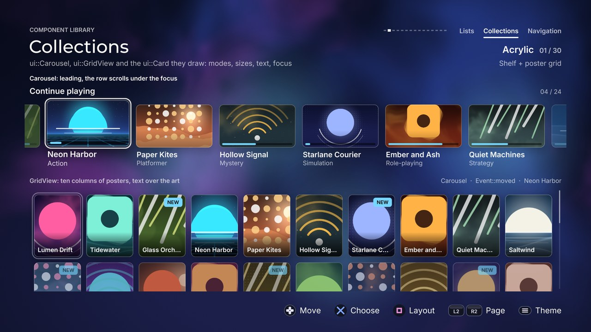

# Collections

[Back to the component guide](../COMPONENTS.md)



Headers: [`card.hpp`](../../src/ui/components/card.hpp),
[`grid.hpp`](../../src/ui/components/grid.hpp),
[`carousel.hpp`](../../src/ui/components/carousel.hpp) &middot;
page: [`collections_page.cpp`](../../src/concepts/components/collections_page.cpp) &middot;
tests: [`components_collections_test.cpp`](../../tests/unit/components_collections_test.cpp)

Three components that present many items of content. `Card` is one item;
`GridView` and `Carousel` lay cards out, move one focus over them and scroll.
Both take the same `std::vector<ui::CardItem>` and carry a `CardLook` in their
style, so a look worked out for one works in the other.

## Card

One piece of content: artwork, a title, a subtitle, and up to three marks on
the artwork (a badge, a progress bar, a "selected" check). A card keeps no
state. Its owner says how focused and how pressed it is (0..1 each) and the
card draws that, so the same card can be drawn alone, in a grid or by a layout
of your own. The artwork is a surface of the theme: it gets the theme's
shadow, outline, corner type and pressed state, and the picture lies in it.

```cpp
#include "ui/components/card.hpp"

ui::Card card;                                   // a member of your screen
card.style.theme = theme;                        // any ui::Theme
card.style.art_aspect = 16.0f / 9.0f;
card.style.text = ui::CardText::over;

ui::CardItem item;
item.title = "Tidewater";
item.subtitle = "Adventure";
item.texture = cover;                            // 0 draws the placeholder
item.uv = gfx::kCanvasUv;                        // for textures you rendered into
item.progress = 0.35f;

// draw(): focus and press are springs or pulses you own
card.draw(canvas, {96, 300, 420, card.height_for(420)}, item, focus.value, press.value);
```

Without the class, `ui::draw_card(canvas, style, look, rect, item, state)`
draws one card from any `ComponentStyle` and `CardLook`. That is what the two
containers call.

### Items (`ui::CardItem`)

| Field | Effect |
| --- | --- |
| `title` | The card's name, cut with "..." when it does not fit |
| `subtitle` | A second, quieter line |
| `badge` | A short pill in a corner of the art ("NEW", "4K"), in the theme's accent |
| `texture` | The artwork; 0 draws the placeholder gradient instead |
| `uv` | The part of the texture to show (`gfx::kFullUv`, or `gfx::kCanvasUv` for textures you rendered into) |
| `image_aspect` | Width / height of the picture inside `uv`. The card crops the middle of the picture to its own shape, never stretches it |
| `top`, `bottom` | The placeholder gradient; alpha 0 uses the theme's well colour |
| `accent` | The colour of the card's glow; alpha 0 uses the theme's focus colour |
| `progress` | 0..1 draws a bar along the bottom of the art; negative draws none |
| `selected` | Draws the check |
| `disabled` | Dimmed; containers refuse confirm on it |
| `tag` | An integer of yours |

### Style (`ui::CardLook`; `ui::CardStyle` is `ComponentStyle` plus this)

| Knob | Default | Effect |
| --- | --- | --- |
| `art_aspect` | 1 | Width / height of the artwork; 0 lets it fill what the text leaves of the rectangle |
| `radius` | -1 | Corner of the art; negative takes the theme's card radius. Capped at 22 % of the shorter side |
| `plate` | false | A themed surface behind art and text; the focus then surrounds the plate |
| `plate_padding` | 10 | Space between the plate and the art |
| `text` | `below` | `CardText::below` (under the art), `over` (on the art's lower edge, on a scrim) or `none` |
| `align` | left | `gfx::Align` of the text: left, center or right |
| `title_size`, `subtitle_size` | 24, 20 | Text sizes; `subtitle_size` 0 leaves the subtitle and its room out |
| `text_gap` | 12 | Space between the art and the title (`below`) |
| `text_inset` | 14 | Space from the art's edges to the text (`over`) |
| `scrim` | black, 78 % | What `over` darkens the art with; the text takes black or white, whichever reads on it |
| `on_panel` | false | The card sits on a themed panel: text uses the panel's colours instead of the page's |
| `badge_size` | 16 | Text size of the badge |
| `badge_corner` | `top_left` | `CardCorner`: which corner of the art holds the badge. The check takes the other top corner |
| `progress_height` | 6 | Thickness of the progress bar |
| `check_size` | 30 | Size of the "selected" check |
| `focus_scale` | 1.06 | Size at full focus; 1 keeps the card still |
| `lift` | 6 | Pixels the card rises at full focus |
| `press_scale` | 0.04 | How far a press pushes it back in |
| `shadow` | true | A soft shadow grows under the focused card. Only in themes whose depth is a soft shadow (flat, soft, gloss, glass) |
| `ring` | true | The theme's own focus indicator around the card |
| `glow` | false | Light around the focused card |
| `glow_color` | none | Colour of that light; alpha 0 takes the item's `accent`, else the theme's focus colour |
| `dim` | 0 | 0..1: how far cards without the focus fade |

Under `reduced_motion` a card neither grows nor rises; the ring, glow and
dimming still fade in.

### State (`ui::CardState`)

`Card::draw(canvas, rect, item, focus, press)` covers the usual case. The
overload that takes a `CardState`, and `draw_card`, give the rest:

| Field | Default | Effect |
| --- | --- | --- |
| `focus` | 0 | 0..1: ring, glow, shadow, rise and dimming |
| `press` | 0 | 0..1: pushes the card in |
| `selected` | -1 | 0..1 for a check you animate; negative reads `item.selected` |
| `emphasis` | -1 | 0..1: how much of `focus_scale` applies; negative follows `focus`. A wheel keeps its middle item large while the focus is elsewhere |
| `text` | 1 | Opacity of title and subtitle. `Carousel` fades the words of an item its edge cuts |
| `marks` | true | Draw the ring and the glow. False when the owner draws one gliding indicator for all its cards |

### Slot

| Slot | Replaces |
| --- | --- |
| `art` (`ui::CardArt`) | The artwork. Receives the canvas, the art's rectangle, the corner radius it should use, the item and the focus amount |

### Helpers

| Function | Gives |
| --- | --- |
| `card_height(look, width)` | How tall a card of that width is (`Card::height_for`) |
| `card_text_height(look)` | The room the text takes under the art |
| `card_art(look, card)`, `card_frame(look, card)` | Where the art sits; what the focus surrounds |
| `card_scale`, `card_lift` | The scale and rise of a card in a state |
| `draw_card_halo`, `draw_card_ring` | The two halves of the focus indicator (under and over the card), for layouts that draw one gliding indicator for all their cards |

A card returns no events and plays no cues: it has no input of its own.

## GridView

A grid of cards for libraries, stores, galleries and pickers. One focus glides
between cells. The grid scrolls by whole rows on a spring, so no row is ever
cut at the top; what does not fit at the bottom peeks in, faded. The focus
remembers its column when it passes through a shorter last row. All four edges
refuse softly, or hand the focus back to the screen.

```cpp
#include "ui/components/grid.hpp"

ui::GridView grid;
grid.style.theme = theme;
grid.style.columns = 6;
grid.style.card.art_aspect = 3.0f / 4.0f;        // posters
grid.style.card.text = ui::CardText::over;
grid.style.exits.up = true;                      // a shelf sits above the grid
grid.set_items(items);                           // std::vector<ui::CardItem>
grid.set_bounds({96, 560, 1712, 390});

// update()
const ui::Event event = grid.handle(input, feedback);
if (event == ui::Event::activated)
    open(grid.focus());
else if (grid.exit() == Direction::up)
    focus_the_shelf();
grid.update(dt);

// draw()
grid.draw(canvas);
```

The scroll thumb is drawn 8 px outside the right edge of the bounds, like
`ListView`'s: leave it that room.

### A grid over a data source

`set_items()` keeps a `CardItem` per cell, which is right for a library of a
few hundred titles and wrong for a catalogue of tens of thousands read from a
database. `set_count()` gives the grid only the number of cells; it keeps
nothing per cell and the `content` slot draws each one from your own data
(page it in as the focus moves; the slot is called for the rows in view only).

```cpp
grid.content = [&](ui::Canvas &canvas, const gfx::Rect &cell, const ui::CardItem &,
                   int index, float focus)
{
    draw_station(canvas, cell, catalogue.at(index), focus);   // your data, your card
};
grid.accent = [&](int index) { return catalogue.color_of(index); };
grid.set_count(catalogue.size());      // again whenever the size changes

grid.set_focus_at_top(catalogue.first_under('M'));   // a letter rail's jump
```

- `set_count()` with a new count keeps the focus and the scroll where they
  are (clamped), so a catalogue that grows while it downloads does not jump.
  The same count again does nothing: call it every frame if that is easier.
- The item the slot receives is empty. `select_on_confirm` and `disabled`
  belong to items and do nothing here: confirm reports `activated`.
- `accent` colours the light around the focused cell; without it, or when it
  returns a transparent colour, the theme's focus colour is used.
- `set_focus_at_top(index)` moves the focus with its row first in the view
  (as far as the end of the list allows), without a glide: the start of a
  section, the target of a `JumpBar`. `set_focus()` scrolls the least that
  shows the row, which leaves a jump target on the last row in view.
- For L2 / R2 that keep turning pages while held, see `hui::HeldStep`
  ([`core/held_step.hpp`](../../src/core/held_step.hpp)).

### Style (`ui::GridStyle`, on top of `ComponentStyle`)

| Knob | Default | Effect |
| --- | --- | --- |
| `card` | | A `CardLook`: how every cell looks. `card.focus_scale` and `card.lift` are how the focused cell grows |
| `columns` | 5 | Cells per row |
| `cell_width` | 0 | Width of a cell; 0 lets the columns share the width |
| `cell_height` | 0 | Height of a cell; 0 takes what a card of that width needs (art aspect plus text) |
| `gap_x`, `gap_y` | 22, 22 | Space between cells |
| `padding` | -1 | Room kept inside the bounds so the focused cell can grow and wear its ring unclipped; negative works it out from the card and the theme |
| `scroll_thumb` | true | A thin position marker, only when the grid overflows |
| `edge_fade` | 0.8 | A row cut by the clip fades over this share of its height; 0 turns it off |
| `entrance_step` | 0.035 | Seconds between cells arriving after `enter()`, as a diagonal wave from the first row in view; 0 for none |
| `wrap` | `none` | `GridWrap::none`, `rows` (a row and a column each wrap onto themselves) or `flow` (reading order: the end of a row continues on the next one, the last cell on the first). Going round never happens on a held direction |
| `exits` | none | `EdgeExits{up, down, left, right}`: edges that hand the focus back instead of refusing. An exit beats the wrap on its edge |
| `select_on_confirm` | false | Confirm toggles the item's `selected` and reports `changed` |
| `pitch_by_row` | true | The move cue falls in pitch down the rows |

### Slots

| Slot | Replaces |
| --- | --- |
| `content` | The whole card: draw a cell yourself. The rectangle is already scaled and lifted by the focus; the gliding ring, scrolling and fades stay |
| `art` | Only the artwork of the default card (see Card) |

`content` receives the canvas, the cell's rectangle on screen, the item, its
index and its focus amount (0..1).

### Events and cues

| Input | Event | Cue |
| --- | --- | --- |
| A direction | `moved` | `sounds.move`, panned by the cell's place on screen, pitched by its row |
| A direction at an edge | `refused` | `sounds.refuse` (quiet), a short rumble, a nudge along that axis; silent on a held direction |
| A direction at an edge listed in `exits` | `none`, and `exit()` names the edge | none: the screen moves the focus and plays its own |
| Confirm | `activated` | `sounds.activate`, a short rumble |
| Confirm with `select_on_confirm` | `changed` | `sounds.change`, higher when ticking than when clearing |
| Confirm on a disabled item | `refused` | as above |
| Back | `cancelled` | `sounds.cancel` |

Also: `set_focus(index, snap)`, `set_focus_at_top(index)`, `count()`, `set_active(false)` to fade the ring and let
the focused cell settle while another component has the focus, `enter()` to
replay the entrance, `cell_rect(index)`, `columns()`, `rows()`. Call
`set_bounds` again after changing sizes in `style` to settle without a glide;
without that call the focus and the scroll glide to their new places.

## Carousel

A horizontal shelf of cards. The focus is a position that glides along the
row, and the row scrolls so the focus stays where the mode wants it. The
focused item grows about its centre and pushes its neighbours aside, so the
gaps keep their size while it travels.

| Mode | Behaviour |
| --- | --- |
| `CarouselMode::leading` | The focused item stays near the left edge and the row scrolls under it: a streaming-app shelf |
| `CarouselMode::centered` | The focused item sits in the middle, larger than its neighbours: a cover wheel. With `wrap` and enough items it is a ring that turns on for ever |
| `CarouselMode::paged` | The focus moves item by item, the row a page at a time; dots show the page. One item per page makes a hero pager |

```cpp
#include "ui/components/carousel.hpp"

ui::Carousel shelf;
shelf.style.theme = theme;
shelf.style.mode = ui::CarouselMode::leading;
shelf.style.item_width = 248;
shelf.style.card.art_aspect = 16.0f / 9.0f;
shelf.title = "Continue playing";
shelf.set_items(items);                          // std::vector<ui::CardItem>
shelf.set_bounds({96, 284, 1728, 100});
shelf.set_bounds({96, 284, 1728, shelf.preferred_height()});

// update(): up and down are never the shelf's, so they come back as `none`
if (shelf.handle(input, feedback) == ui::Event::activated)
    open(shelf.focus());
shelf.update(dt);

// draw()
shelf.draw(canvas);
```

### Style (`ui::CarouselStyle`, on top of `ComponentStyle`)

| Knob | Default | Effect |
| --- | --- | --- |
| `card` | | A `CardLook`: how every item looks. `card.focus_scale` is how much the focused one grows (1.3 for a wheel, 1 for none) |
| `mode` | `leading` | See the table above |
| `item_width` | 280 | Width of an item at rest |
| `item_height` | 0 | Height of an item; 0 takes what a card of that width needs |
| `gap` | 22 | Space between items |
| `per_page` | 0 | paged: items on a page; the item width is then worked out so a page fills the shelf. 0 fits as many items of `item_width` as there is room for |
| `peek` | 56 | How much of what comes before stays in view. leading: the focused item rests this far from the left edge once the row has scrolled. paged: the neighbouring pages show this much at both ends |
| `stop_at_end` | true | leading: the row stops when its last item reaches the right edge, and the focus walks on |
| `neighbour_fade` | 0 | 0..1: opacity lost per item of distance from the focus |
| `edge_fade` | 0.9 | Items fade over this share of their width where the shelf cuts them; 0 turns it off |
| `title_size`, `title_gap` | 26, 16 | The shelf's title (the `title` member) and the space under it |
| `counter` | true | "07 / 24" at the right end of the title line |
| `dots`, `dot_size`, `dots_gap` | true, 8, 18 | paged: one dot per page under the row; the current one is a short bar |
| `entrance_step` | 0.04 | Seconds between items arriving after `enter()`, outward from the focus; 0 for none |
| `wrap` | false | Past the last item comes the first. A centered shelf whose items overflow its width by three or more becomes a ring; any other shelf runs back to its other end, and not on a held direction |
| `exits` | none | `EdgeExits`: `left` and `right` hand the focus back instead of refusing |

### Slots

| Slot | Replaces |
| --- | --- |
| `content` | The whole card: draw an item yourself (a banner, a profile, a chapter). The rectangle is already scaled and lifted; the gliding ring, scrolling and fades stay |
| `art` | Only the artwork of the default card (see Card) |

### Events and cues

| Input | Event | Cue |
| --- | --- | --- |
| Left, right | `moved` | `sounds.move`, panned by where the focused item rests |
| Left, right across a page boundary (paged) | `moved` | `sounds.page` |
| Left or right at an end | `refused` | `sounds.refuse` (quiet), a short rumble, a nudge; silent on a held direction |
| Left or right at an end listed in `exits` | `none`, and `exit()` names the end | none |
| Up, down | `none` | none: they belong to the screen |
| Confirm | `activated` | `sounds.activate`, a short rumble |
| Confirm on a disabled item | `refused` | as above |
| Back | `cancelled` | `sounds.cancel` |

Also: `set_focus(index, snap)`, `set_active(false)` (a shelf lets its focused
item settle back; a centered wheel keeps its shape and only fades its ring),
`enter()`, `preferred_height()`, `item_rect(index)`, `page()`, `pages()`.

## Moving the focus between collections

A shelf above a grid needs three lines of the screen's own: the shelf never
takes up and down, and the grid says when the focus leaves through its top.

```cpp
grid.style.exits.up = true;

if (on_grid)
{
    grid.handle(input, feedback);
    if (grid.exit() == Direction::up)
        on_grid = false;
}
else if (input.nav == Direction::down)
    on_grid = true;
else
    shelf.handle(input, feedback);
shelf.set_active(!on_grid);
grid.set_active(on_grid);
```
