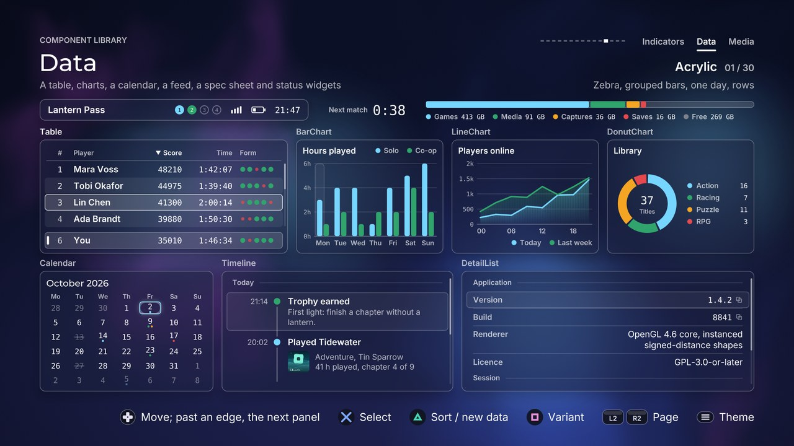

# Data

[Back to the component guide](../COMPONENTS.md)



[Back to the component guide](../COMPONENTS.md)

Components that present structured information: a sortable table, labelled
values, an activity feed, three charts, a calendar and the small status
widgets a console screen keeps in a corner. Each has a public `style` (a
`ui::Theme` plus its own knobs), `set_bounds(rect)`, `update(dt)` and
`draw(canvas)`; the ones that take the focus also have
`handle(input, feedback)`, which returns a `ui::Event` and plays the
component's cues. Values never jump: new data eases in with the theme's speed
(`style.omega()`) and bounce (`style.damping()`), and with
`style.reduced_motion` nothing travels.

| Header | Components |
| --- | --- |
| `ui/components/table.hpp` | `Table` |
| `ui/components/detail_list.hpp` | `DetailList` |
| `ui/components/timeline.hpp` | `Timeline` |
| `ui/components/chart.hpp` | `BarChart`, `LineChart`, `DonutChart`, `Legend` |
| `ui/components/calendar.hpp` | `Calendar`, the date helpers |
| `ui/components/status.hpp` | `Countdown`, `StorageBar`, `StatusBar` |
| `ui/components/data_common.hpp` | What they share: numbers, series colours, readouts |

The gallery page is `src/concepts/components/data_page.cpp`: all of them on
one dashboard.

### Shared: focus, edges and panels

- **`set_active(bool)`** says whether the component has the screen's focus.
  Without it the highlight stays as a faint mark of where the focus will
  return. A filled highlight does not fade well, so an inactive component
  shows a tint instead (`ui::draw_focus`).
- **`style.exits`** (`ui::EdgeExits`) names the edges that hand the focus back
  to the screen. At such an edge `handle()` returns `Event::none` and
  `exit()` names the direction; every other edge refuses softly. A dashboard
  chains components this way:

  ```cpp
  const ui::Event event = table.handle(input, feedback);
  if (event == ui::Event::none && table.exit() == Direction::right)
      focus_the_chart();
  ```

- **`style.panel`** draws the theme's panel behind the component. Without it
  the component sits on the page and uses the page's text colours
  (`Painter::page_text()`), which differ from the panel's in some themes.
  `Countdown` and `StorageBar` have no panel of their own; tell them where
  they sit with `style.on_panel`.

### Shared: numbers, series colours, readouts

`ui/components/data_common.hpp`:

| Helper | Does |
| --- | --- |
| `draw_number`, `number_width`, `fit_number` | Text in the monospaced face, so figures line up and do not jitter. A theme whose label face is a bitmap or handwriting keeps its own face |
| `format_value(value, decimals)` | A value as short text: `950`, `1.5k`, `2M` |
| `series_color(theme, n, on_panel)` | The nth colour of a chart series, storage category or player slot: the theme's primary, accent, success, warning and danger colours and mixes of them, duplicates removed, each pulled toward the text colour until it shows on the ground |
| `visible_on(theme, color, on_panel)` | Any colour made visible on the ground by the same rule |
| `inks(paint, on_panel)`, `ground_color`, `rule_color` | The text colours, the ground and a hairline colour for a panel or the page |
| `draw_block`, `draw_marker` | A bar or segment in the theme's material; a dot in the theme's shape (square in square languages) |
| `draw_readout` | The small bubble a focused bar or point speaks through |
| `draw_focus` | A gliding highlight that turns faint while the component is not active |
| `row_visibility` | How visible a row is at the edge of a scrolling view: hidden until half of it shows |

Everywhere a style has a `status` or takes series colours it also accepts a
`color`: give it an alpha above 0 to use any colour instead.

## Table

A data grid for leaderboards and file lists. Columns are data (a title, a
fixed width or a share of what is left, an alignment, a numeric flag, an
optional slot), the header stays put, rows scroll under one gliding
highlight, and sorting moves every row to its new place instead of redrawing
the list. A leading rank column, a pinned row ("you") and selection marks
are knobs.

```cpp
ui::Table table;
table.style.theme = theme;
table.style.rank = true;
table.style.pinned_id = my_id;

std::vector<ui::TableColumn> columns(2);
columns[0].title = "Player";
columns[0].strong = true;                  // flex 1 by default
columns[1].title = "Score";
columns[1].width = 110;
columns[1].align = gfx::Align::right;
columns[1].numeric = true;
table.set_columns(columns);

ui::TableRow row;
row.id = 7;                                // stable: keys position, focus and mark
row.cells = {{"Mara Voss"}, {"48210", 48210.0}};
table.set_rows({row /* ... */});
table.set_bounds({96, 300, 620, 400});
table.sort_by(1, ui::SortOrder::descending, false);
...
if (input.is_pressed(Action::north))
    table.cycle_sort(feedback);            // the dedicated sort action
else if (table.handle(input, feedback) == ui::Event::activated)
    open(table.focus());
table.update(dt);
table.draw(canvas);
```

Navigation: up and down move through the rows. Up from the first row enters
the **header zone**: there left and right move a column cursor over the
sortable columns and confirm sorts by that column; down returns to the rows.
`cycle_sort()` does the same from anywhere: in the header it turns the
cursor's column over, among the rows it steps through every sortable column
and order. A numeric column sorts by `TableCell::number` and starts with the
largest; a text column sorts by its text, ignoring case, and starts with A.
Sorting is stable.

`set_rows()` matches rows by `id`: a row that was there before keeps its
place on screen, its mark and the focus, so new data slides into place.
`focus()` is an index into `rows()`; `focus_place()` and `place_of(row)` give
places in the shown order.

`TableColumn`:

| Field | Default | Effect |
| --- | --- | --- |
| `title` | empty | The header text |
| `width` | 0 | A fixed width; 0 shares the remaining width by `flex` |
| `flex` | 1 | This column's share of the width the fixed columns leave |
| `align` | `left` | Of the header and the cells |
| `numeric` | false | Cells in the number face; sorts by `TableCell::number` |
| `strong` | false | Cells in the label face and the full text colour (a name column) |
| `sortable` | true | The header cursor stops here and `cycle_sort()` includes it |
| `cell` | none | A slot that draws the cell instead of its text |

`TableStyle`:

| Knob | Default | Effect |
| --- | --- | --- |
| `row_height` | 52 | Height of a row |
| `header_height` | 46 | Height of the header |
| `padding` | 18 | Inside the table, left and right |
| `column_gap` | 18 | Between columns |
| `panel_padding` | 12 | Between the panel and the rows |
| `rank_width` | 52 | Width of the rank column |
| `mark_width` | 44 | Width of the selection mark column |
| `pinned_gap` | 8 | Between the rows and the pinned row |
| `text_size` | 22 | Cells |
| `header_size` | 17 | Column titles |
| `highlight` | tint | The row highlight (`ui::HighlightStyle`); the header cursor is a tint, or the theme's ring when this is `ring` |
| `lines` | `zebra` | `plain`, `zebra` (every second row on a faint band), `dividers` (hairlines) |
| `panel` | true | A themed panel behind the table |
| `header` | true | The sticky header row; without it there is no header zone |
| `rank` | false | A leading column with each row's place in the shown order |
| `scroll_thumb` | true | Shown only when the rows overflow |
| `edge_fade` | 0.5 | A row cut by the view is hidden until this share of it shows; 0 never fades |
| `multi_select` | false | Confirm marks the row (`Event::changed`) instead of activating it |
| `pinned_id` | -1 | The id of a row repeated in a well under the others, with its current rank |
| `unsorted_step` | false | Turning a column over passes through "unsorted" |
| `exits` | none | Edges that hand the focus back |
| `entrance_step` | 0.03 | Seconds between rows arriving on `enter()`; 0 for none |

Slots: `TableColumn::cell(canvas, cell, row, focus)`.

Events: `moved` (a row, or the column cursor), `changed` (the order, or a
mark), `activated`, `cancelled`, `refused`.

Cues: `move` (pitch falls down the list and rises along the header),
`change` (higher for ascending, lower for descending; higher for marking,
lower for unmarking), `activate` with a short rumble, `cancel`, `refuse`.

Notes: a disabled row (`TableRow::disabled`) takes the focus and refuses
confirm. `selected(row)`, `set_selected(row, bool)` and `selected_count()`
read and write the marks. With reduced motion a sort places the rows at once.

## DetailList

Key and value pairs: an "About" page, a spec sheet, the details of a save.
Three layouts, section titles, long values that wrap or are cut, and rows
marked focusable that can be confirmed (to copy a value, to open what it
names).

```cpp
ui::DetailList about;
about.style.layout = ui::DetailLayout::grid;
about.style.columns = 3;
about.set_items({
    {"Application", "", true},                // a section title
    {"Version", "1.4.2", false, true},        // focusable
    {"Renderer", "OpenGL 4.6 core, instanced signed-distance shapes"},
});
about.set_bounds({96, 300, 700, 320});
...
if (about.handle(input, feedback) == ui::Event::activated)
    copy(about.items()[about.focus()].value);
```

The focus visits only the focusable pairs, by position: up and down in every
layout, left and right too in the grid. A list with nothing focusable scrolls
with up and down instead. Focusable pairs carry a small "two squares" mark
that flashes when confirmed.

`DetailItem`: `label`, `value`, `header` (a section title), `focusable`,
`numeric` (the value in the number face, one line), `color` (the value's
colour), `tag`.

| Knob | Default | Effect |
| --- | --- | --- |
| `layout` | `rows` | `rows` (label left, value right), `stacked` (label above value), `grid` (columns of stacked pairs) |
| `columns` | 2 | Columns of the grid |
| `row_height` | 46 | The least height of a pair in the rows layout |
| `header_height` | 44 | A section title |
| `padding` | 16 | Inside a pair, left and right |
| `padding_y` | 9 | Above and below a pair's text |
| `gap` | 2 | Between pairs |
| `column_gap` | 20 | Between grid columns |
| `panel_padding` | 12 | Between the panel and the pairs |
| `label_share` | 0.4 | Rows layout: the label's share of the width |
| `stack_gap` | 4 | Stacked and grid: between a label and its value |
| `label_size` | 19 | Labels |
| `value_size` | 22 | Values |
| `header_size` | 17 | Section titles |
| `max_lines` | 2 | Lines of a value: 1 cuts it with "...", more wraps it |
| `highlight` | tint | The focus highlight |
| `panel` | true | A themed panel behind the list |
| `dividers` | true | Hairlines between pairs (rows and stacked layouts) |
| `scroll_thumb` | true | Shown only when the pairs overflow |
| `exits` | none | Edges that hand the focus back |

Slots: `value(canvas, area, item, index, focus)` draws a value instead of its
text (one line high).

Events: `moved`, `activated`, `cancelled`, `refused`.

Cues: `move` (pitch falls down the list), `activate`, `cancel`, `refuse`.

Notes: wrapping needs the fonts, and only drawing has them: `draw()` notes
how many lines each value takes and the next `update()` lays the list out
with that. Call `measure(fonts)` after `set_items()` or a restyle when the
very first frame must already be right (the gallery does, because its
pictures are taken without a frame before them).

## Timeline

A vertical activity feed: a rail with one node per entry, coloured by what
the entry reports, with the time, a title, a few words and room for a card of
yours. Group titles ("Today", "Earlier") break the rail. On `enter()` the
rail draws itself from the top and each entry appears as the tip reaches its
node.

```cpp
ui::Timeline feed;
std::vector<ui::TimelineEntry> entries(3);
entries[0].title = "Today";
entries[0].group = true;
entries[1].time = "21:14";
entries[1].title = "Trophy earned";
entries[1].body = "First light: finish a chapter without a lantern.";
entries[1].status = ui::Status::success;
entries[2].time = "20:02";
entries[2].title = "Played Tidewater";
entries[2].card_height = 52;               // room for the `card` slot
feed.set_entries(entries);
feed.card = [&](ui::Canvas &canvas, const gfx::Rect &area, const ui::TimelineEntry &entry,
                int index, float focus) { draw_game_card(canvas, area, focus); };
feed.set_bounds({96, 300, 560, 420});
feed.enter();
```

`TimelineEntry`: `time`, `title`, `body`, `status` (a `ui::Status`: the
node's colour), `color` (overrides it), `card_height`, `group`, `tag`.

| Knob | Default | Effect |
| --- | --- | --- |
| `time_width` | 86 | Width of the time column |
| `node_size` | 16 | Diameter of a node |
| `rail_width` | 3 | Thickness of the rail |
| `rail_gap` | 18 | Between the rail and the text |
| `entry_gap` | 6 | Between entries |
| `padding` | 14 | Inside an entry, left and right |
| `padding_y` | 10 | Above and below an entry's text |
| `group_height` | 40 | A group title |
| `panel_padding` | 12 | Between the panel and the entries |
| `title_size` | 22 | Titles |
| `body_size` | 19 | Bodies |
| `time_size` | 18 | Times |
| `group_size` | 17 | Group titles |
| `body_lines` | 2 | Lines a body wraps to; 0 leaves bodies out |
| `highlight` | tint | The focus highlight |
| `time` | `column` | Where the time goes: `column` (left of the rail), `line` (at the end of the title's line), `none` |
| `node` | `filled` | `filled` (a dot) or `hollow` (a ring) |
| `panel` | true | A themed panel behind the feed |
| `scroll_thumb` | true | Shown only when the entries overflow |
| `draw_in` | 0.7 | Seconds the rail takes to draw itself on `enter()`; 0: at once |
| `exits` | none | Edges that hand the focus back |

Slots: `icon(canvas, node, entry, index, focus)` draws a node instead of the
dot; `card(canvas, area, entry, index, focus)` draws the attached card of an
entry that reserved `card_height`.

Events: `moved`, `activated`, `cancelled`, `refused`.

Cues: `move` (older entries sound lower), `activate` with a short rumble,
`cancel`, `refuse`.

Notes: the focus skips group titles. Nodes are squares in square themes.
Bodies are measured like `DetailList` values: `measure(fonts)` makes the
first frame exact.

## BarChart

Bars per category: vertical or across, grouped side by side or stacked, with
an optional figure on each bar. Left and right (up and down when the bars run
across) walk the bars; the focused one keeps its colour while the others step
back, and a readout says what it is. `set_series()` with the same shape eases
every bar to its new height; `enter()` grows them from the axis, category by
category.

```cpp
ui::BarChart chart;
chart.title = "Hours played";
chart.style.axis.unit = "h";
chart.set_categories({"Mon", "Tue", "Wed"});
chart.set_series({{"Solo", {2, 4, 3}}, {"Co-op", {1, 0, 2}}});
chart.set_bounds({96, 300, 420, 280});
chart.enter();
...
chart.set_series(next_week);               // the bars ease to it
```

Grouped, every bar is a stop (`focus()` is the category, `focus_series()` the
series). Stacked, a category is one stop and `focused_value()` is its total.

Every chart shares `ChartStyle`:

| Knob | Default | Effect |
| --- | --- | --- |
| `panel` | true | A themed panel behind the chart |
| `padding` | 16 | Between the panel and the chart |
| `title_size` | 20 | The title |
| `legend` | `top` (`side` for the donut) | `top` (on the title's line; moves under the plot when it does not fit), `bottom`, `side` (donut only), `none` |
| `legend_size` | 17 | Legend text |
| `readout` | true | The bubble over the focused bar or point |
| `readout_size` | 18 | Its text |
| `entrance` | 0.6 | Seconds bars take to grow, a line to draw, a donut to sweep |
| `exits` | none | Edges that hand the focus back |

and the bar and line charts an `axis` (`AxisStyle`):

| Knob | Default | Effect |
| --- | --- | --- |
| `grid` | true | Lines across the plot at each tick |
| `labels` | true | Tick values and category names |
| `ticks` | 4 | About this many intervals; the scale ends on "nice" values (1, 2, 2.5, 5 times a power of ten) |
| `label_size` | 16 | Axis text |
| `from_zero` | true | The scale includes zero |
| `unit` | empty | Appended to tick values and readouts |

`BarChartStyle` adds:

| Knob | Default | Effect |
| --- | --- | --- |
| `horizontal` | false | Bars run left to right, categories top to bottom |
| `layout` | `grouped` | `grouped` or `stacked` |
| `slot_fill` | 0.68 | The share of a category's room its bars take |
| `bar_gap` | 3 | Between the bars of a group |
| `radius` | 5 | Corner of a bar, at most the theme's control radius |
| `value_labels` | false | Each bar's value at its end (a stack's total) |
| `grow_step` | 0.045 | Seconds between categories starting to grow |
| `highlight` | tint | The plate behind the focused bar or category |

Slots: none. Events: `moved`, `activated`, `cancelled`, `refused`.

Cues: `move` (a taller bar sounds higher), `activate`, `cancel`, `refuse`.

Notes: bars are drawn in the theme's material (`draw_block`): shaded in the
glossy theme, glowing in the lit one, outlined in the brutal, pixel and
sketch themes. Category names that do not fit are shortened together, to
three letters, two or one. `nice_step(range, ticks)` and
`nice_scale(low, high, ticks)` are public if you draw an axis of your own.

## LineChart

One or more series over the same steps: lines with round joints, an optional
fill fading down from each line, optional dots, and a cursor that left and
right move from step to step with a readout of the values under it. New data
eases in; `enter()` draws the lines from left to right.

```cpp
ui::LineChart chart;
chart.title = "Players online";
chart.set_labels({"00", "06", "12", "18"});
chart.set_series({{"Today", {310, 420, 980, 1640}}, {"Last week", {280, 510, 900, 1500}}});
chart.set_bounds({96, 300, 420, 280});
```

`LineChartStyle` (with `ChartStyle` and `axis` as above):

| Knob | Default | Effect |
| --- | --- | --- |
| `shape` | `theme` | `straight`, `stepped`, or `theme`: stepped in a pixel-art theme, straight elsewhere |
| `line_width` | 3.5 | Thickness of a line |
| `area` | true | A fill fading down from each line |
| `area_alpha` | 0.34 | Its opacity under the line (shared out when there are several lines) |
| `area_step` | 4 | Width of the strips the fill is built from |
| `points` | false | A dot on every value |
| `point_size` | 5 | Its radius; the cursor's dots are a little larger |

Slots: none. Events: `moved`, `activated`, `cancelled`, `refused`.

Cues: `move` (panned along the chart; the pitch follows the first line up and
down), `activate`, `cancel`, `refuse`.

Notes: the fill is built from thin vertical gradient rectangles, about
`width / area_step` shapes per line. Step names are thinned out until they
fit.

## DonutChart

Shares of a whole as arcs with gaps, a figure in the middle and a legend.
Left and right walk round the slices; the focused one moves out and the
middle shows its value and name instead of the total.

```cpp
ui::DonutChart chart;
chart.title = "Library";
chart.style.center_label = "Titles";
chart.set_slices({{"Action", 16}, {"Racing", 7}, {"Puzzle", 11}});
chart.set_bounds({96, 300, 420, 280});
```

`DonutChartStyle` (with `ChartStyle` as above):

| Knob | Default | Effect |
| --- | --- | --- |
| `thickness` | 0.3 | The ring's width as a share of its radius |
| `gap` | 4 | Pixels between slices |
| `pop` | 8 | How far the focused slice moves out |
| `start_angle` | 0 | Where the first slice starts, in radians, clockwise from 12 o'clock |
| `center` | true | A figure in the middle: the total, or the focused slice while the chart is active |
| `center_label` | "Total" | The caption under the total; left out when it does not fit the hole |
| `center_size` | 0 | Size of the figure; 0: sized from the ring |
| `percent` | false | The legend and the middle show shares instead of values |
| `wrap` | true | Past the last slice comes the first (an exit beats the wrap) |
| `unit` | empty | Appended to values |

Slots: none. Events: `moved`, `activated`, `cancelled`, `refused`.

Cues: `move` (a larger share sounds lower), `activate`, `cancel`, `refuse`.

Notes: `total()` is the sum of the slices. The donut has no readout bubble:
its middle is the readout.

## Legend

What the colours of a chart mean: a row (or a column) of colour marks with
labels and optional values. The charts and the `StorageBar` draw one
themselves; use it alone to label anything else that is colour coded.

```cpp
ui::Legend legend;
legend.set_items({{"Solo", ui::series_color(theme, 0)}, {"Co-op", ui::series_color(theme, 1)}});
legend.set_bounds({96, 600, 400, 24});
legend.set_highlight(1);                   // dims the others; -1 shows all alike
```

| Knob | Default | Effect |
| --- | --- | --- |
| `text_size` | 17 | Labels and values |
| `swatch` | 12 | Size of the colour mark |
| `gap` | 20 | Between items in a row |
| `row_gap` | 8 | Between rows |
| `vertical` | false | One item per row, values at the right edge |
| `on_panel` | true | Which text colours to use |
| `align` | `left` | Of a horizontal legend inside its bounds |
| `dim` | 0.45 | Opacity of the items that are not highlighted |

Slots: none. Events: none. Cues: none.

Notes: a horizontal legend wraps; `width(paint)` and `height(paint, width)`
say how much room it takes, and `draw_at(canvas, rect)` draws it somewhere
other than its bounds.

## Calendar

A month: days moved through in two dimensions under one gliding focus, today
marked, one day or a range selected, dots under days that have something on,
days that cannot be chosen. Left and right move by a day, up and down by a
week; a move that leaves the month slides to the next one.

```cpp
ui::Calendar calendar;
calendar.set_today({2026, 10, 2});
calendar.style.select = ui::CalendarSelect::range;
calendar.set_marks({{{2026, 10, 9}}, {{2026, 10, 17}, ui::Status::danger}});
calendar.disabled = [](const ui::CalendarDate &date) { return date.day == 13; };
calendar.set_bounds({96, 300, 430, 330});
...
if (calendar.handle(input, feedback) == ui::Event::changed && calendar.has_range())
    book(calendar.range_start(), calendar.range_end());
```

Selecting: with `single`, confirm selects the focused day. With `range`, the
first confirm sets the start, the second the end (picked backwards, the two
swap), and until then the range is previewed up to the focus. With `none`,
confirm returns `Event::activated`.

| Knob | Default | Effect |
| --- | --- | --- |
| `week_start` | `monday` | The first column: `monday` or `sunday` |
| `select` | `single` | `none`, `single`, `range` |
| `exits` | none | Edges of the grid that hand the focus back instead of changing month |
| `padding` | 14 | Between the panel and the grid |
| `title_height` | 40 | The month and year |
| `weekday_height` | 26 | The row of weekday names |
| `cell_gap` | 4 | Between days |
| `slide` | 36 | How far a month travels when it changes |
| `title_size` | 22 | The month and year |
| `weekday_size` | 15 | Weekday names |
| `day_size` | 20 | Day numbers |
| `highlight` | ring | The focus: the theme's ring, drawn on the day's own edge |
| `panel` | true | A themed panel behind the calendar |
| `outside_days` | true | Show the neighbouring months' days in the spare cells |
| `mark_today` | true | A ring round today |
| `max_marks` | 3 | Dots shown under one day |
| `mark_size` | 5 | Diameter of a dot |
| `months` | English | The twelve month names |
| `weekdays` | "Su" .. "Sa" | The seven weekday names, Sunday first whatever `week_start` is |

Slots: `disabled(date)` returns true for a day that cannot be chosen (it
stays focusable, dimmed and struck through, and refuses confirm);
`day(canvas, cell, date, focus, selected)` draws a day instead of its number
and dots.

Events: `moved`, `changed` (the selection), `activated` (`select` is `none`),
`cancelled`, `refused`.

Cues: `move` (panned by the day's column, lower later in the month), `page`
when the month changes, `change` when a day or a range end is chosen (the end
of a range sounds higher than its start), `activate`, `cancel`, `refuse`.

Notes: the grid always has six rows, so its height never jumps. An exit
applies at the edge of the month's own days: the first and last column, the
first week, and the last occurrence of each weekday. `set_limits(first, last)`
keeps the focus inside a span of dates. The date helpers are exact for every
Gregorian date: `is_leap_year`, `days_in_month`, `weekday_of` (0 is Sunday),
`add_days`, `days_between`.

## Countdown

Time remaining, as `m:ss` or as a ring that drains. It counts down by itself
from `start(seconds)`; the colour turns to the theme's warning and then
danger colour under two thresholds, the figure pulses once a second near the
end, and `finished()` says when it is over.

```cpp
ui::Countdown timer;
timer.label = "Next match";
timer.set_bounds({96, 96, 240, 56});
timer.start(90.0f);
...
timer.update(dt, feedback);                // ticks the last seconds; update(dt) is silent
if (timer.finished())
    begin_match();
```

| Knob | Default | Effect |
| --- | --- | --- |
| `shape` | `text` | `text`, or `ring`: in wide bounds the ring leads and the figure follows it; in square bounds the figure sits inside the ring |
| `text_size` | 36 | The figure |
| `label_size` | 17 | The caption |
| `thickness` | 7 | The ring's stroke |
| `align` | `left` | Of the group inside its bounds |
| `status` | `accent` | The ring's colour while calm |
| `color` | clear | Overrides `status` when its alpha is above 0 |
| `tint_text` | false | The calm figure takes the status colour too |
| `on_panel` | false | Which text colours to use |
| `warning_at` | 30 | Seconds left from which it shows the warning colour |
| `danger_at` | 10 | ... and from which the danger colour |
| `pulse_at` | 5 | The figure pulses (and ticks) once a second from here |
| `hours` | false | Always show hours (`h:mm:ss`); otherwise only from one hour up |

Slots: none. Events: none (`finished()`, `zone()`, `remaining()`, `text()`).

Cues (only through `update(dt, feedback)`): `step` on each of the last
seconds, rising as the end nears; `notify` at zero.

Notes: `set_remaining()` corrects the time without restarting; `pause()` and
`resume()` hold it. The figure is rounded up, so "0:01" shows until the time
is really over.

## StorageBar

A drive's capacity split by what fills it: a bar of segments, the free space
left as empty track, and a legend. Segments ease when the sizes change. Left
and right move a focus that makes one category's segment taller and lights
its legend entry.

```cpp
ui::StorageBar storage;
storage.title = "Console storage";
storage.set_capacity(825.0f);
storage.set_categories({{"Games", 412}, {"Media", 96}, {"Saves", 12}});
storage.set_bounds({96, 300, 760, 84});
```

| Knob | Default | Effect |
| --- | --- | --- |
| `height` | 16 | The bar |
| `segment_gap` | 3 | Between categories |
| `focus_grow` | 5 | The focused segment is this much taller, above and below |
| `text_size` | 20 | Title and figures |
| `legend_size` | 17 | Legend text |
| `spacing` | 10 | Between the title line, the bar and the legend |
| `header` | true | The title and "used / capacity" on a line above the bar |
| `legend` | true | The categories under the bar |
| `legend_values` | true | ... with their sizes (dropped when names and sizes do not fit the height) |
| `show_free` | true | "Free" as the legend's last entry |
| `on_panel` | false | Which text colours to use |
| `unit` | " GB" | Appended to sizes |
| `free_label` | "Free" | The name of the free space |
| `decimals` | -1 | Of sizes; negative: none for whole numbers, one otherwise |
| `exits` | none | Edges that hand the focus back |

Slots: none. Events: `moved`, `activated`, `cancelled`, `refused`.

Cues: `move` (panned along the bar, rising to the right), `activate`,
`cancel`, `refuse`.

Notes: it starts inactive (a status widget usually only shows); call
`set_active(true)` when it takes the focus. `used()` and `free()` report the
sums.

## StatusBar

The strip along the top of a screen: a title at one end and, at the other,
the player slots, the connection, the controller's battery and the clock.
It takes no input. The screen supplies the clock text: the kit does not know
the time zone or the format the player chose.

```cpp
ui::StatusBar bar;
bar.title = "Lantern Pass";
bar.clock = "21:47";
bar.set_battery(0.64f, false);             // level 0..1, charging
bar.set_signal(3);                         // lit bars; 0 reads as "no connection"
bar.set_player(0, true);                   // slot 1 connected, in the theme's first colour
bar.set_bounds({96, 60, 1728, 52});
```

| Knob | Default | Effect |
| --- | --- | --- |
| `show_players` | true | The four player slots |
| `show_signal` | true | The connection bars |
| `show_battery` | true | The battery glyph |
| `show_clock` | true | The clock text |
| `battery_percent` | false | The level as a number beside the glyph |
| `padding` | 20 | Inside the strip, left and right |
| `gap` | 24 | Between the groups |
| `text_size` | 22 | The title and the clock |
| `glyph_size` | 22 | Height of the battery, bars and player marks |
| `signal_bars` | 4 | Number of connection bars |
| `panel` | true | A themed strip behind it |
| `low_battery` | 0.2 | From here down the battery shows the danger colour |

Slots: none. Events: none. Cues: none.

Notes: the battery level and the signal ease; a charging battery fills in the
success colour and gains a bolt; a slot that connects pops in with the
theme's bounce. Every glyph is drawn from shapes and is square in square
themes.
