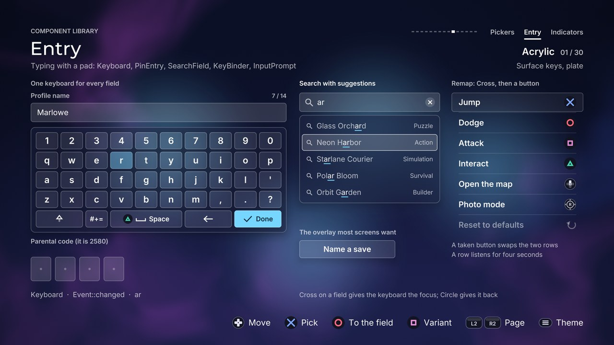

# Entry

[Back to the component guide](../COMPONENTS.md)



Components for typing and capturing input with a controller: an on-screen
keyboard, a code entry, a search box with suggestions, a list that remaps
buttons, and the overlay that asks for a line of text. They build on
[`ui::TextField`](forms.md): none of them owns a keyboard *and* a text, so any
of them can be combined with any other.

Headers: `ui/components/keyboard.hpp`, `pin_entry.hpp`, `search_field.hpp`,
`key_binder.hpp`, `input_prompt.hpp`, and the shared helper
`action_glyph.hpp`.

## Keyboard

An on-screen keyboard: a grid of keys under one highlight that glides between
them and takes the size of the key it lands on. It does not own the text.
Every character it types goes out through `on_text`, every deletion through
`on_backspace`, and the Done key through `on_done`; the same information is
kept in `typed()` and `erased()` for an owner that prefers to poll. So one
keyboard can feed a `TextField`, a `SearchField`, a `PinEntry` or your own
buffer.

Left and right wrap around: the highlight leaves through one edge of the board
and comes in through the other. Up and down remember the column the player
left, so going down onto the space bar and up again returns to the same key.
Shift is armed for one letter by a first press and locked by a second; a key's
two cases cross-fade. A held backspace waits, then repeats.

```cpp
ui::Keyboard keys;
keys.style.theme = theme;
keys.style.bindings = ui::KeyboardBindings::standard();
keys.style.max_length = 12;
keys.set_bounds({560, 520, 800, 360});
keys.on_text = [&](std::string_view utf8) { name.insert(utf8); };
keys.on_backspace = [&] { name.backspace(); };

keys.set_length(name.length());            // lets it refuse at the limit
const ui::Event event = keys.handle(input, feedback);
if (event == ui::Event::activated) accept(name.text());   // the Done key
if (event == ui::Event::cancelled) close();
keys.update(dt);
keys.draw(canvas);
```

Without callbacks, after `handle()`:

```cpp
for (int i = 0; i < keys.erased(); ++i) name.backspace();
if (!keys.typed().empty()) name.insert(keys.typed());
```

The keyboard plays the type and erase cues itself: feed it the *silent* editing
calls of the field (`insert(utf8)`, `backspace()`), not the ones that take a
`Feedback`.

### Layouts are data

A `KeyboardLayout` has a `name` (shown on the key that switches to it), a
number of `columns` and `rows` of `KeyboardKey`. A key has a `kind`
(`character`, `space`, `shift`, `backspace`, `layout`, `done`), the `text` it
types (it may be several characters, such as ".com"), the `shifted` text, the
`span` in columns and an optional `label`. A row that covers fewer columns
than the grid is centred.

| Factory | Contents |
| --- | --- |
| `KeyboardLayout::letters()` | Digits, qwerty, `' , . ?` (shift gives `" ; : !`); shift, the layout key, space, backspace, done |
| `KeyboardLayout::symbols()` | Digits and three rows of symbols; the layout key, space, backspace, done |
| `KeyboardLayout::numeric()` | A 3 x 4 pad: 1 to 9, backspace, 0, done |
| `KeyboardLayout::email()` | Letters with `@ . _ -` and a ".com" key |

`add_row("qwerty")` makes one key per character (letters get their capital as
`shifted`); `add_row({keys})` takes keys you built. `set_layouts({...})`
replaces the set (a new keyboard has `letters()` and `symbols()`),
`cycle_layout()` goes to the next one, `set_layout(index)` does the same
silently. A screen can swap the set when another field takes the keyboard: the
gallery shows a numeric pad for its code entry.

### Shortcuts

The frequent actions need not move the focus. `style.bindings` names the
button of each; `Action::count` means none, and **nothing is bound by
default**, so the keyboard never takes a button the screen uses for something
else. The mapping players know from console keyboards is
`KeyboardBindings::standard()`:

| Button | Action | Binding |
| --- | --- | --- |
| Square | `Action::west` | `backspace` (repeats while held) |
| Triangle | `Action::north` | `space` |
| L2 | `Action::jump_prev` | `shift` |
| R2 | `Action::jump_next` | `layout` (symbols) |
| none | `Action::count` | `done` |

A bound key shows its controller glyph and dips when its shortcut is used, so
the player learns which key each button stands for. The same actions are
methods, for a screen that maps its own input: `backspace(feedback)`,
`space(feedback)`, `done(feedback)`, `toggle_shift(feedback)`,
`cycle_layout(feedback)`.

`tap(utf8, feedback)` presses the key that types a text as if the player had:
the highlight glides there, the key dips, shift and the layout follow as
needed ("\b" is backspace, "\n" is done). It is how the gallery types by
itself, and it suits tutorials and tests.

### Limits

The keyboard cannot see the text, so tell it the length: `set_length(n)`
before `handle()`. With it, `max_length` refuses further characters, an empty
text refuses backspace, and `auto_capital` arms shift while the text is empty.
A negative length (the default) means "unknown": nothing is refused.

### Style: `KeyboardStyle`

| Knob | Default | Effect |
| --- | --- | --- |
| `key_width` | 0 | Width of one column; 0 lets the columns share the bounds' width |
| `key_height` | 0 | Height of one row; 0 lets the rows share the bounds' height |
| `gap` | 8 | Space between keys |
| `radius_source` | `theme` | Corners of the keys: `theme`, `pill`, `square` or `custom` |
| `radius` | 10 | The corner size for `RadiusSource::custom` |
| `panel_padding` | 16 | Between the panel and the keys |
| `icon_size` | 26 | The symbols of shift, backspace, space and done |
| `glyph_size` | 30 | The controller glyph of a bound key |
| `label_size` | 28 | Characters |
| `wide_label_size` | 21 | The words on wide keys |
| `highlight` | fill | The focus highlight: any `HighlightKind`, its colour, radius, thickness |
| `surfaces` | true | Every key is a surface of the theme (a button); false draws flat caps |
| `panel` | true | A themed panel behind the keys |
| `binding_glyphs` | true | A bound key shows its controller button |
| `wide_labels` | true | Wide keys show a word beside their symbol when it fits |
| `space_label`, `done_label` | "Space", "Done" | Those words |
| `wrap` | true | Left and right wrap around the row (a held direction stops at the edge) |
| `column_memory` | true | Up and down return to the column the player left |
| `exits` | none | Edges that hand the focus back (`handle` returns `none`, `exit()` names the edge); an exit beats the wrap |
| `shift_lock` | true | A second press of shift locks it; false turns it off again |
| `auto_capital` | false | Arm shift while the text is empty (needs `set_length`) |
| `max_length` | 0 | Refuse characters from this length on; 0 for no limit (needs `set_length`) |
| `bindings` | none | The shortcuts, see above |
| `repeat_delay` | 0.42 | Seconds a held backspace waits before repeating |
| `repeat_interval` | 0.09 | Seconds between repeats |
| `press_dip` | 0.06 | A pressed key shrinks by this share |
| `entrance_step` | 0.04 | Seconds between rows arriving on `enter()`; 0 for none |
| `pitch_by_column` | true | Keys to the right sound a little higher |
| `type` | `Cue::type` | The cue of a character |
| `erase` | `Cue::erase` | The cue of a backspace |

With `key_width` and `key_height` set, the board is centred in the bounds and
`preferred_width()` / `preferred_height()` give the size it needs.

In the `fill` highlight the caps under the plate take the theme's
`on_primary`; on the Done key, which already has the plate's colour, the
theme's focus ring joins it.

Slots: `on_text(utf8)`, `on_backspace()`, `on_done()`.

Events: `moved` (the focus moved), `changed` (a character or a deletion went
out), `activated` (Done), `cancelled` (back), `refused` (an edge, the limit,
backspace on an empty text), `none` (shift, a layout change, an edge listed
in `exits`).

Cues: `sounds.move` (lower rows sound lower), `style.type` (pitch rises with
the column; capitals a touch higher), `style.erase`, `sounds.change` (shift:
1.0 armed, 1.12 locked, 0.9 off), `sounds.page` (layout), `sounds.activate`
(Done), `sounds.cancel`, `sounds.refuse`.

## PinEntry

A row of boxes for a numeric code. It works with a pad alone: up and down spin
the digit of the current box (9 wraps to 0), left and right change box,
confirm moves to the next box and submits once every box is set. It also works
with a keyboard: `insert(digit, feedback)` fills the current box and moves on,
`backspace(feedback)` takes a digit back. With `masked`, a digit turns into a
dot a moment after it was set.

The owner gives the verdict on a complete code: `reject(feedback, message)`
clears the boxes, shakes them and outlines them in the theme's danger colour
until the next edit; `accept(feedback)` fills the boxes with the success
colour one after another and settles the code until `reset()`.

```cpp
ui::PinEntry pin;
pin.style.theme = theme;
pin.style.length = 4;
pin.style.masked = true;
pin.set_label("Parental code");
pin.set_bounds({760, 480, 400, pin.preferred_height()});

pin.set_active(focused);
if (pin.handle(input, feedback) == ui::Event::activated)   // every box is set
{
    if (pin.value() == secret) pin.accept(feedback);
    else pin.reject(feedback, "That is not the code");
}
// from a keyboard
if (pin.insert('7', feedback) == ui::Event::activated) check(pin.value());
pin.update(dt);
pin.draw(canvas);
```

API: `set_label`, `set_message` (a quiet line under the boxes), `value()` (the
digits that are set), `digit(index)` (-1 for an empty box), `complete()`,
`set_value(digits)`, `clear()`, `cursor()`, `set_cursor(index)`, `state()`
(`PinState::neutral`, `error`, `success`), `insert`, `backspace`, `reject`,
`accept`, `reset()`, `preferred_width()`, `preferred_height()`,
`box_rect(index)`, `exit()`.

When a `Keyboard` feeds it, both would play a cue for each digit: set
`style.enter` and `style.erase` to `audio::Cue::count`.

### Style: `PinEntryStyle`

| Knob | Default | Effect |
| --- | --- | --- |
| `length` | 4 | Boxes, 1 to 12 |
| `box_width`, `box_height` | 64, 76 | One box |
| `gap` | 12 | Between boxes |
| `group` | 0 | More than 0: a wider gap after every `group` boxes |
| `group_gap` | 18 | How much wider |
| `label_gap` | 12 | Between the label line and the boxes |
| `message_gap` | 14 | Between the boxes and the message line |
| `centered` | false | Centre the row in the bounds instead of leading |
| `digit_size` | 36 | The digits |
| `label_size` | 20 | The label |
| `message_size` | 20 | The message and the error |
| `masked` | false | A digit turns into a dot |
| `mask_delay` | 0.7 | Seconds a digit stays readable; 0 masks at once |
| `chevrons` | true | Arrows over and under the current box, when `spin` is on |
| `on_page` | false | Label and message sit on the page, not on a panel |
| `success_step` | 0.07 | Seconds between boxes filling on `accept()` |
| `spin` | true | Up and down change the current digit |
| `auto_advance` | true | An inserted digit moves on to the next box |
| `exits` | none | Left and right edges (and up and down when `spin` is off) that hand the focus back |
| `enter` | `Cue::type` | The cue of a typed digit |
| `erase` | `Cue::erase` | The cue of a removed digit |
| `success` | `Cue::saved` | The cue of `accept()` |

The boxes take the field look of the theme: a line where the theme's fields
are lines, a white face in the bevel and hard looks, a well elsewhere.

Slots: none.

Events from `handle`: `changed` (a digit was spun), `moved` (another box),
`activated` (confirm with every box set), `refused` (an edge, confirm on an
empty box), `cancelled` (back), `none` (an exit, or an accepted code). From
`insert`: `changed`, `activated` when that digit completed the code, `refused`
for anything that is not a digit. From `backspace`: `changed`, `refused`.

Cues: `sounds.step` (pitch follows the digit), `sounds.move`,
`sounds.activate`, `sounds.cancel`, `sounds.refuse` (edges softly, `reject()`
at full strength with a rumble), `style.enter` (pitch climbs along the code),
`style.erase`, `style.success`.

## SearchField

A search box: a magnifier, the query, a spinner while it searches, a clear
button, and under it a list of suggestions with the part that matches the
query emphasised. With an empty query the list shows recent searches. Like
`TextField` it has no keyboard: confirm on the field returns `activated` so
the screen can open one, and `insert` / `backspace` take what it types.

Suggestions come from a provider, a function the field calls with the query
once the player has stopped typing for `debounce` seconds. The spinner turns
during that wait, and for as long as `set_busy(true)` says a search is running
elsewhere.

```cpp
ui::SearchField search;
search.style.theme = theme;
search.set_placeholder("Search the library");
search.set_recent({"racing", "tide"});
search.provider = [&](std::string_view query, std::vector<ui::Suggestion> &out) {
    for (const Game &game : games)
        if (matches(game.title, query)) out.push_back({game.title, game.genre, game.id});
};
search.set_bounds({1100, 290, 440, search.preferred_height()});

search.set_active(focused);
if (search.handle(input, feedback) == ui::Event::activated)
{
    if (search.has_pick()) open(search.picked());   // a suggestion was chosen
    else open_keyboard();                            // confirm on the field
}
search.update(dt);
search.draw(canvas);
```

The focus moves inside the component: down from the field enters the list, up
from the first row returns, right from the field reaches the clear button
while there is text. `focus()` is `kFocusField`, `kFocusClear` or a row index.
The bounds give the position and the width; the list drops below the field
and is as tall as its rows, so draw the field after what it may cover.

API: `set_placeholder`, `set_recent`, `recent()`, `add_recent`, `set_text`,
`text()`, `length()`, `full()`, `insert(char)`, `insert(utf8)`, `backspace()`,
`clear()` (silent, for code and for a `Keyboard`), `insert(c, feedback)`,
`backspace(feedback)` (with the field's own cues), `searching()`,
`set_busy`, `refresh()` (ask the provider now), `suggestions()`,
`showing_recent()`, `focus()`, `in_list()`, `has_pick()`, `picked()`,
`exit()`, `field_rect()`, `list_rect()`, `preferred_height()`.

### Style: `SearchFieldStyle`

| Knob | Default | Effect |
| --- | --- | --- |
| `field_height` | 60 | The field |
| `row_height` | 52 | One suggestion |
| `gap` | 10 | Between the field and the list |
| `list_padding` | 8 | Inside the list's panel |
| `header_height` | 34 | The "Recent" line |
| `max_rows` | 5 | Suggestions shown at most |
| `text_size` | 24 | The query |
| `row_size` | 23 | A suggestion |
| `detail_size` | 19 | Its right-aligned detail |
| `header_size` | 16 | The "Recent" line |
| `highlight` | tint | The focus highlight of the list |
| `list_panel` | true | The list floats on a panel; false draws the rows on what is behind |
| `match_underline` | true | A line under the matching part of a suggestion |
| `clear_button` | true | An "x" at the end of the field while it has text |
| `row_icons` | true | A magnifier (a clock for recent searches) before each row |
| `keep_open` | false | The list stays visible while the field is not active |
| `pill` | false | The field is a pill whatever the theme's radius |
| `focus_ring` | true | False: only the caret says the field is active (while a keyboard has the focus) |
| `on_page` | false | Text without a panel under it uses the page's text colours |
| `recent_title` | "Recent" | The header over recent searches; empty for none |
| `empty_text` | "No matches" | Shown when the provider had no answer; empty closes the list instead |
| `max_length` | 0 | Characters allowed; 0 for no limit |
| `debounce` | 0.25 | Seconds after the last edit before the provider is asked; 0 asks at once |
| `remember` | true | A picked suggestion joins the recent searches |
| `max_recent` | 5 | How many are kept |
| `fill_on_pick` | true | A picked suggestion becomes the query and closes the list |
| `exits` | none | Edges that hand the focus back |
| `caret_period` | 1.0 | Seconds per blink; 0 keeps the caret lit |
| `type` | `Cue::type` | The cue of `insert(c, feedback)` |
| `erase` | `Cue::erase` | The cue of `backspace(feedback)` and of the clear button |

Slots: `provider(query, out)` fills the suggestions.

Events: `moved`, `activated` (confirm on the field, or on a suggestion: then
`has_pick()` is true), `changed` (the clear button), `refused` (an edge),
`cancelled` (back; the focus returns to the field), `none` (an exit). From
the editing calls with a `Feedback`: `changed`, `refused`.

Cues: `sounds.move` (lower rows sound lower), `sounds.activate`,
`sounds.cancel`, `sounds.refuse`, `style.type`, `style.erase`.

## KeyBinder

Controller remapping: a list of actions, each with the button it is bound to
drawn as a controller glyph. Confirm on a row makes it listen: the row pulses,
shows "Press a button..." and a ring that empties over `listen_seconds`. The
next button the player presses becomes the binding. Back, or waiting, keeps
the old one. A last row restores every default.

A binding is a logical `Action` (see `core/input.hpp`). Only the actions in
`style.allowed` can be captured: by default the face buttons, the D-pad
directions and the stick clicks. L1, R1, L2, R2, Options and the touchpad are
left to the application; a press of one of them while a row listens is refused
softly. A button another row already has is handled by `style.conflict`: the
two rows swap and both flash, or the press is refused, or sharing is allowed.

```cpp
ui::KeyBinder binder;
binder.style.theme = theme;
binder.set_bindings({{kJump, "Jump", Action::confirm},
                     {kDodge, "Dodge", Action::back},
                     {kMap, "Open the map", Action::north}});
binder.set_bounds({1200, 300, 520, binder.preferred_height()});

// While binder.listening() give it every input: it is waiting for one.
if (binder.handle(input, feedback) == ui::Event::changed)
    save(binder.changed_id(), binder.action_of(binder.changed_id()));
binder.update(dt);
binder.draw(canvas);
```

A `KeyBinding` has an `id`, a `label`, the `action` it is bound to
(`Action::count` for none), the `fallback` the reset row restores (left at
`Action::count` it takes the action given to `set_bindings`) and `locked`
(shown, but not changeable).

API: `set_bindings`, `bindings()`, `action_of(id)`, `set_action(id, action)`,
`restore_defaults()`, `is_default()`, `focus()`, `set_focus`, `listening()`,
`listen_left()`, `stop_listening()`, `changed_id()` (`kResetId` after the
reset row), `exit()`, `preferred_height()`, `row_rect(index)`.

`ui/components/action_glyph.hpp` holds the translation the component uses and
that you can use too: `button_for(action)` gives the `ui::Button` of an action
and `draw_action_glyph(canvas, theme, action, x, cy, size)` draws it. A D-pad
direction is the D-pad glyph with the other three arms dimmed.

### Style: `KeyBinderStyle`

| Knob | Default | Effect |
| --- | --- | --- |
| `row_height` | 60 | One row |
| `gap` | 4 | Between rows |
| `padding` | 22 | Inside a row, left and right |
| `panel_padding` | 12 | Between the panel and the rows |
| `glyph_size` | 38 | The controller glyph |
| `label_size` | 25 | The action's name |
| `hint_size` | 20 | "Press a button..." and "Not set" |
| `highlight` | tint | The focus highlight |
| `panel` | false | A themed panel behind the rows |
| `dividers` | true | Hairlines between rows |
| `on_page` | false | Rows without a panel use the page's text colours |
| `reset_row` | true | A last row that restores every fallback |
| `reset_label` | "Reset to defaults" | Its text |
| `listening_text` | "Press a button..." | Shown by the row that listens |
| `unbound_text` | "Not set" | Shown by a row without a button |
| `allowed` | `kDefaultAllowed` | The action bits a row accepts |
| `conflict` | `swap` | `swap`, `refuse` or `allow`, for a button another row has |
| `listen_seconds` | 4 | How long a row listens |
| `cancel_with_back` | true | Back ends the listening; false lets back be bound (waiting still cancels) |
| `swap_confirm` | false | Mirror the player's setting: which glyph confirm and back show |
| `wrap` | false | Past the last row comes the first |
| `exits` | none | Edges that hand the focus back; left and right are never used by the rows |

The list scrolls when its rows do not fit the bounds.

Slots: none.

Events: `moved`, `activated` (a row began to listen), `changed` (a binding
changed, or the defaults came back: see `changed_id()`), `refused` (an edge,
a locked row, a reserved or taken button, nothing to reset), `cancelled`
(back, or the listening ended unanswered), `none`.

Cues: `sounds.move`, `sounds.activate` (listening starts), `sounds.change`
(a new binding; pitch 0.94 for the reset), `sounds.cancel`, `sounds.refuse`.

## InputPrompt

The overlay most screens want when they need a line of text: a title, a
`TextField`, a `Keyboard` and Done / Cancel on a modal panel over a scrim. It
is a composition, and its two parts are public members, so everything about
them stays adjustable: `prompt.field.set_label(...)`,
`prompt.keyboard.style.bindings`, the keyboard's layouts and highlight.

It opens on the keys. Down from the last row of keys reaches the Cancel / Done
row. Done (the key or the button) on an empty text is refused and the field
says why, unless `allow_empty` is set. Back, or Cancel, closes it.

```cpp
ui::InputPrompt prompt;
prompt.style.theme = theme;
prompt.style.max_length = 16;
prompt.set_title("Name this save");
prompt.field.set_placeholder("Untitled");
prompt.keyboard.style.bindings = ui::KeyboardBindings::standard();
prompt.open(feedback, save.name);

if (prompt.is_open())
{
    const ui::Event event = prompt.handle(input, feedback);
    if (event == ui::Event::activated) save.name = prompt.text();
}
prompt.update(dt);
prompt.draw(overlay);   // last, so it is on top; in the gallery: draw_modal
```

Each frame the prompt gives both parts its theme, sounds and reduced-motion
setting, and the knobs it owns: `max_length`, `password`, the key height and
gap, `auto_capital`, the keyboard's exits and `panel` (off: the keys sit on
the prompt's own panel). Everything else on `field.style` and
`keyboard.style` is yours.

API: `set_title`, `set_bounds` (the area the scrim covers; the whole canvas by
default), `open(feedback, initial)`, `close(feedback)`, `dismiss()` (no sound,
no animation), `is_open()`, `visible()`, `text()`, `on_buttons()`,
`panel_rect()`.

### Style: `InputPromptStyle`

| Knob | Default | Effect |
| --- | --- | --- |
| `width` | 900 | The panel; its height follows its content |
| `padding` | 36 | Between the panel's edge and its content |
| `gap` | 20 | Between the title, the field, the keys and the buttons |
| `key_height` | 58 | One row of keys |
| `key_gap` | 8 | Between keys |
| `button_height` | 56 | Cancel and Done |
| `button_width` | 190 | Each |
| `button_gap` | 16 | Between them |
| `title_size` | 34 | The title |
| `buttons` | true | A Cancel / Done row under the keys |
| `done_label`, `cancel_label` | "Done", "Cancel" | Their text |
| `frosted` | true | The blurred screen behind the panel (needs `canvas.glass`), else solid |
| `frost` | 0.6 | How much surface colour covers the frost |
| `scrim` | 0.55 | Opacity of the veil over the screen |
| `scrim_color` | black | Its colour |
| `enter_scale` | 0.94 | The panel grows from this |
| `enter_rise` | 26 | And rises this far |
| `exit_speed` | 1.8 | Leaving is this much quicker than arriving |
| `max_length` | 0 | Characters allowed; 0 for no limit |
| `password` | false | The field shows masks |
| `allow_empty` | false | Done accepts an empty text |
| `trim` | true | Spaces at the end are removed on Done |
| `auto_capital` | true | Shift is armed while the text is empty |
| `empty_error` | "Type something first" | The field's error when Done is refused |

Slots: none of its own; the keyboard's callbacks stay free for you.

Events: `activated` (Done with a text the prompt accepts; it has closed and
`text()` is the answer), `cancelled` (back or Cancel; it has closed),
`changed` (the text changed), `moved`, `refused` (Done on an empty text, a
full field, an edge), `none`.

Cues: `sounds.open`, `sounds.close` (cancel), `sounds.activate` (Done),
`sounds.move`, `sounds.refuse`, and the keyboard's own `type`, `erase`,
`sounds.change` and `sounds.page`.

### The gallery page

`make_entry_page` puts the five components on one screen.

- Left: a `TextField` ("Profile name"), the `Keyboard`, and a `PinEntry`.
- Middle: a `SearchField` whose provider searches the catalogue's titles, and
  the button that opens the `InputPrompt`.
- Right: a `KeyBinder` with six actions and the reset row.

**The focus model.** Three fields want one keyboard, and the keyboard wants
the D-pad the fields are reached with. The page uses the contract `TextField`
was built for: the D-pad moves between the fields; Cross on a field hands the
focus to the keyboard, which then types into that field; Circle, or the Done
key, hands it back. The field keeps its caret meanwhile (and gives up its
ring), so the player sees where the text goes. The hint row changes with the
state and says which applies. Triangle on a field lets the page type for the
player through `Keyboard::tap()`: the tour types that way. While the keyboard
has the focus Triangle is space, bound through `style.bindings`; Square stays
the page's variant button, which is why the keyboard binds nothing by default.

The code entry shows both ways of filling it: in the first and third variant
Cross gives it the D-pad (spin the digits), in the second the keyboard turns
into a numeric pad for it. The code is shown in its label; a wrong one is
rejected, the right one accepted.

Square cycles three variants:

| Variant | Knobs |
| --- | --- |
| Surface keys, plate | The defaults: keys as surfaces, `fill` highlight, a code spun with the D-pad, `tint` lists, conflicts swap |
| Numeric pad, masked PIN | `HighlightKind::ring` on the keys; `KeyboardLayout::numeric()` with `key_width` 100 for the code; six `masked` boxes in groups of three, `spin` off; a `pill` search field with a `bar` highlight; a `KeyBinder` in a `panel` with `BindConflict::refuse` |
| Flat keys, underline | `surfaces` and `panel` off, fixed key size, `underline` highlight; smaller boxes; suggestions without a panel or icons; a `KeyBinder` without dividers; an `InputPrompt` without buttons |

Tour pictures: `entry`, `entry-pin`, `entry-prompt`, `entry-numeric`,
`entry-flat`.
