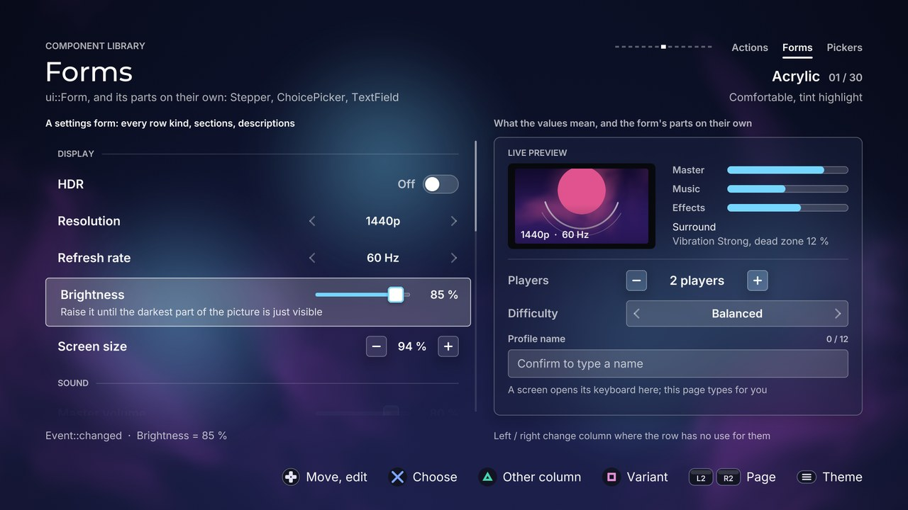

# Forms

[Back to the component guide](../COMPONENTS.md)



Components that edit values: the building blocks of a settings screen.

| Component | Header | What it is |
| --- | --- | --- |
| `ui::Form` | `ui/components/form.hpp` | A scrolling column of typed rows with one gliding highlight |
| `ui::Stepper` | `ui/components/stepper.hpp` | A whole number between a minus and a plus |
| `ui::ChoicePicker` | `ui/components/choice.hpp` | One value from a short list, between two arrows |
| `ui::TextField` | `ui/components/text_field.hpp` | A labelled line of text with a caret; no keyboard |

All four follow the five rules of `ui/components/component.hpp`: a public
`style`, `set_bounds`, `handle` returning an `Event`, `update(dt)` and a const
`draw(canvas)`. Every style derives from `ComponentStyle`, so each also has
`theme`, `sounds` and `reduced_motion`.

The gallery page is `src/concepts/components/forms_page.cpp`; it is also the
usage example for a two-column settings screen.

## Form

A settings form. Rows are added in order, grouped under section headers. Up
and down move one highlight between the rows; left, right and confirm edit the
focused row. The form scrolls with a spring to keep the focus in view, fades
the rows that are cut by its top and bottom edge, and unfolds the focused row
to show its description. A row that is disabled can still be focused, so its
description can say why; every input on it is refused.

```cpp
enum { kHdr, kResolution, kMusic, kPlayers, kReset };

ui::Form form;
form.style.theme = theme;
form.add_header("Display");
form.add_toggle(kHdr, "HDR", true).description = "For televisions that support it";
form.add_choice(kResolution, "Resolution", {"1080p", "1440p", "2160p"}, 2);
form.add_header("Sound");
form.add_slider(kMusic, "Music", 70, 0, 100, 5).unit = " %";
form.add_stepper(kPlayers, "Players", 2, 1, 4);
form.add_action(kReset, "Restore defaults");
form.set_bounds({96, 240, 900, 640});

// every frame
switch (form.handle(input, feedback))
{
case ui::Event::changed:   apply(form.changed_id()); break; // read it with the getters
case ui::Event::activated: run(form.changed_id());   break; // an action row
default: break;
}
form.update(dt);
form.draw(canvas);
```

### Row kinds

Each `add_*` returns the new `FormRow`; set its optional parts on the result.
The reference stays valid until `clear()`. Every row has `id`, `label`,
`description` and `disabled`.

| Builder | Row | Input | Optional parts |
| --- | --- | --- | --- |
| `add_header(label)` | A section title. Never focused | none | |
| `add_toggle(id, label, on)` | A switch (`Painter::toggle`) | Right turns it on, left off, confirm flips it | |
| `add_choice(id, label, options, index)` | `<  Value  >`, a `ChoicePicker` | Left / right step; confirm picks the next and goes round | `row.choice.option` (slot) |
| `add_slider(id, label, value, min, max, step)` | A track (`Painter::slider`) and the number | Left / right step; a held direction speeds up | `unit`, `decimals`, `format`; `step` 0 is continuous |
| `add_stepper(id, label, value, min, max, step)` | `-  12  +`, a `Stepper` | Left / right step; a held direction speeds up | `row.stepper.set_suffix()`, `row.stepper.format` |
| `add_action(id, label)` | A button-like row | Confirm returns `activated` | `danger`, `chevron`, `text` (trailing) |
| `add_value(id, label, text)` | Read-only label and text | Skipped, or focusable and dimmed (`focus_values`) | |

### Values

By row id, silent, usable at any time. The form animates to a value that was
set from code (a "restore defaults" moves every thumb).

| Read | Write |
| --- | --- |
| `toggle_value(id)` | `set_toggle(id, on)` |
| `choice_index(id)`, `choice_text(id)` | `set_choice(id, index)` |
| `slider_value(id)`, `slider_text(row)` | `set_slider(id, value)` |
| `stepper_value(id)` | `set_stepper(id, value)` |
| `value_text(id)` | `set_value_text(id, text)` |
| `row(id)` (the `FormRow`, or null) | `set_disabled(id, disabled)` |

Focus: `focus()` (row index), `focus_id()`, `set_focus(index, snap)`,
`focus_row(id, snap)`, `set_active(bool)`, `enter()` (replays the entrance),
`row_rect(index)`.

`help_text()` is the focused row's description, for a help area of the screen's
own: turn `description_inline` off and draw it where you like.

`uses_horizontal()` says whether the focused row answers left and right itself.
On a row that does not (an action, a read-only row) `handle` returns
`Event::none` for them, so a screen with several columns can use them to change
column there, and only there.

### Style: `FormStyle`

| Knob | Default | Effect |
| --- | --- | --- |
| `row_height` | 72 | Height of a row |
| `header_height` | 58 | Height of a section title |
| `gap` | 6 | Space between rows |
| `padding` | 26 | Space inside a row, left and right |
| `panel_padding` | 14 | Space between the panel and the rows (`panel`) |
| `label_ratio` | 0.44 | The label column's share of a row; where controls start when `values_right` is off |
| `label_width` | 0 | The label column in pixels; above 0 it replaces the ratio |
| `control_width` | 320 | Width of choices and sliders |
| `stepper_width` | 196 | Width of steppers |
| `toggle_width`, `toggle_height` | 76, 40 | Size of a switch |
| `slider_height` | 34 | Height of a slider (its thumb) |
| `number_width` | 86 | Room kept for a slider's number, so the track never moves |
| `label_size` | 26 | Row labels |
| `value_size` | 24 | Values, numbers, "On" / "Off" |
| `header_size` | 18 | Section titles |
| `description_size` | 21 | The description line |
| `highlight` | tint | The gliding highlight: `HighlightStyle` (`ring`, `fill`, `tint`, `bar`, `underline`, `glow`, `none`) |
| `panel` | false | A themed panel behind the whole form |
| `on_page` | true | Without a panel the rows use the page's text colours; set false on a surface of your own |
| `dividers` | false | Hairlines between rows |
| `header_rule` | true | A hairline after a section title |
| `compact` | false | Rows at 80 % height, type at 90 % (never under 20), controls at 86 % |
| `values_right` | true | Controls end at the row's right edge; false: they start where the label column ends |
| `toggle_text` | true | "On" / "Off" beside a switch |
| `on_text`, `off_text` | "On", "Off" | Those two words |
| `description_inline` | true | The focused row unfolds to show its description |
| `scroll_thumb` | true | A thumb at the right edge when the form overflows |
| `stepper_buttons` | surface | `StepperButtons::surface` (two small buttons) or `plain` (bare signs) |
| `wrap` | false | Past the last row comes the first |
| `wrap_choices` | true | A choice goes round at its ends |
| `focus_values` | false | Read-only rows take the focus and are dimmed; false: the focus skips them |
| `focus_shift` | 6 | The focused row's label moves this far right |
| `edge_fade` | 0.9 | A row cut by the top or bottom edge fades: gone when half of it is cut, solid when this share shows; 0 turns it off |
| `entrance_step` | 0.03 | Seconds between rows arriving; 0 for none |
| `slider_steps` | 50 | Presses from one end to the other of a continuous slider |
| `fast_after` | 6 | Held repeats before sliders and steppers speed up; 0 never |
| `fast_factor` | 4 | Steps taken at once from then on |
| `pitch_by_position` | true | The move cue falls a little toward the bottom of the form |

Changing any of these at any time re-flows the form: values, focus and scroll
are not part of the style.

### Slots

| Slot | Replaces |
| --- | --- |
| `form.trailing(canvas, control, row, focus)` | The text and chevron of action and value rows |
| `row.format(value)` | The number and unit of a slider row |
| `row.choice.option(canvas, area, index, focus)` | The text of a choice's options |
| `row.stepper.format(value)` | The text of a stepper's value |

### Events

| Event | When |
| --- | --- |
| `moved` | Up or down moved the focus |
| `changed` | A switch, choice, slider or stepper changed; `changed_id()` names the row |
| `activated` | Confirm on an action row; `changed_id()` names it |
| `refused` | An end of the form, a limit of a value, a disabled or read-only row |
| `cancelled` | Back |
| `none` | Nothing happened; also left / right on a row without a use for them, and confirm on a slider or stepper |

### Cues

| Cue | When | Pitch |
| --- | --- | --- |
| `sounds.move` | The focus moved | 1.05 at the top to 0.95 at the bottom |
| `sounds.change` | A switch or a choice changed | Switch: 1.06 on, 0.94 off. Choice: 1.05 forward, 0.95 back |
| `sounds.step` | A slider or stepper stepped | 0.9 at the minimum to 1.2 at the maximum |
| `sounds.activate` | An action was confirmed (with a short rumble) | 1 |
| `sounds.cancel` | Back | 1 |
| `sounds.refuse` | Any refusal: quiet, with a light rumble and a shake of the highlight; silent on a held direction | 1 |

Cues are panned by where they happen: moves at the form's centre, edits at its
controls.

## Stepper

An integer with a minimum, a maximum and a step, drawn as `-  12  +`. Left and
right change it. Holding a direction takes longer strides after a moment. The
number rolls up or down like a counter, the sign that was used is pushed in,
and a limit refuses softly. A value that the maximum pushed off the step grid
returns to the grid on the way back.

```cpp
ui::Stepper players;
players.style.theme = theme;
players.set_range(1, 4);
players.set_value(2);
players.format = [](int n) { return std::to_string(n) + (n == 1 ? " player" : " players"); };
players.set_bounds({1200, 400, 300, 56});

players.set_active(focused);
if (focused && players.handle(input, feedback) == ui::Event::changed)
    apply(players.value());
players.update(dt);
players.draw(canvas);
```

API: `set_range(min, max, step)`, `set_value(v)` (silent), `set_suffix(text)`,
`value()`, `minimum()`, `maximum()`, `step()`, `fraction()` (0..1), `text()`.

### Style: `StepperStyle`

| Knob | Default | Effect |
| --- | --- | --- |
| `button_size` | 44 | The square minus and plus buttons (capped by the bounds' height) |
| `sign_size` | 9 | Half the length of a sign's stroke |
| `sign_width` | 3 | Its thickness |
| `box_padding` | 5 | Space between the well and the buttons (`boxed`) |
| `value_size` | 26 | The number |
| `buttons` | surface | `StepperButtons::surface`: two buttons in the theme's surface style. `plain`: bare signs |
| `boxed` | false | A sunken well behind the whole control |
| `focus_ring` | true | The theme's focus ring around the bounds while active |
| `dim_at_limit` | true | The sign that can go no further fades |
| `on_page` | false | Drawn straight on the page: the number uses the page's text colour |
| `ink` | theme | The number's colour (alpha 0 means the theme's) |
| `wrap` | false | Past the maximum comes the minimum |
| `fast_after` | 8 | Held repeats before the stride grows; 0 never |
| `fast_factor` | 5 | Steps taken at once from then on |
| `roll` | 14 | How far the number travels when it changes |
| `pitch_by_value` | true | The step cue rises with the value |

Slot: `format(value)` returns the text of a value.

Events: `changed`, `refused` (a limit), `cancelled` (back), `none`.

Cues: `sounds.step` (pitch 0.9 to 1.2 with the value), `sounds.refuse`,
`sounds.cancel`.

## ChoicePicker

One value from a short list, shown as `<  Value  >`. Left and right step
through the options: the arrow that was used jumps, the old value leaves in the
direction of travel and the new one follows it in. Use it for three to eight
options; for more, open a list.

```cpp
ui::ChoicePicker difficulty;
difficulty.style.theme = theme;
difficulty.style.dots = true;
difficulty.set_options({"Story", "Balanced", "Veteran"});
difficulty.set_index(1);
difficulty.set_bounds({1200, 480, 420, 56});

difficulty.set_active(focused);
if (focused && difficulty.handle(input, feedback) == ui::Event::changed)
    apply(difficulty.index());
difficulty.update(dt);
difficulty.draw(canvas);
```

API: `set_options(list)`, `options()`, `set_index(i)` (silent), `index()`,
`value()` (the selected text).

### Style: `ChoiceStyle`

| Knob | Default | Effect |
| --- | --- | --- |
| `arrow_size` | 9 | Half the height of an arrow |
| `arrow_width` | 3 | Its stroke |
| `arrow_inset` | 22 | From the bounds' edge to an arrow's centre |
| `dot_size` | 6 | The position dots (`dots`) |
| `value_size` | 24 | The value |
| `boxed` | true | A sunken well behind the control |
| `focus_ring` | true | The theme's focus ring around the bounds while active |
| `dots` | false | One dot per option under the value (2 to 12 options); the lit one glides |
| `dim_at_limit` | true | An arrow that leads nowhere fades (`wrap` off) |
| `idle_arrows` | 0.4 | The arrows' opacity without the focus |
| `on_page` | false | Drawn straight on the page (with `boxed` off): the page's text colour |
| `ink` | theme | The value's and the arrows' colour (alpha 0 means the theme's) |
| `wrap` | true | Past the last option comes the first (never on a held direction) |
| `confirm_cycles` | true | Confirm picks the next option and goes round; false: it returns `activated`, for opening a full list |
| `slide` | 26 | How far the value travels when it changes |
| `nudge` | 6 | How far an arrow jumps when it is used |
| `pitch_by_direction` | true | The change cue is higher forward than back |

Slot: `option(canvas, area, index, focus)` draws an option instead of its text
(a colour swatch, an icon).

Events: `changed`, `refused` (an end, with `wrap` off), `activated` (confirm,
with `confirm_cycles` off), `cancelled` (back), `none`.

Cues: `sounds.change` (pitch 1.05 forward, 0.95 back), `sounds.refuse`,
`sounds.activate`, `sounds.cancel`.

## TextField

A text field without a keyboard. It shows a label, the value or a placeholder,
a caret that blinks only while the field is active, and a helper line or an
error underneath. Confirm returns `activated`: the screen opens whatever enters
text (an on-screen keyboard, the system dialog) and feeds the result back with
`insert`, `backspace` and `clear`. Text longer than the field scrolls so the
caret stays in sight. An error is drawn in the theme's danger colour, outlines
the field and shakes it once.

```cpp
ui::TextField name;
name.style.theme = theme;
name.style.max_length = 12;
name.set_label("Profile name");
name.set_placeholder("Not set");
name.set_helper("Shown to other players");
name.set_bounds({1200, 560, 420, name.preferred_height()});

name.set_active(focused);
if (focused && name.handle(input, feedback) == ui::Event::activated)
    open_keyboard();
// from the keyboard
name.insert('a', feedback);   // Event::changed, or refused when the field is full
name.backspace(feedback);
if (name.length() < 3)
    name.set_error("Three characters at least");
name.update(dt);
name.draw(canvas);
```

API: `set_label`, `set_placeholder`, `set_helper`, `set_error` (empty clears
it), `error()`, `set_disabled`, `set_text`, `text()`, `length()` (characters,
not bytes), `full()`, `preferred_height()`, `field_rect()`.

Editing comes in two forms. `insert(char)`, `insert(utf8)`, `backspace()` and
`clear()` are silent and return whether anything changed. `insert(char,
feedback)` and `backspace(feedback)` return an `Event` and play the field's
cues; a full or an empty field refuses softly.

### Style: `TextFieldStyle`

| Knob | Default | Effect |
| --- | --- | --- |
| `field_height` | 60 | Height of the field itself |
| `label_gap` | 12 | Space between the label line and the field |
| `helper_gap` | 16 | Space between the field and the helper line |
| `label_size` | 20 | The label and the counter |
| `helper_size` | 20 | The helper and the error |
| `counter` | true | "5 / 12" at the end of the label line when `max_length` is set; it turns to the warning colour when full |
| `on_page` | false | Label and helper sit on the page, not on a panel |
| `password` | false | One mask per character instead of the text |
| `mask` | bullet | The mask; an asterisk in faces that have no such glyph |
| `max_length` | 0 | Characters allowed; 0 for no limit |
| `caret_period` | 1.0 | Seconds per blink; 0 keeps the caret lit. `reduced_motion` also keeps it lit |
| `type` | `Cue::type` | The cue of a character going in |
| `erase` | `Cue::erase` | The cue of a character coming out |

The text inside the field is set at size 24 by `Painter::field`.

Slots: none.

Events: `activated` (confirm), `refused` (confirm while disabled),
`cancelled` (back), `none`. From the editing calls: `changed`, `refused`.

Cues: `sounds.activate`, `sounds.cancel`, `sounds.refuse`, `style.type` (pitch
rises as the field fills), `style.erase`.

## Shared detail: the focus ring

`ui/components/focus_frame.hpp` holds the helper the three standalone controls
draw their ring with. `Painter::focus_ring` adds a glow in the soft, gloss,
glass and glow looks, and a glow lights the inside of its rectangle too. The
helper draws the ring under the control in those looks, and only its stroke
where nothing opaque would cover the light.

## The gallery page

`make_forms_page` builds a settings screen in two columns.

- Left: a `Form` with the sections Display, Sound, Controller and Account,
  every row kind, a disabled row, a destructive action, long enough to scroll.
- Right: a panel with a live preview (a small screen that dims with
  Brightness, gains a highlight with HDR and shrinks with Screen size; three
  volume meters; the current choices as text), then a `Stepper`, a
  `ChoicePicker` and a `TextField`. Confirm on the text field types a preset
  name one letter at a time through `insert`; the third name is longer than
  the field allows and ends in the error line.

Moving between the columns: Triangle always changes column. Left and right
change column only where the focused thing has no use for them (an action row,
the text field); everywhere else they edit. The hint row says which applies.

Square cycles four variants:

| Variant | Knobs |
| --- | --- |
| Comfortable, tint highlight | The defaults |
| Compact, dividers, in a panel | `compact`, `dividers`, `panel`, plain stepper signs, a boxed `Stepper`, `dots` on the picker, no counter |
| Wide labels, bar, values at the left | `values_right` off, `label_ratio` 0.5, `HighlightKind::bar`, no header rule, an unboxed picker that does not wrap |
| Theme ring, help line, masked field | `HighlightKind::ring`, `description_inline` off with `help_text()` drawn under the form, `focus_values`, no "On" / "Off", a picker whose confirm returns `activated`, `password` |

Tour pictures: `forms`, `forms-panel`, `forms-compact`, `forms-wide`,
`forms-help`.
