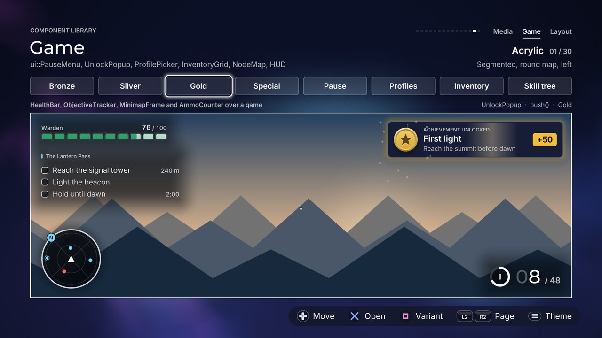

# Game

[Back to the component guide](../COMPONENTS.md)



[Back to the component guide](../COMPONENTS.md)

Pieces only a game needs, with no equivalent on the web: the pause overlay,
the unlock pop-up, the profile select, an inventory you rearrange by hand, a
HUD that stays readable over a moving picture, and a map of nodes you walk in
any direction. Each has a public `style` (a `ui::Theme` plus its own knobs),
`set_bounds(rect)`, `update(dt)` and `draw(canvas)`; the ones that take input
have `handle(input, feedback)` and return a `ui::Event`. With
`style.reduced_motion` nothing travels, tilts or bounces.

| Header | Components |
| --- | --- |
| `ui/components/pause_menu.hpp` | `PauseMenu` |
| `ui/components/unlock_popup.hpp` | `UnlockPopup` |
| `ui/components/profile_picker.hpp` | `ProfilePicker` |
| `ui/components/inventory_grid.hpp` | `InventoryGrid` |
| `ui/components/hud.hpp` | `HealthBar`, `AmmoCounter`, `ObjectiveTracker`, `MinimapFrame` |
| `ui/components/node_map.hpp` | `NodeMap` |

The gallery page is `src/concepts/components/game_page.cpp`.

**Content colours.** Three things here are coloured by what they are, not by
the theme: the metals of a medal (`UnlockPopupStyle::tier_colors`), the rarity
of an item (`InventoryItem::rarity`) and a profile's own colour
(`Profile::accent`). They are data you supply, with defaults. Everything else
(surfaces, wells, rings, text, status colours) comes from the theme.

## PauseMenu

The standard pause overlay. A scrim covers the game (and the blurred game
shows through it when `canvas.glass` is set), a panel carries a small kicker
("PAUSED"), a title, a subtitle and a vertical menu, and a second panel beside
it is yours to draw: the objective, a map, statistics. The menu is a
`ui::ListView`, so rows have subtitles, values, badges, chevrons, section
headers and a disabled state. Rows arrive one after another. While it is open
it should receive every input.

```cpp
ui::PauseMenu pause;
pause.style.theme = theme;
pause.title = "Hollow Reach";
pause.subtitle = "Chapter 3, saved four minutes ago";
std::vector<ui::ListItem> rows(3);
rows[0].title = "Resume";
rows[1].title = "Options";
rows[2].title = "Quit to title";
pause.set_items(rows);
pause.side = [&](ui::Canvas &canvas, const gfx::Rect &area, float shown)
{ draw_objective(canvas, area); };

// when the player presses Options
pause.open(feedback);

// every frame
if (pause.is_open())
{
    const ui::Event event = pause.handle(input, feedback);
    if (event == ui::Event::activated)
        act(pause.focus());        // the screen decides; close() when it resumes
    if (event == ui::Event::cancelled)
        resume_game();
}
pause.update(dt);
pause.draw(canvas); // last, so it is on top
```

Members: `kicker` (default "Paused", drawn in capitals; empty hides it),
`title`, `subtitle`. Calls: `set_items()`, `items()`, `item(i)`,
`set_bounds()` (the area the scrim covers; the whole canvas by default),
`open(feedback)`, `close(feedback)`, `dismiss()` (at once, silent, for screen
changes), `is_open()`, `visible()` (true while it animates out), `focus()`,
`set_focus()`, `panel_rect()`, `side_rect()`.

### Style (`ui::PauseMenuStyle`, on top of `ComponentStyle`)

| Knob | Default | Effect |
| --- | --- | --- |
| `layout` | `left` | `PauseLayout::left` (menu left, side panel right), `center` (the pair in the middle), `right` (mirrored) |
| `width` | 560 | Width of the menu panel |
| `margin` | 96 | Distance from the bounds' left and right edges |
| `padding` | 36 | Inside both panels |
| `side_width` | 560 | Width of the side panel (drawn only when `side` is set) |
| `side_gap` | 36 | Least distance between the two panels |
| `side_height` | 0 | Height of the side panel; 0 makes it as tall as the menu panel |
| `row_height` | 66 | Height of a menu row |
| `row_gap` | 6 | Between rows |
| `kicker_size` | 18 | The small word above the title |
| `title_size` | 46 | Title (cut to one line) |
| `subtitle_size` | 22 | Subtitle |
| `item_size` | 27 | Row titles; subtitles and values scale from it |
| `highlight` | fill | A `ui::HighlightStyle`: the menu's gliding highlight |
| `dividers` | false | Hairlines between rows |
| `frosted` | true | Frosted panels when `canvas.glass` is set, else solid panels |
| `frost` | 0.55 | How much surface colour covers the frost |
| `backdrop_blur` | true | The whole screen behind the scrim is the blurred copy (needs `canvas.glass`). Turn it off when the game is not drawn into the blurred layer |
| `scrim` | 0.6 | Opacity of the veil over the game |
| `scrim_color` | black | Its colour |
| `entrance_step` | 0.05 | Seconds between header lines and rows arriving |
| `travel` | 90 | How far the panels slide in from their side |
| `exit_speed` | 1.8 | Leaving is this many times quicker than arriving |
| `wrap` | true | Past the last row comes the first |
| `close_on_back` | true | Back closes the menu; false only reports `cancelled` |

### Slot

`side(canvas, area, shown)`: draws the content of the side panel. `area` is
the inside of the panel, `shown` is 0..1 while it arrives. Draw text in
`theme.text` and `theme.text_muted`: it sits on a panel.

### Events and cues

| Input | Event | Cue |
| --- | --- | --- |
| `open()` | | `sounds.open` |
| Up, down | `moved`; `refused` at an end when `wrap` is off | `sounds.move` |
| Confirm | `activated` (read `focus()`); `refused` on a disabled row | `sounds.activate` |
| Back | `cancelled`; the menu closes when `close_on_back` | `sounds.close`, or `sounds.cancel` when it stays open |

## UnlockPopup

The achievement or reward pop-up. It slides in from the edge its anchor is
on, a medal (or your icon) lands with a burst of sparks, one band of light
crosses the plate, it holds and leaves the way it came. Several unlocks queue
and show one after another. It never takes the focus, so it has no
`handle()`; `update()` takes the feedback because a queued pop-up sounds when
it appears.

```cpp
ui::UnlockPopup unlocks;
unlocks.style.theme = theme;
unlocks.style.anchor = ui::PopupAnchor::top_right;
unlocks.push("First light", "Reach the summit before dawn", ui::UnlockTier::gold, 50);

// every frame
unlocks.update(dt, feedback);
unlocks.draw(canvas); // after everything else
```

`ui::Unlock`: `title`, `subtitle`, `tier` (`bronze`, `silver`, `gold`,
`special`), `points` (0 hides the pill), `kicker` (empty uses
`style.kicker`), `icon` (draw the `icon` slot instead of the medal),
`seconds` (0 uses `style.hold`) and `tag`. Calls: `push(unlock)`,
`push(title, subtitle, tier, points)`, `clear(now)`, `showing()`, `queued()`,
`empty()`, `current()`, `tier_color(tier)`, `rect()`, `set_bounds()` (the
screen it is anchored in).

**The medal** is drawn from shapes: a rim lit from above, a groove, a face
and an engraved emblem that differs per tier (one chevron, two chevrons, a
star, a diamond), so the tier reads without colour. Stroke-only themes get an
outlined medal and square themes a square one.

### Style (`ui::UnlockPopupStyle`, on top of `ComponentStyle`)

| Knob | Default | Effect |
| --- | --- | --- |
| `anchor` | `top_right` | `PopupAnchor`: `top_left`, `top_center`, `top_right`, `bottom_left`, `bottom_center`, `bottom_right`. Left and right anchors slide in from the side, centred ones from above or below |
| `width` | 560 | Width of the plate |
| `height` | 116 | Height of the plate |
| `margin` | 48 | Distance from the edges of the bounds |
| `padding` | 20 | Inside the plate |
| `medal_size` | 76 | The medal, or the square given to the icon slot |
| `kicker_size` | 16 | The small line above the title |
| `title_size` | 27 | Title |
| `subtitle_size` | 20 | Subtitle |
| `points_size` | 26 | The number in the points pill |
| `kicker` | "Achievement unlocked" | The small line, drawn in capitals; empty hides it |
| `tier_colors` | bronze, silver, gold, theme | The four metals. Alpha 0 uses the theme's primary colour (the default for `special`) |
| `frosted` | true | Frosted plate when `canvas.glass` is set, else solid |
| `frost` | 0.6 | How much surface colour covers the frost |
| `tier_glow` | true | Light in the tier's colour around the plate (themes with soft light only) |
| `shine` | true | One band of light crosses the plate |
| `shine_delay` | 0.4 | Seconds after it lands |
| `shine_time` | 0.75 | Seconds the band takes to cross |
| `sparks` | true | A burst from the medal as it lands |
| `spark_count` | 14 | How many |
| `hold` | 4 | Seconds on screen |
| `gap` | 0.3 | Seconds between one pop-up leaving and the next arriving |
| `gold_cue` | `complete` | The cue of a gold unlock; `audio::Cue::count` falls back to `sounds.notify` |
| `special_cue` | `new_record` | The same for the special tier |

### Slot

`icon(canvas, area, unlock, shown)`: draws into the medal's square for
unlocks whose `icon` is set (a game's own artwork, an item picture).

### Cues

One cue per pop-up, when it appears: `sounds.notify` for bronze and silver
(silver a little higher), `style.gold_cue` and `style.special_cue` for the
other two, panned by where the plate rests. Gold and special also give a
short rumble.

## ProfilePicker

"Who is playing?": a row or a grid of profile cards, each an avatar
(`ui::Avatar`), a name and a line of detail, and one more card that adds a
profile. The focused card rises, grows and opens downward to show a second
line about its player; its ring and light take the profile's own colour.
Profiles signed in on a controller wear a "P1".."P4" tag. A row wider than the
bounds scrolls.

```cpp
ui::ProfilePicker who;
who.style.theme = theme;
std::vector<ui::Profile> people(2);
people[0].name = "Mara Voss";
people[0].detail = "Played today";
people[0].extra = "Level 12, 63 hours";
people[0].controller = 1;
people[1].name = "Guest";
who.set_profiles(people);
who.set_bounds({96, 300, 1728, who.height()});

// every frame
if (who.handle(input, feedback) == ui::Event::activated)
{
    if (who.add_focused())
        create_profile();
    else
        sign_in(who.focus());
}
who.update(dt);
who.draw(canvas);
```

`ui::Profile`: `name`, `detail`, `extra` (shown only on the focused card),
`image` and `uv` (0 draws initials on a colour made from the name), `accent`
(alpha 0: a colour made from the name), `controller` (1..4, 0 for none),
`tag`. Calls: `set_profiles()`, `profiles()`, `profile(i)`, `count()` (cards,
the "add" card included), `focus()`, `add_focused()`, `set_focus(i, snap)`,
`set_active(bool)`, `enter()`, `exit()`, `card_rect(i)`, `height()`.

The picker draws no panel of its own. On a panel or a dialog, set
`style.on_surface` so the title takes the panel's ink.

### Style (`ui::ProfilePickerStyle`, on top of `ComponentStyle`)

| Knob | Default | Effect |
| --- | --- | --- |
| `columns` | 0 | 0: one row. Otherwise a grid this wide; every row is placed by `align`, so a shorter last row is centred |
| `card_width` | 230 | Width of a card |
| `card_height` | 252 | Height of a card at rest |
| `gap` | 28 | Between cards, both ways (rows of a grid stand `expand` further apart) |
| `avatar_size` | 116 | Diameter of the avatar |
| `avatar_shape` | `circle` | `AvatarShape::circle` or `rounded` |
| `align` | `center` | Where the cards and the title sit in the bounds |
| `title` | "Who is playing?" | Heading above the cards; empty for none |
| `title_size` | 40 | Its size |
| `name_size` | 25 | Names |
| `detail_size` | 19 | The detail and extra lines |
| `on_surface` | false | The title uses `theme.text` instead of the page's text colour |
| `focus_scale` | 1.1 | Size of the focused card |
| `lift` | 12 | Pixels it rises |
| `expand` | 38 | Pixels it grows downward to show `extra`; 0 keeps its height and hides `extra` |
| `accent_by_profile` | true | Light and avatar ring in the profile's colour; false uses the theme's focus colour |
| `dim` | 0 | How far the other cards fade, 0..1 |
| `add_card` | true | A last card that adds a profile |
| `add_label` | "Add profile" | Its label |
| `slots` | true | The "P1".."P4" tags |
| `slot_size` | 30 | Their height |
| `slot_prefix` | "P" | The letter before the number |
| `wrap` | false | Past the last card of a row comes the first |
| `exits` | none | `ui::EdgeExits`: edges that hand the focus back (an exit beats the wrap) |
| `entrance_step` | 0.06 | Seconds between cards arriving; 0 for none |

### Slot

`avatar(canvas, area, profile, index, focus)`: draws a profile's picture
instead of the `ui::Avatar`.

### Events and cues

| Input | Event | Cue |
| --- | --- | --- |
| Left, right, up, down | `moved`; `refused` at an edge; `none` with `exit()` set when the edge is an exit | `sounds.move`, panned; `sounds.refuse` |
| Confirm | `activated` (`focus()`, `add_focused()`) | `sounds.activate` |
| Back | `cancelled` | `sounds.cancel` |

## InventoryGrid

A bag: fixed slots drawn as wells, items that live in them, and one gesture
to rearrange them. Confirm lifts the focused item; it floats above the focus
with a shadow under it and leans into its movement; confirm again sets it
down in an empty slot, trades places with the item there, or merges two
stacks; back puts it where it came from. Every item is a pair of position
springs keyed by its id, so a move, a swap and a return are the same motion
and nothing teleports.

```cpp
ui::InventoryGrid bag;
bag.style.theme = theme;
bag.style.columns = 6;
bag.style.rows = 4;
ui::InventoryItem tonic;
tonic.id = 1;
tonic.name = "Tonic";
tonic.count = 3;
tonic.max_stack = 9;
tonic.kind = kTonic; // equal kinds stack
bag.put(0, tonic);
bag.set_bounds({96, 300, 660, 440});

// every frame
if (bag.handle(input, feedback) == ui::Event::changed)
    save(bag.last_move());
bag.update(dt);
bag.draw(canvas);
```

`ui::InventoryItem`: `id` (unique, not 0), `name`, `count`, `max_stack`,
`kind` (what the default merge rule compares), `category` (for the filter),
`rarity` (the frame's colour; alpha 0 gives a quiet frame), `tint` (the
placeholder icon's colour), `texture` and `uv` (the icon), `tag`.

Calls: `clear()`, `put(slot, item)` (false when the slot is taken or the id
is known), `remove(id)`, `at(slot)`, `find(id)`, `slot_of(id)` (-1 while it
is carried), `item_count()`, `slot_count()`, `focus()`, `set_focus(slot,
snap)`, `holding()` (the carried id, or 0), `last_move()`, `set_filter(category)`
(-1 shows all), `filter()`, `set_active(bool)`, `enter()`, `exit()`,
`slot_rect(slot)`. After changing `style.columns` or `style.rows`, `clear()`
and `put()` the items again: slots are numbered row by row.

**Merging.** `merge` is a rule the screen provides:
`int(const InventoryItem &held, const InventoryItem &target)` returns how many
units of the carried item go into the target; 0 means "these do not stack"
and the two swap instead. When `merge` is unset, `InventoryGrid::default_merge`
stacks equal non-zero `kind`s up to the target's `max_stack`. If the target
cannot take everything, the rest stays in the hand.

**The filter.** `set_filter(category)` fades the items of other categories
and refuses to lift them; they still accept what is set down on them.

`ui::InventoryMove` (from `last_move()` after a `changed`): `action`
(`picked`, `placed`, `swapped`, `merged`, `returned`), `item` (the id that
was in the hand), `from`, `to`, `other` (the id it met), `amount` (units
merged).

### Style (`ui::InventoryStyle`, on top of `ComponentStyle`)

| Knob | Default | Effect |
| --- | --- | --- |
| `columns` | 6 | Slots across |
| `rows` | 4 | Slots down |
| `slot_size` | 0 | Side of a slot; 0 uses the largest square that fits the bounds. The grid is centred in the bounds |
| `gap` | 12 | Between slots |
| `tile_inset` | 5 | Between a slot's well and the item in it |
| `icon_inset` | 12 | Between the item's frame and its icon |
| `count_size` | 19 | The stack count |
| `rarity_frame` | true | Items wear a frame in their rarity colour |
| `letters` | true | The placeholder icon shows the name's first letter |
| `filtered_dim` | 0.26 | Opacity of items the filter leaves out |
| `carry_scale` | 1.16 | Size of the lifted item |
| `carry_lift` | 22 | How far it floats above the focused slot |
| `tilt` | 0.16 | Radians it leans at full speed; 0 keeps it upright |
| `wrap` | false | Past an edge comes the opposite one |
| `exits` | none | `ui::EdgeExits`; never taken while an item is carried |
| `entrance_step` | 0.012 | Seconds between slots arriving, as a diagonal wave; 0 for none |
| `pickup` | `pickup` | Cue of lifting |
| `drop` | `drop` | Cue of setting down in an empty slot |
| `swap` | `rotate` | Cue of trading places |
| `merge` | `merge` | Cue of merging, pitched up as the stack fills |

### Slot

`icon(canvas, tile, item, lift)`: draws an item's icon instead of its
texture or the placeholder. `tile` is the inside of the frame; `lift` is 0..1
while the item is carried. The frame, the count and the motion stay.

### Events and cues

| Input | Event | Cue |
| --- | --- | --- |
| A direction | `moved`; `refused` at an edge; `none` with `exit()` set at an exit | `sounds.move` (a little lower while carrying) |
| Confirm, empty hand | `changed` (`picked`); `refused` on an empty or filtered slot | `style.pickup` |
| Confirm, full hand | `changed` (`placed`, `swapped` or `merged`) | `style.drop`, `style.swap`, `style.merge` |
| Back, full hand | `changed` (`returned`) | `sounds.cancel` |
| Back, empty hand | `cancelled` | `sounds.cancel` |

## HealthBar

Health that shows how hard a hit was. The fill drops at once and a pale ghost
of the lost part stays for a moment, then drains after it. Healing grows the
fill with a flash. At or under `style.low` the bar changes colour, breathes
and glows. A shield is a strip along the top of the bar. Continuous or cut
into segments.

All four HUD pieces share `ui::HudStyle` and take no input.

### HUD backing (`ui::HudStyle`, on top of `ComponentStyle`)

A HUD cannot count on the theme's page colour: the game is behind it. Each
piece carries its own backing.

| Knob | Default | Effect |
| --- | --- | --- |
| `backing` | `glow` | `HudBacking::glow`: a soft dark pool under the piece, light ink whatever the theme. `plate`: a panel in the theme's surface (frosted when `canvas.glass` is set), the theme's own ink. `none`: nothing; text keeps its shadow |
| `glow_spread` | 34 | How far the under-glow reaches past the piece |
| `shade` | near black, 0.62 | Colour of the glow, of bare tracks and of text shadows |
| `ink` | automatic | Text and marks. Alpha 0: near white over the glow, `theme.text` on a plate |
| `plate_padding` | 16 | Between a plate's edge and the piece |
| `frosted` | true | Plates show the blurred game when possible |
| `text_shadow` | true | `glow` and `none`: a dark copy under every text |

Theme colours that would vanish on the HUD ground (a navy primary on the
dark glow, a white primary on a white plate) are pulled toward the ink.

```cpp
ui::HealthBar health;
health.style.theme = theme;
health.style.kind = ui::HealthKind::segmented;
health.title = "Warden";
health.set_bounds({96, 64, 420, 58}); // the bar sits at the bottom of the bounds
health.set_value(100.0f, true);        // snap at start-up

health.set_value(72.0f);               // a hit: the ghost shows the 28 lost
health.set_shield(30.0f);
health.update(dt);
health.draw(canvas);
```

Calls: `set_max()`, `max()`, `set_value(value, snap)`, `value()`,
`set_shield(value, snap)`, `shield()`, `low()`, `shown()` and `ghost()` (what
is drawn right now, as shares of the maximum). `title` is the word above the
bar.

### Style (`ui::HealthBarStyle`, on top of `HudStyle`)

| Knob | Default | Effect |
| --- | --- | --- |
| `kind` | `continuous` | `HealthKind::continuous` or `segmented` |
| `segments` | 10 | Cells of a segmented bar; the last lit one fills partly |
| `segment_gap` | 4 | Between cells |
| `bar_height` | 22 | Thickness of the bar |
| `title_size` | 18 | The title |
| `value_size` | 22 | The number |
| `show_value` | true | "72 / 100" at the right of the title line |
| `status` | `success` | Colour of the fill (`ui::Status`) |
| `low_status` | `danger` | ... at or under `low` |
| `shield_status` | `primary` | Colour of the shield strip |
| `low` | 0.25 | Share of the maximum that counts as low health |
| `low_pulse` | true | A low bar breathes and glows |
| `ghost` | true | The part just lost lingers |
| `ghost_delay` | 0.45 | Seconds before the ghost starts to drain |
| `ghost_rate` | 0.3 | How fast it drains, as a share of the theme's speed |
| `shield_height` | 0.38 | The shield strip, as a share of the bar's height |
| `shake` | 8 | Pixels the bar jolts on a hit; 0 for none |

Slots: none. Events: none. Cues: none (the game has its own hit sound).

## AmmoCounter

Rounds in the magazine over rounds in reserve. The digits sit in fixed-width
cells, so the number never jitters while it counts down; leading zeros are
faint; each shot kicks the digits. The count turns to the warning colour when
low and to the danger colour when empty. A ring shows the magazine's level,
and the reload sweeping over it while one runs.

```cpp
ui::AmmoCounter ammo;
ammo.style.theme = theme;
ammo.set_capacity(30);
ammo.set_bounds({1464, 900, 360, 76});
ammo.set_ammo(29, 120);   // one fired
ammo.set_reload(0.4f);    // while reloading; negative when done
ammo.update(dt);
ammo.draw(canvas);
```

Calls: `set_capacity()`, `capacity()`, `set_ammo(current, reserve)`,
`current()`, `reserve()`, `set_reload(progress)`, `reloading()`, `level()`
(`neutral`, `warning` or `danger`).

### Style (`ui::AmmoStyle`, on top of `HudStyle`)

| Knob | Default | Effect |
| --- | --- | --- |
| `digits_size` | 60 | The rounds in the magazine (the theme's heading face) |
| `reserve_size` | 26 | "/ 120" |
| `label_size` | 16 | The small word above the reserve |
| `label` | empty | That word ("9 mm"); empty for none |
| `align` | `right` | Which side of the bounds the block hugs (`left`, `center`, `right`) |
| `min_digits` | 2 | The count is padded with faint zeros to this many cells |
| `low` | 0.25 | Share of the capacity at or under which the count warns |
| `ring` | true | The magazine ring |
| `ring_size` | 64 | Its diameter |
| `ring_thickness` | 7 | Its stroke |
| `pips` | false | One small bar per round under the digits (capacities up to 60) |
| `pip_height` | 10 | Their height |

Slots: none. Events: none. Cues: none.

## ObjectiveTracker

The current goals: a title and a checklist. A new objective slides in. A
completed one ticks itself (two strokes that grow), is struck through,
lingers and leaves, and the rest close the gap. More objectives than
`max_rows` wait their turn. The first open objective is the brightest line.

```cpp
ui::ObjectiveTracker goals;
goals.style.theme = theme;
goals.title = "The Lantern Pass";
goals.set_bounds({96, 160, 440, 220});
const int tower = goals.add("Reach the signal tower", "240 m");
goals.add("Light the beacon");

goals.set_distance(tower, "120 m");
goals.complete(tower, &feedback); // ticks, chimes, then leaves
goals.update(dt);
goals.draw(canvas);
```

Calls: `add(text, distance, feedback)` returns an id, `complete(id,
feedback)`, `set_distance(id, text)`, `clear(now)`, `count()`, `remaining()`,
`done(id)`. The feedback pointer is optional; without it nothing sounds.

### Style (`ui::ObjectiveStyle`, on top of `HudStyle`)

| Knob | Default | Effect |
| --- | --- | --- |
| `title_size` | 17 | The title |
| `text_size` | 23 | Objective text |
| `distance_size` | 19 | The right-aligned distance |
| `row_height` | 38 | Height of a row |
| `check_size` | 22 | The check box |
| `max_rows` | 5 | More than this wait their turn |
| `linger` | 1.6 | Seconds a ticked objective stays; negative: it stays for good |
| `slide` | 36 | How far a new objective travels in |
| `tick_time` | 0.4 | Seconds the tick takes to draw itself |
| `done_status` | `success` | Colour of the ticked box |
| `complete_cue` | `mark` | Played by `complete()` when given feedback |
| `add_cue` | none | Played by `add()` when given feedback; silent unless you name a cue |

Slots: none. Events: none.

## MinimapFrame

The frame of a minimap. You draw the map through the `content` slot; the
frame draws the ground, the rim, a north marker, the player's arrow and the
points of interest, and turns with the heading the short way round. Round or
square; the map turns under a fixed arrow, or north stays up and the arrow
turns.

```cpp
ui::MinimapFrame map;
map.style.theme = theme;
map.set_bounds({96, 760, 190, 190});
ui::MapPip camp;
camp.angle = 0.6f;     // radians clockwise from north
camp.distance = 0.4f;  // share of the frame's range
ui::MapPip goal;
goal.angle = 2.1f;
goal.distance = 1.4f;  // out of range: it sits on the rim, smaller
goal.objective = true; // a diamond that pulses
map.set_pips({camp, goal});
map.content = [&](ui::Canvas &canvas, const gfx::Rect &inner, float turned, ui::MinimapShape)
{ draw_world_map(canvas, inner, turned); };

map.set_heading(player.yaw);
map.update(dt);
map.draw(canvas);
```

Calls: `set_heading(radians, snap)`, `heading()`, `set_pips()`, `pips()`,
`frame()` (the square the frame occupies), `inner()` (the square the map may
fill), `pip_position(pip, &x, &y)`.

`ui::MapPip`: `angle`, `distance`, `color` (alpha 0: the theme's accent),
`objective`, `tag`.

### Style (`ui::MinimapStyle`, on top of `HudStyle`)

| Knob | Default | Effect |
| --- | --- | --- |
| `shape` | `round` | `MinimapShape::round` or `square` |
| `rotate` | true | The map turns with the heading; false keeps north up and turns the arrow |
| `rim` | 4 | The frame's stroke |
| `inset` | 8 | Between the rim and the content |
| `pip_size` | 12 | Points of interest |
| `north_size` | 26 | The "N" marker; 0 hides it |
| `player_size` | 22 | The arrow in the middle; 0 hides it |
| `grid` | true | Range rings and a cross when there is no content slot |

### Slot

`content(canvas, inner, turned, shape)`: draws the map. `inner` is the square
it may fill, `turned` the angle the map is turned by (0 when `rotate` is
off). A round frame does not clip: keep the drawing inside the circle.

Events: none. Cues: none.

## NodeMap

Free-direction focus over nodes placed anywhere: a skill tree, a world map,
a mission board. Nodes are `locked`, `available` or `done`; links are lines
that light up from their `from` end to their `to` end once both are done, and
carry walking dots toward a node that is available. A direction moves the
focus to the best node that way, a ring glides to it, and the camera pans on
a spring to keep it in view when the map is larger than its bounds.

```cpp
ui::NodeMap tree;
tree.style.theme = theme;
std::vector<ui::MapNode> nodes(3);
nodes[0] = {0, 0, "Core", ui::NodeState::done};
nodes[1] = {230, -120, "Dash", ui::NodeState::available};
nodes[2] = {230, 120, "Guard"};
tree.set_nodes(nodes, {{0, 1}, {0, 2}});
tree.set_bounds({96, 300, 1100, 560});

// every frame
if (tree.handle(input, feedback) == ui::Event::activated && can_afford(tree.focus()))
    tree.set_state(tree.focus(), ui::NodeState::done);
tree.update(dt);
tree.draw(canvas);
```

`ui::MapNode`: `x`, `y` (its centre, in the map's own pixels, any origin),
`label`, `state`, `size` (0 uses `style.node_size`), `color` (its accent;
alpha 0 uses the theme's), `tag`. `ui::MapLink`: `from`, `to`.

Calls: `set_nodes(nodes, links)`, `nodes()`, `links()`, `node(i)`,
`set_state(i, state)`, `focus()`, `set_focus(i, snap)`, `set_active(bool)`,
`enter()`, `neighbour(from, direction)`, `linked(a, b)`, `exit()`,
`node_rect(i)` (on screen, camera and zoom applied).

**Which node a direction means.** The vector to each candidate is split into
the distance `along` the pressed direction and the offset to the `side`.
Nodes behind the focus are dropped, then nodes outside a cone (`side / along`
above `cone`; linked nodes get the wider `linked_cone`). Of the rest the
lowest `along + side_cost * side` wins, and linked nodes score at
`linked_discount`, so the drawn lines win ties.

**Shapes.** Round themes draw discs. Bevel, pixel and sketch themes draw
their own boxes, chamfer themes an octagon.

### Style (`ui::NodeMapStyle`, on top of `ComponentStyle`)

| Knob | Default | Effect |
| --- | --- | --- |
| `node_size` | 64 | Diameter of a node |
| `link_width` | 5 | Stroke of a link |
| `zoom` | 1 | Scales the whole map |
| `margin` | 120 | The camera keeps the focus this far inside the bounds |
| `padding` | 36 | Room kept around the outermost nodes |
| `labels` | true | Draw the labels under the nodes |
| `label_size` | 19 | Their size |
| `label_gap` | 16 | Between a node and its label |
| `label_width` | 170 | Labels are cut to this |
| `on_surface` | false | Labels and links use the panel's ink instead of the page's |
| `flow` | true | Dots walk along links that lead to an available node |
| `cone` | 1 | Tangent of the half angle searched (1 is 45 degrees) |
| `linked_cone` | 2.2 | ... for nodes linked to the focus (about 65 degrees) |
| `side_cost` | 2 | How much being off the axis counts against a node |
| `linked_discount` | 0.45 | Linked nodes score at this share |
| `activate_locked` | false | Confirm on a locked node reports `activated` instead of refusing |
| `exits` | none | `ui::EdgeExits`: a direction with no node hands the focus back |
| `entrance_step` | 0.03 | Seconds between nodes arriving; 0 for none |

### Slot

`node_slot(canvas, box, node, index, focus)`: draws a node instead of the
default. `box` is the node's square in the map's own pixels (zoom and camera
are already applied to the canvas). The focus ring, the links and the labels
stay.

### Events and cues

| Input | Event | Cue |
| --- | --- | --- |
| A direction | `moved`; `refused` when nothing lies that way; `none` with `exit()` set at an exit | `sounds.move`, panned by where the node will be |
| Confirm | `activated` (the screen decides to unlock); `refused` on a locked node unless `activate_locked` | `sounds.activate` |
| Back | `cancelled` | `sounds.cancel` |

### The gallery page

`src/concepts/components/game_page.cpp` runs a small "game" in its main area:
a procedural dusk over drifting ridges, with the four HUD pieces live on a
timeline (hits, a shield, a low-health pulse and a heal; bursts and reloads;
objectives that tick off and are replaced). A row of triggers opens the pause
menu (which stops the game's clock), fires an unlock of each tier, opens the
profile picker on a panel, and swaps the inventory and the skill tree into the
main area. Square changes the knobs of everything together:

| Variant | What changes |
| --- | --- |
| Segmented, round map, left | Segmented health, glow backing, round rotating map; pause on the left; pop-up top right; bag 6 x 4 |
| Plates, square map, centre | Continuous health, plates, square north-up map, ammo pips; pause centred with a bar highlight; pop-up bottom centre with the icon slot; profiles as a grid; bag 8 x 3; tree zoomed out |
| Bare, compact, right | No backing, thin bar, no ring; pause on the right with dividers; compact pop-up top centre without sparks; profiles without "add"; bag 5 x 4 with wrap; tree zoomed in |
