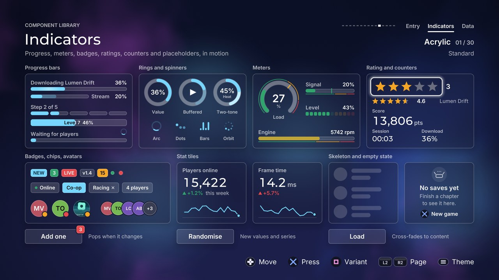

# Indicators

[Back to the component guide](../COMPONENTS.md)



Small components that show state: how far, how much, how many, who, how good,
still loading, nothing yet. Most take no input. Each has a public `style`
(a `ui::Theme` plus its own knobs), `set_bounds(rect)`, `update(dt)` and
`draw(canvas)`. Values are never drawn where you set them: they ease there
with the theme's speed (`style.omega()`) and bounce (`style.damping()`), and
with `style.reduced_motion` nothing travels or bounces.

| Header | Components |
| --- | --- |
| `ui/components/progress.hpp` | `ProgressBar`, `ProgressRing`, `Spinner`, `Meter`, the `Status` colours |
| `ui/components/badge.hpp` | `Badge`, `Chip`, `Avatar`, `AvatarStack` |
| `ui/components/rating.hpp` | `Rating` |
| `ui/components/counter.hpp` | `Counter` |
| `ui/components/skeleton.hpp` | `Skeleton` |
| `ui/components/stat.hpp` | `StatTile`, `EmptyState` |

The gallery page is `src/concepts/components/indicators_page.cpp`.

## Shared: status colours

Components that colour themselves by outcome take a `ui::Status`:

| Value | Colour |
| --- | --- |
| `neutral` | `theme.text_muted` |
| `primary` | `theme.primary` |
| `accent` | `theme.accent` |
| `success` | `theme.success` |
| `warning` | `theme.warning` |
| `danger` | `theme.danger` |

`status_color(theme, status)` returns the colour and `status_ink(theme, status)`
the text colour that reads on it. Wherever a style has a `status` it also has a
`color` field: give it an alpha above 0 to use any colour instead.

`solid_surface(theme)` is the theme's surface colour made opaque (a glass
theme's surface is translucent). It is the default for "cut out" rims and for
unfilled rating glyphs.

## ProgressBar

A horizontal bar for progress with a known end, an unknown end, a loaded part
ahead of a played part, or a number of steps. It can carry a label and the
percentage above it, after it or inside it.

```cpp
ui::ProgressBar bar;
bar.style.theme = theme;
bar.style.sheen = true;
bar.label = "Downloading";
bar.set_bounds({96, 400, 480, 44});   // text and bar together
bar.set_value(0.64f);                 // eases there; set_value(v, true) snaps
bar.update(dt);
bar.draw(canvas);
```

`value()` is the target, `shown()` the eased value on screen. `set_buffer()`
sets the second value of the buffered mode.

| Knob | Default | Effect |
| --- | --- | --- |
| `mode` | `determinate` | `determinate`, `indeterminate` (a travelling segment), `buffered` (two values), `segmented` (N steps) |
| `height` | 14 | Height of the bar itself |
| `radius_source` | `theme` | `theme` (the control radius), `pill`, `square`, `custom` |
| `radius` | 6 | The radius when `radius_source` is `custom` |
| `segments` | 5 | Number of steps in `segmented` mode |
| `segment_gap` | 6 | Space between steps |
| `text_size` | 20 | Label and percentage |
| `text_gap` | 10 | Space between the text and the bar |
| `track` | `well` | `well` (the theme's sunken surface), `flat` (a faint fill), `none` |
| `status` | `accent` | The fill's colour |
| `color` | clear | Overrides `status` when its alpha is above 0 |
| `buffer_alpha` | 0.35 | Strength of the loaded part in `buffered` mode |
| `sheen` | false | A band of light that crosses the fill |
| `sheen_period` | 2.2 | Seconds per crossing |
| `finish_flash` | true | A glow when the value reaches 1 |
| `placement` | `above` | Where the text goes: `above`, `right`, `inside`, `none` |
| `percent` | true | Show the value as "64%" |
| `travel_period` | 1.6 | `indeterminate`: seconds per crossing |
| `travel_width` | 0.32 | `indeterminate`: the segment's share of the track |

Notes: `inside` needs a bar at least 18 high and draws the text twice, each
copy clipped to its side of the fill's edge, so it costs two extra draw calls.
With reduced motion the indeterminate bar breathes instead of travelling and
the sheen is off.

Slots: none. Events: none. Cues: none.

## ProgressRing

The same modes drawn as a ring. The centre shows the percentage and an
optional label, or whatever the `center` slot draws.

```cpp
ui::ProgressRing ring;
ring.style.thickness = 10.0f;
ring.style.ticks = 12;
ring.label = "Left";
ring.set_bounds({96, 300, 120, 120});
ring.set_value(0.4f);
```

| Knob | Default | Effect |
| --- | --- | --- |
| `mode` | `determinate` | As for the bar; `indeterminate` is a turning arc whose length stretches and shrinks |
| `thickness` | 12 | Width of the ring |
| `start_angle` | 0 | Where the track starts, in radians, clockwise from 12 o'clock |
| `sweep` | a full turn | Length of the track; less than a turn gives a gauge |
| `segments` | 8 | Number of segments in `segmented` mode |
| `segment_gap` | 5 | Pixels between segments |
| `ticks` | 0 | Tick marks inside the ring; those the value has passed take its colour |
| `caps` | `theme` | Arc ends: `theme` (round where the theme is round), `round`, `flat` |
| `track` | `well` | `well`, `flat`, `none` |
| `status` | `accent` | The arc's colour |
| `color` | clear | Overrides `status` |
| `two_tone` | false | The leading half of the arc takes a second colour, which reads as a gradient |
| `status_to` | `primary` | The second colour |
| `color_to` | clear | Overrides `status_to` |
| `buffer_alpha` | 0.35 | Strength of the buffered arc |
| `percent` | true | The value as a number in the middle |
| `text_size` | 0 | Size of the number; 0 sizes it from the ring |
| `label_size` | 0 | Size of the label; 0 sizes it from the ring |
| `spin_period` | 1.4 | `indeterminate`: seconds per turn |

Slots: `center(canvas, inner, value)` replaces the number and the label;
`inner` is the square inside the ring and `value` the eased value.
Events: none. Cues: none.

## Spinner

"Working, for an unknown time", in four shapes.

```cpp
ui::Spinner spinner;
spinner.style.kind = ui::SpinnerKind::dots;
spinner.set_bounds({96, 300, 48, 48});
spinner.set_spinning(loading);   // fades out when false
```

| Knob | Default | Effect |
| --- | --- | --- |
| `kind` | `arc` | `arc` (a turning arc that stretches and shrinks), `dots` (three bouncing dots), `bars` (equaliser bars), `orbit` (dots on a circle fading in turn) |
| `size` | 0 | Diameter; 0 uses the smaller side of the bounds |
| `thickness` | 0 | `arc` only; 0 sizes it from the spinner |
| `speed` | 1 | Multiplies every rate |
| `status` | `accent` | Colour |
| `color` | clear | Overrides `status` |
| `track` | true | `arc` only: a faint ring under the arc |

With reduced motion the spinner stands still in a rest pose and pulses slowly.
In themes with square corners the dots are squares.

Slots: none. Events: none. Cues: none.

## Meter

A level with zones: green up to `warning_at`, amber up to `danger_at`, red
above. Linear, or radial (a 270 degree dial with the value in the middle).
The fill's colour eases between zones.

```cpp
ui::Meter meter;
meter.label = "Signal";
meter.style.shape = ui::MeterShape::radial;
meter.set_bounds({96, 300, 160, 160});
meter.set_value(level);          // every frame is fine
ui::Status zone = meter.zone(meter.shown());
```

| Knob | Default | Effect |
| --- | --- | --- |
| `shape` | `linear` | `linear` or `radial` |
| `warning_at` | 0.6 | Where the warning zone starts |
| `danger_at` | 0.85 | Where the danger zone starts |
| `zone_strip` | true | A thin scale beside the track in the three zone colours |
| `height` | 16 | Linear: height of the bar |
| `thickness` | 14 | Radial: width of the arc |
| `segments` | 0 | Linear: above 0, that many lamps, each in the colour of its own zone |
| `segment_gap` | 4 | Space between lamps |
| `radius_source` | `theme` | As for the bar |
| `radius` | 4 | The radius when `radius_source` is `custom` |
| `track` | `well` | `well`, `flat`, `none` |
| `peak_hold` | true | A marker stays at the highest recent level |
| `peak_seconds` | 1.2 | How long it stays |
| `peak_fall` | 0.6 | Then how fast it falls, in levels per second |
| `show_value` | true | The level as a number |
| `value_scale` | 100 | The number shown is `level * value_scale` |
| `unit` | "%" | Text after the number |
| `text_size` | 20 | Linear: label and value. Radial: the label |
| `value_size` | 0 | Radial: the number; 0 sizes it from the dial |
| `text_gap` | 10 | Linear: space between the text and the bar |

`peak()` returns the held level. Slots: none. Events: none. Cues: none.

## Badge

A count or a short word in a pill, or a plain dot. When its value changes it
pops with a small bounce; when it appears or disappears it grows or shrinks.

```cpp
ui::Badge badge;
badge.style.kind = ui::Status::danger;
badge.style.cutout = 3.0f;           // a rim, for a badge on a button's corner
badge.set_bounds({x, y, 40, 30});
badge.set_count(3);                  // "3"; above max_count it shows "99+"
badge.set_text("NEW");               // a word instead; "" returns to the count
float w = badge.width(paint);        // to lay things out beside it
```

| Knob | Default | Effect |
| --- | --- | --- |
| `kind` | `primary` | The colour: `neutral`, `primary`, `accent`, `success`, `warning`, `danger` |
| `fill` | `solid` | `solid`, `tinted` (a wash of the colour with a border), `outline` |
| `dot` | false | A dot instead of a pill |
| `height` | 30 | Height of the pill |
| `dot_size` | 14 | Diameter of the dot |
| `text_size` | 18 | Text in the pill |
| `padding` | 10 | Left and right of the text |
| `max_count` | 99 | Above it the badge shows "99+" |
| `hide_zero` | true | A count of 0 hides the badge |
| `align` | `center` | Where the pill sits in the bounds |
| `cutout` | 0 | Width of a rim in the backing colour around the badge |
| `backing` | clear | The rim's colour; alpha 0 uses the opaque surface colour |
| `pulse` | false | Dot: a halo that breathes |
| `pop` | 1 | How hard a change bounces; 0 for none |

Slots: none. Events: none. Cues: none (the screen that changes the count
plays the cue that explains why).

## Chip

A label in a capsule, with an optional status dot before it and an optional
"x" after it. It displays only: the screen decides what selecting or removing
means and tells the chip with `set_selected()` and `set_focused()`.

```cpp
ui::Chip chip;
chip.label = "Online";
chip.style.leading_dot = true;
chip.set_bounds({x, y, chip.width(paint), 40});
chip.set_selected(true);
```

| Knob | Default | Effect |
| --- | --- | --- |
| `height` | 40 | Height of the chip |
| `text_size` | 19 | Label |
| `padding` | 16 | Left and right of the content |
| `leading_dot` | false | A dot before the label |
| `dot` | `success` | The dot's colour |
| `removable` | false | A small "x" after the label |
| `align` | `left` | Where the chip sits in the bounds |

Slots: none. Events: none. Cues: none.

## Avatar and AvatarStack

A person: an image, or initials on a colour. Both come from the name
(`Avatar::initials_of`, `Avatar::color_of`), so one person looks the same on
every screen. A presence dot can sit on the rim; it pops when it changes.

```cpp
ui::Avatar avatar;
avatar.set_name("Mara Voss");                 // "MV" on a hashed colour
avatar.set_image(texture, gfx::kCanvasUv);    // or a picture; 0 returns to initials
avatar.set_presence(ui::Presence::online);
avatar.set_bounds({x, y, 64, 64});

ui::AvatarStack stack;
stack.set_people({{"Mara Voss"}, {"Tobi Okafor"}, {"Lin Chen", cover}});
stack.set_bounds({x, y, 260, 52});            // the height is the diameter
```

Avatar style:

| Knob | Default | Effect |
| --- | --- | --- |
| `shape` | `circle` | `circle` or `rounded` (a square with the theme's corners) |
| `size` | 0 | Diameter; 0 uses the smaller side of the bounds |
| `text_scale` | 0.38 | Initials, as a share of the size |
| `saturation` | 0.55 | Of the colour made from the name |
| `brightness` | 0.72 | Of that colour |
| `status_scale` | 0.28 | The presence dot, as a share of the size |
| `cutout` | 0 | Width of a rim in the backing colour around the avatar |
| `backing` | clear | The rim's colour and the ring around the presence dot; alpha 0 uses the opaque surface colour |

`Presence`: `none`, `online` (success), `away` (warning), `busy` (danger),
`offline` (a hollow dot).

AvatarStack style: everything above (with `text_scale` 0.32 and `cutout` 3),
plus:

| Knob | Default | Effect |
| --- | --- | --- |
| `overlap` | 0.22 | How much of each avatar the next one covers |
| `max_shown` | 4 | The rest become "+N", which pops when N changes |

`hidden()` is N; `width()` is the width the stack draws.

Slots: none. Events: none. Cues: none.

## Rating

A score out of N as stars, hearts or dots. For display it fills fractions
("4.3 of 5"). With the focus, left and right change the value; each glyph
pops as it fills and the cue climbs in pitch with the value.

```cpp
ui::Rating rating;
rating.style.step = 0.5f;              // half stars
rating.set_bounds({96, 300, 260, 44});
rating.set_value(3.0f, true);
rating.set_active(true);               // shows the theme's focus ring
if (rating.handle(input, feedback) == ui::Event::changed)
    save(rating.value());
```

| Knob | Default | Effect |
| --- | --- | --- |
| `glyph` | `star` | `star`, `heart`, `dot` |
| `count` | 5 | Number of glyphs |
| `size` | 36 | Size of one glyph |
| `gap` | 8 | Space between glyphs |
| `status` | `warning` | The filled colour |
| `color` | clear | Overrides `status` (use an opaque colour: a heart is three overlapping shapes) |
| `empty` | clear | Colour of unfilled glyphs; alpha 0 uses a muted surface tone |
| `show_value` | false | The value as text after the glyphs |
| `value_size` | 22 | Size of that text |
| `value_gap` | 18 | Space between the glyphs and that text |
| `value_decimals` | 0 | Digits after the point in that text |
| `pop` | 1 | How hard a glyph bounces as it fills; 0 for none |
| `interactive` | true | false: `handle()` ignores everything |
| `step` | 1 | What one press changes; 0.5 gives half glyphs |
| `allow_zero` | true | Whether the value may go down to none |
| `pitch_by_value` | true | The step cue rises with the value |

Events from `handle()`:

| Event | When |
| --- | --- |
| `changed` | Left or right moved the value one step |
| `refused` | Left at the lowest value or right at the highest |
| `activated` | Confirm |
| `cancelled` | Back |

Cues: `sounds.step` on a change (pitch 0.85 to 1.3 with the value, panned to
the glyph), `sounds.refuse` at an end (quiet, with a short rumble and a shake;
silent on a held direction), `sounds.activate`, `sounds.cancel`.

Slots: none.

## Counter

A number that counts toward the value you set instead of jumping. Every
digit is drawn in a cell as wide as the widest digit, so the number keeps its
width while it changes. With `rolling` the digits roll vertically like an
odometer.

```cpp
ui::Counter score;
score.style.suffix = "pts";
score.style.rolling = true;
score.set_bounds({96, 300, 400, 60});
score.set_value(12480);         // counts there; set_value(v, true) snaps
std::string now = score.text(); // what is on screen
```

| Knob | Default | Effect |
| --- | --- | --- |
| `format` | `integer` | `integer` (1,234,567), `decimal` (1,234.5), `percent` (64.2%), `time` (seconds as mm:ss, h:mm:ss from one hour) |
| `decimals` | 1 | `decimal` and `percent`: digits after the point |
| `separator` | ',' | Between thousands; 0 for none |
| `point` | '.' | The decimal mark |
| `prefix` | empty | Drawn before the number, smaller |
| `suffix` | empty | Drawn after the number, smaller |
| `size` | 48 | Size of the digits |
| `face` | `heading` | `heading` (the theme's heading face) or `label` |
| `color` | clear | Alpha 0 uses the theme's text colour |
| `affix_scale` | 0.5 | Prefix and suffix, as a share of `size` |
| `align` | `left` | Where the number sits in the bounds |
| `rolling` | false | Digits roll like an odometer (one clip rectangle while they move) |
| `rate` | 0.35 | How fast it counts, as a share of the theme's speed |

`value()` is the target, `shown()` the number on its way, `format(v)` the
settled text for any value and `width(paint)` the width at the settled value.
The spring is in double precision, so large numbers keep their last digit.
With reduced motion a rolling counter shows plain digits.

Slots: none. Events: none. Cues: none.

## Skeleton

Placeholders in the shape of content that is still loading, with a shimmer
that sweeps across all of them, and a cross-fade to the real content.

```cpp
ui::Skeleton rows;
rows.style.kind = ui::SkeletonKind::list_row;
rows.style.panel = true;
rows.style.padding = 20.0f;
rows.content = [&](ui::Canvas &canvas, const gfx::Rect &area, float alpha) {
    draw_rows(canvas, area);    // already faded by the component
};
rows.set_bounds(area);
...
rows.set_loaded(true);          // when the data has arrived
```

| Knob | Default | Effect |
| --- | --- | --- |
| `kind` | `line` | `line` (lines of text), `block`, `circle`, `list_row` (a circle and two lines per row), `card` (a picture, a title and lines) |
| `lines` | 3 | `line`: how many. `card`: lines under the title |
| `line_height` | 16 | Height of a line |
| `line_gap` | 14 | Space between lines |
| `last_line` | 0.6 | The last line's share of the width |
| `rows` | 3 | `list_row`: number of rows (rows that do not fit are left out) |
| `row_height` | 64 | Height of a row and diameter of its circle |
| `row_gap` | 14 | Space between rows |
| `picture` | 0.5 | `card`: the picture's share of the height |
| `padding` | 0 | Space between the bounds and the placeholders |
| `radius` | -1 | Corner of blocks; negative uses the theme's control radius |
| `color` | clear | Placeholder colour; alpha 0 uses a faint text tone |
| `panel` | false | A themed panel behind everything |
| `shimmer` | true | The sweeping band of light |
| `shimmer_period` | 1.7 | Seconds per sweep |
| `shimmer_width` | 0.3 | The band, as a share of the width |
| `fade` | 0.28 | Seconds of cross-fade when the content arrives |

`bones()` returns the placeholder rectangles, `content_alpha()` how much of
the content is visible. With reduced motion the placeholders breathe instead
of shimmering and the content does not slide.

Slots: `content(canvas, area, alpha)` draws the real content inside `area`
(the bounds less the padding). Events: none. Cues: none.

## StatTile

One figure and its story: a label, a big value (a `Counter`), the change with
an arrow coloured by whether it is good news, and a sparkline.

```cpp
ui::StatTile tile;
tile.label = "Players online";
tile.style.delta_note = "this week";
tile.set_bounds({96, 300, 280, 236});
tile.set_value(12480);          // counts there
tile.set_delta(4.2f);           // percent; the sign picks arrow and colour
tile.set_series(history);       // std::span<const float>, oldest first
```

| Knob | Default | Effect |
| --- | --- | --- |
| `padding` | 22 | Inside the tile |
| `label_size` | 20 | The label |
| `value_size` | 48 | The figure; it shrinks if it would not fit |
| `delta_size` | 20 | The delta line |
| `spark_height` | 54 | Height of the sparkline |
| `spark_width` | 3 | Thickness of its line |
| `panel` | true | A themed panel behind the tile |
| `sparkline` | true | Draw the sparkline (built in, or the slot) |
| `spark_dot` | true | A dot on the newest value |
| `spark_status` | `accent` | The line's colour |
| `spark_color` | clear | Overrides `spark_status` |
| `format` | `integer` | The figure's `CounterFormat` |
| `decimals` | 1 | Digits after the point |
| `prefix`, `suffix` | empty | Around the figure |
| `rolling` | false | Odometer digits |
| `show_delta` | true | The delta line |
| `up_is_good` | true | false for figures that should fall: then a rise is red |
| `delta_decimals` | 1 | Digits after the point in the delta |
| `delta_note` | empty | Muted text after the delta |

A series of the same length as the previous one morphs into place; another
length draws itself in from the oldest value. `counter()` gives read access to
the figure.

Slots: `sparkline(canvas, area)` replaces the built-in line.
Events: none. Cues: none.

## EmptyState

For "nothing here yet": an icon, a title, a short body and a hint naming the
button that fills the space. The parts arrive one after the other; `enter()`
replays that.

```cpp
ui::EmptyState empty;
empty.title = "No saves yet";
empty.body = "Finish a chapter to see it here.";
empty.action = "New game";
empty.action_button = ui::Button::cross;
empty.set_bounds(area);
empty.enter();
```

| Knob | Default | Effect |
| --- | --- | --- |
| `icon_size` | 96 | The icon's square |
| `title_size` | 30 | Title |
| `body_size` | 22 | Body |
| `hint_size` | 22 | The action's label |
| `gap` | 16 | Space between icon, title, body and hint |
| `max_text_width` | 520 | Width the text wraps to |
| `max_lines` | 3 | Lines of body; the last ends in an ellipsis |
| `padding` | 24 | Inside the bounds |
| `panel` | false | A themed panel behind it |
| `float_icon` | true | The icon drifts a few pixels while idle |

The body is wrapped into lines of similar length, so the last line is never a
single word. The block is centred in the bounds.

Slots: `icon(canvas, area)` replaces the built-in icon (an empty box).
Events: none. Cues: none.
