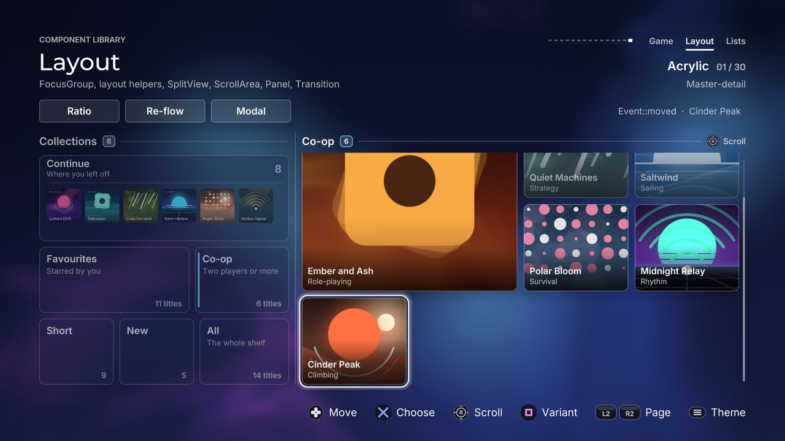

# Layout

[Back to the component guide](../COMPONENTS.md)



Headers: [`focus_group.hpp`](../../src/ui/components/focus_group.hpp),
[`layout.hpp`](../../src/ui/components/layout.hpp),
[`split_view.hpp`](../../src/ui/components/split_view.hpp),
[`scroll_area.hpp`](../../src/ui/components/scroll_area.hpp),
[`surface.hpp`](../../src/ui/components/surface.hpp),
[`transition.hpp`](../../src/ui/components/transition.hpp) &middot;
page: [`layout_page.cpp`](../../src/concepts/components/layout_page.cpp) &middot;
tests: [`components_layout_test.cpp`](../../tests/unit/components_layout_test.cpp)

The pieces that place other components and move the focus between them. The
other groups are things on a screen; this group is the screen: where things
go (`Row`, `Column`, `GridLayout`, `Wrap`), how they move when that changes
(`SpringLayout`, `Transition`), what they sit on (`Panel`, `Divider`,
`SectionHeader`), how two regions share the room (`SplitView`), how content
larger than its room is reached (`ScrollArea`), and how the D-pad finds its
way through all of it (`FocusGroup`).

The gallery page is built from these pieces alone, so it is the worked
example: read it next to this guide.

### How they fit together

```cpp
// update(): rectangles first, then the focus, then motion
const std::vector<gfx::Rect> cells = grid.layout(view, spans);   // pure arithmetic
springs.target(cells);                                           // ... eased
springs.update(dt, style);
for (int i = 0; i < springs.count(); ++i)
    focus.set_rect(kFirstCard + i, scroll.to_screen(springs.rect(i)));
if (focus.handle(input, feedback) == ui::Event::moved)
    scroll.reveal(springs.target_rect(focus.focus() - kFirstCard));
focus.update(dt);
scroll.update(dt);

// draw(): surfaces, content, then the one highlight
split.draw(canvas);
scroll.begin(canvas);
for (int i = 0; i < springs.count(); ++i)
    draw_card(canvas, springs.rect(i));
scroll.end(canvas);
focus.draw(canvas);
```

## FocusGroup

Spatial navigation for anything a screen draws. The screen registers each
focusable thing as a rectangle with an id; the group decides where up, down,
left and right lead from the geometry, owns the highlight that glides between
the items, plays the cues and refuses softly at the edges. A screen that uses
it has no navigation code of its own.

```cpp
#include "ui/components/focus_group.hpp"

ui::FocusGroup focus;                            // a member of your screen
focus.style.theme = theme;
focus.add({kPlay, play_rect});                   // id, rectangle
focus.add({kOptions, options_rect});
focus.add({kFirstCard, card_rect, kCards});      // ... and a scope tag
focus.set_focus(kPlay);

// update()
focus.set_rect(kFirstCard, card_rect);           // every frame, if it moves
switch (focus.handle(input, feedback))
{
case ui::Event::activated: run(focus.focus()); break;
case ui::Event::cancelled: leave(); break;
default: break;
}
focus.update(dt);

// draw(): after the items
focus.draw(canvas);
```

### How a direction picks its item

Take a move to the right; the other three are the same, turned. An item is a
candidate when it lies further right with both edges: its left edge is right
of the focused item's left edge, and its right edge right of the focused
item's right edge. (So a wide panel in the row below is "down", never
"right".) Each candidate gets a cost and the lowest wins; ties go to the item
added first.

```
along   = max(0, candidate.left - focused.right)       the gap to cross
shared  = the length the two share on the vertical axis
overlap = clamp(shared / min(candidate.h, focused.h), 0, 1)
side    = max(0, -shared)                              how far it is off to the side

cost = along
     + style.misalign * (1 - overlap)                  aligned items first
     + style.side_weight * side                        then the nearest sideways
     + (overlap > 0 ? 0 : style.beam_bias)             straight ahead beats off to the side
```

An item straight ahead wins over a nearer one that is off to the side, unless
that one is `beam_bias` pixels nearer. `FocusGroup::cost()` is public and
`neighbour(direction)` says where a move would go without making it.
`set_neighbour(id, direction, target)` overrides the answer for one item and
one direction: another id, `kNeighbourNone` for "nothing that way", or
`kNeighbourAuto` to give it back to the geometry.

### Scopes

Every item carries a scope tag (0 unless you give one): a pane, a toolbar, a
dialog.

- The group **remembers the last item focused in each scope**. A move that
  lands in another scope goes to that item, so re-entering a pane returns
  where you were. `forget(scope)` drops the memory (its content changed);
  `style.remember = false` turns it off.
- **`push_scope(scope, id)`** keeps the focus among the items of one scope: a
  modal layer. **`pop_scope()`** lifts the restriction and returns the focus to
  the item that had it before. Scopes nest. Add a layer's items when it opens
  and remove them when it closes (or keep them disabled), or the D-pad will
  find them under the screen.

### Items (`ui::FocusItem`)

| Field | Effect |
| --- | --- |
| `id` | Yours; 0 or above, unique in the group |
| `rect` | Where the item is on screen. Update it with `set_rect` as often as you like |
| `scope` | The region it belongs to |
| `enabled` | `false`: the focus passes over it |
| `radius` | The highlight's corner on this item; negative uses the style's |
| `picture` | The item is artwork, not a themed surface: the bevelled theme's dotted ring, which is drawn inside a control, goes around it instead (with the selection colour, as old desktops did) |
| `clip` | The highlight is cut to this while it sits on the item (give a `ScrollArea`'s bounds) |
| `up`, `down`, `left`, `right` | Explicit neighbours |

`add()` replaces an item with the same id. `clear()` forgets the items but
not the focus, so a screen may rebuild them every frame. An item that goes
away or is disabled while focused hands the focus to the nearest one left.

### Style (`ui::FocusGroupStyle`, on top of `ComponentStyle`)

| Knob | Default | Effect |
| --- | --- | --- |
| `highlight` | ring | A `HighlightStyle`: kind (ring, fill, tint, bar, underline, glow, none), colour, radius, thickness, grow, breathe |
| `press` | 3 | Pixels the highlight squeezes in on confirm |
| `inactive` | 0 | The highlight's opacity while `set_active(false)` |
| `clip_bleed` | 12 | Room past an item's `clip`, so a ring is not cut |
| `wrap` | false | Past the last item of a row or column comes its first (not on a held direction) |
| `remember` | true | Entering another scope returns to its last item |
| `exits` | none | Edges that hand the focus on instead of refusing (`ui::EdgeExits`) |
| `pitch_by_height` | true | The move cue falls in pitch down the screen |
| `misalign` | 60 | Cost of an item that only partly lines up |
| `side_weight` | 2 | Cost of each pixel an item is off to the side |
| `beam_bias` | 480 | Head start of items straight ahead; make it huge for "always first" |

### Events and cues

| Input | Event | Cue |
| --- | --- | --- |
| A direction with an item that way | `moved` | `sounds.move`, panned by the item's place, pitched by its height |
| A direction with none | `refused` | `sounds.refuse` (quiet), a short rumble, the highlight shakes; silent on a held direction |
| A direction through an edge in `style.exits` | `none`, and `exit()` names the edge | none |
| Confirm | `activated` | `sounds.activate`, a short rumble, the highlight squeezes |
| Back | `cancelled` | `sounds.cancel` |

Also: `focus()`, `focus_scope()`, `set_focus(id, snap)`, `set_active(bool)`,
`focus_amount(id)` (0..1: how much of an item the highlight covers, for its
own emphasis), `highlight_rect(time)`, `set_clip`, `set_enabled`,
`set_radius`, `scope_depth()`.

The highlight travels with its item: when the focused item scrolls or is
animated, the highlight is on it at once and does not chase it. Kinds that
fill (`fill`, `tint`, `bar`, `glow`) should be drawn between the items'
surfaces and their text; a ring can be drawn last.

## Row

Children one after another from left to right. `Row` and `Column` are the
same `ui::Stack` with the axis set. Fixed children take their size; flexible
ones share what is left by weight, within their minimum and maximum.

```cpp
#include "ui/components/layout.hpp"

ui::Row row{16.0f};                                  // gap; optional ui::Edges padding
const ui::LayoutChild children[] = {
    ui::LayoutChild::fixed(200.0f),                  // a button
    ui::Spacer::flex(),                              // pushes the rest to the right
    ui::LayoutChild::flexible(2.0f, 120.0f, 400.0f), // weight, min, max
};
const std::vector<gfx::Rect> r = row.layout(bounds, children);
row.layout(bounds, children, out_span);              // or into your own storage
row.layout(bounds, 4);                               // four equal children
```

| Knob | Default | Effect |
| --- | --- | --- |
| `gap` | 0 | Space between children |
| `padding` | none | `ui::Edges` inside the bounds (`Edges::all(8)`, `Edges::symmetric(h, v)`) |
| `main` | start | Spare room along the axis: after (start), around (center), before (end) or between the children (stretch) |
| `cross` | stretch | Children across the axis: fill it, or start, center, end for children that give a `cross` size |

`ui::LayoutChild`: `size` (negative: flexible), `flex`, `min`, `max`,
`cross`. `content_size(children)` is the length the fixed sizes, minimums,
gaps and padding need: a content size for a `ScrollArea`.

## Column

The same from top to bottom.

```cpp
ui::Column column{12.0f, ui::Edges::all(24.0f)};
const ui::LayoutChild rows[] = {ui::LayoutChild::fixed(56.0f), ui::LayoutChild::flexible(),
                                ui::LayoutChild::fixed(40.0f)};
const std::vector<gfx::Rect> r = column.layout(panel, rows);   // header, body, footer
```

Its knobs are `Row`'s.

## GridLayout

Equal columns. Children fill the cells row by row, each into the first free
place its span fits, so a wide child leaves no hole a smaller one could fill.

```cpp
ui::GridLayout grid;
grid.columns = 4;
grid.cell_aspect = 1.2f;                                  // cells a little wider than tall
const ui::GridSpan spans[] = {{2, 2}, {}, {}, {}, {}};    // a feature, then single cells
const std::vector<gfx::Rect> cells = grid.layout({0, 0, width, 0}, spans);
scroll.set_content_size(width, ui::bounds_of(cells).h);
```

| Knob | Default | Effect |
| --- | --- | --- |
| `columns` | 3 | Columns of equal width |
| `gap_x`, `gap_y` | 16, 16 | Space between cells |
| `padding` | none | Inside the bounds |
| `row_height` | 0 | Above 0: every row is this tall |
| `cell_aspect` | 1 | Otherwise a cell's width / height; 0: the rows share the bounds' height |

`layout(bounds, count)` places `count` single cells; `cell_width(width)` is
one column's width.

## Wrap

A flow layout: children keep their own sizes and fill a line; the one that
does not fit starts the next. Tags, chips, tiles of different widths.

```cpp
ui::Wrap wrap;
wrap.line = ui::LayoutAlign::stretch;                     // every line is filled
const std::vector<gfx::Rect> tiles = wrap.layout(bounds, sizes);   // ui::LayoutSize{w, h}
```

| Knob | Default | Effect |
| --- | --- | --- |
| `gap_x`, `gap_y` | 12, 12 | Space between children and between lines |
| `padding` | none | Inside the bounds |
| `line` | start | The spare room of a line: after, around or before the children, or shared out among them (stretch) |
| `cross` | start | A child shorter than its line: top, middle, bottom, or as tall as the line (stretch) |

A child wider than a line is cut to it.

### Small helpers (all `constexpr`)

| Helper | Gives |
| --- | --- |
| `inset(r, edges)`, `inset(r, h, v)` | The rectangle inside the padding; never inside out |
| `split(r, side, amount, gap)` | `{strip, rest}`: a strip cut off the left, top, right or bottom |
| `center_in(outer, w, h)`, `align_in(outer, w, h, horizontal, vertical)` | A rectangle of a size placed in another |
| `aspect_fit(outer, aspect)` | The largest rectangle of that aspect inside `outer` (a picture shown whole) |
| `aspect_fill(outer, aspect)` | The smallest one that covers it (a picture cropped by a clip) |
| `translate(r, dx, dy)` | The rectangle moved |
| `bounds_of(rects)` | The rectangle around all of them (not `constexpr`) |

## SpringLayout

Rectangles that ease to new places when a layout changes. Give it the result
of a layout as often as you like and draw `rect(i)` instead; children are
keyed by index, so "child 3" glides from where it was to where it now belongs.

```cpp
springs.stagger = 0.02f;                       // the children leave one after another
springs.target(grid.layout(area, spans));      // update()
springs.update(dt, style);                     // the theme's pace and bounce
draw_card(canvas, springs.rect(i));            // draw()
```

| Member | Effect |
| --- | --- |
| `stagger` | Seconds between one child starting to move and the next; 0 moves them together |
| `snap(rects)` | Places them without motion |
| `target(rects)` | New places. The first call snaps; a child that appears later starts in its place |
| `update(dt, style)` | Moves at `style.omega()` with `style.damping()`; reduced motion snaps. `update(dt, omega, damping)` takes the numbers |
| `rect(i)`, `rects()`, `target_rect(i)`, `count()`, `settled()` | Where a child is, where it is going |

Positions may overshoot in a theme that bounces; sizes never do, so text
inside does not jump.

## SplitView

Master and detail: two panes (or three) with a divider between them. It owns
the geometry and the emphasis, not the content: it says where each pane is,
dims the panes without the focus, draws the dividers and optional panels and
animates the ratio.

```cpp
#include "ui/components/split_view.hpp"

ui::SplitView split;
split.style.ratio = 0.36f;                       // the first pane's share
split.set_bounds(area);
list.set_bounds(split.pane_rect(0));             // place your components
grid.set_bounds(split.pane_rect(1));

// update(): an edge exit of the focused pane crosses the split
if (grid.handle(input, feedback) == ui::Event::none && grid.exit() != Direction::none)
    split.handle_exit(grid.exit(), input, feedback);   // moved, or a soft refusal
split.set_preset(ui::SplitPreset::collapsed);    // or set_ratio(0.5f): it glides
split.update(dt);

// draw()
split.draw(canvas);                              // panels and dividers
split.begin_pane(canvas, 0);  list.draw(canvas);  split.end_pane(canvas, 0);
split.begin_pane(canvas, 1);  grid.draw(canvas);  split.end_pane(canvas, 1);
```

With a `FocusGroup` spanning both panes the group does the crossing; the
screen only says which pane has the focus: `split.set_focus(pane)`, or `-1`
when the focus is outside the view (no pane dims then).

### Style (`ui::SplitStyle`, on top of `ComponentStyle`)

| Knob | Default | Effect |
| --- | --- | --- |
| `axis` | horizontal | Panes side by side, or stacked (`vertical`) |
| `ratio` | 0.36 | The first pane's share of the room; writing it (or `set_ratio`) glides |
| `third` | 0 | A third pane's share; 0 for two panes |
| `gap` | 32 | Between two panes; the divider runs down its middle |
| `min_pane` | 0 | No pane gets smaller than this, unless it is collapsed |
| `regular`, `compact`, `wide` | 0.36, 0.24, 0.6 | What the presets of those names mean |
| `panels` | false | A themed panel behind every pane |
| `panel_kind` | plain | `plain` or `well` |
| `panel_padding` | 20 | Between such a panel and `pane_rect()` |
| `divider` | true | A line in the gap (not drawn between panels) |
| `line` | solid | `solid`, `dashed` or `inset` |
| `divider_inset` | 0 | The line stops this far short of the panes' ends |
| `dim` | 0.4 | How far the panes without the focus fade |
| `dim_mode` | automatic | `fade` draws the pane's content at a lower opacity: right over anything, but shapes fade one by one, so a surface over its own shadow turns grey. `veil` lays a wash of the colour behind the pane over it: exact where the page is plain. `automatic` veils on a plain page and fades over a backdrop and in glass themes |
| `clip` | true | `begin_pane()` clips to the pane while the ratio is moving |
| `on_panel` | false | The whole view lies on a themed surface |

Presets (`set_preset`): `collapsed` (the first pane folds away with its gap
and the second has everything), `compact`, `regular`, `balanced`, `wide`.

### Events and cues

| Call | Event | Cue |
| --- | --- | --- |
| `cross(direction, feedback)` toward a pane | returns `true` | `sounds.move`, panned to the pane |
| `handle_exit(direction, input, feedback)` toward a pane | `moved` | the same |
| ... toward nothing (the edge, along the divider, a collapsed pane) | `refused` | `sounds.refuse` (quiet), a short rumble, the focused pane's content is nudged; silent on a held direction |

Also: `pane_rect(i)`, `pane_frame(i)` (what its panel covers),
`target_pane_rect(i)` (where it will be when the ratio has settled),
`divider_rect(i)`, `pane_count()`, `pane_opacity(i)`, `pane_toward(direction)`,
`ratio()`, `moving()`, `collapsed()`, `focus()`.

## ScrollArea

Scrolling for content of any kind. The screen says how large the content is,
draws it between `begin()` and `end()` in the content's own coordinates (the
clip and the transform are pushed for it) and asks the area to keep the
focused thing in view.

```cpp
#include "ui/components/scroll_area.hpp"

ui::ScrollArea scroll;
scroll.set_bounds(view);
scroll.set_content_size(view.w, 2400.0f);

// update()
scroll.handle(input, feedback);                  // the right stick scrolls
scroll.reveal(card);                             // when the focus moves (content coordinates)
scroll.update(dt);

// draw()
scroll.begin(canvas);
for (const gfx::Rect &card : cards)
{
    canvas.list.push_opacity(scroll.visibility(card));   // soft edges
    draw_card(canvas, card);
    canvas.list.pop_opacity();
}
scroll.end(canvas);
scroll.draw(canvas);                             // the thumbs
```

### Style (`ui::ScrollStyle`, on top of `ComponentStyle`)

| Knob | Default | Effect |
| --- | --- | --- |
| `axes` | vertical | `vertical`, `horizontal` or `both`. An axis that does not scroll never moves |
| `margin` | 28 | Room `reveal()` keeps between its target and the view's edge |
| `stick` | true | The right stick scrolls |
| `stick_speed` | 1500 | Pixels a second at full deflection (the response is squared: a small tilt creeps) |
| `edge_fade` | 0.8 | `visibility()` fades content over this share of its own size where an edge cuts it; 0 turns it off |
| `clip_bleed` | 10 | The clip is this much larger than the bounds, for rings and shadows |
| `thumb` | true | A position marker on each axis that overflows |
| `thumb_width`, `thumb_gap`, `thumb_min` | 5, 9, 36 | Its width, its distance outside the bounds, its smallest length |
| `thumb_idle` | 0.5 | Its opacity at rest; it brightens while the area moves |
| `on_panel` | false | It lies on a themed surface, not on the page |

### Events and cues

| Input | Event | Cue |
| --- | --- | --- |
| Right stick, content moves | `changed` | none: scrolling is silent |
| Right stick pushed against an end | `refused` once, then `none` | `sounds.refuse` (quiet), the thumb flashes in the focus colour |
| Anything else | `none` | none |

Also: `to_screen(rect)` and `to_content(rect)` (give `to_screen` rectangles to
a `FocusGroup`), `visible()` (the content window in view), `visibility(rect)`
(0..1; content fades only toward an edge that hides more content),
`scroll_to(x, y, snap)`, `scroll_by(dx, dy)`, `offset_x()`, `offset_y()`,
`max_x()`, `max_y()`, `progress_x()`, `progress_y()`.

## Panel

A themed surface for a group of content: plain, with a title bar, or sunk
into what is behind it. It draws itself and says where the content goes.

```cpp
#include "ui/components/surface.hpp"

ui::Panel panel;
panel.style.kind = ui::PanelKind::titled;
panel.title = "Storage";
panel.subtitle = "412 GB free";
panel.set_bounds(rect);
panel.draw(canvas);
draw_my_content(panel.content_rect());

panel.draw(canvas, other_rect);                  // one Panel can draw a whole column
```

### Style (`ui::PanelStyle`, on top of `ComponentStyle`)

| Knob | Default | Effect |
| --- | --- | --- |
| `kind` | plain | `plain` (the theme's panel), `titled` (with a title bar), `well` (sunk) |
| `padding_x`, `padding_y` | 24, 20 | Between the panel's edge and its content |
| `radius` | -1 | Corner; negative uses the theme's card radius |
| `header_height` | 0 | The title bar; 0 fits the title and the subtitle |
| `footer_height` | 0 | Room for the `footer` slot; 0: no footer |
| `header_slot` | 120 | Width kept at the right of the title bar for `header_right` |
| `title_size`, `subtitle_size` | 24, 19 | Text sizes |
| `surface` | true | `false`: no surface, only the title bar, rules and slots (the panel lies on a surface drawn by something else: a split view's pane, an overlay) |
| `header_rule` | true | A line under the title bar and over the footer |
| `rule` | solid | That line: `solid`, `dashed`, `inset` |
| `accent_bar` | false | A short bar in the accent colour before the title |

### Slots

| Slot | Draws |
| --- | --- |
| `header_right` | At the right end of the title bar: a count, a switch, a status |
| `footer` | In the footer: buttons, a total |

Each receives the canvas and the rectangle it may draw in. `content_rect()`,
`header_rect()` and `footer_rect()` (also with a rectangle given on the spot)
say where things are. A panel takes no input and plays no cue; make it
focusable with a `FocusGroup`.

## Divider

A line between two groups, with an optional word in the middle. The theme
decides what a line is: a pen stroke in the sketch theme, square dashes on the
grid in the pixel theme, a groove where surfaces are bevelled or soft, a lit
stroke on the sci-fi console.

```cpp
ui::Divider divider;
divider.style.line = ui::DividerLine::dashed;
divider.label = "OR";
divider.set_bounds({x, y, width, 16.0f});        // the line runs through the middle
divider.draw(canvas);

ui::draw_divider(canvas, style, rect);           // or without an object
```

| Knob | Default | Effect |
| --- | --- | --- |
| `vertical` | false | The line runs down the bounds instead of across |
| `line` | solid | `solid`, `dashed`, `inset` (a groove: a dark line beside a light one) |
| `thickness` | 0 | 0 takes the theme's stroke (1.5 at least, 4 at most; `divider_thickness(style)` says) |
| `dash`, `dash_gap` | 12, 8 | A dash and the space after it |
| `inset` | 0 | The line stops this far short of both ends |
| `color` | theme | Alpha 0: the theme's stroke colour, or a muted text tone where it has none |
| `on_panel` | false | It lies on a themed surface, not on the page |
| `label_size`, `label_gap` | 18, 14 | The label, and the space between it and the line |

## SectionHeader

The title of a group: a name, how many things are in it, and what a button
does with them.

```cpp
ui::SectionHeader header;
header.title = "Recently played";
header.set_count(12);                            // pops when it changes; negative hides it
header.action = "Sort";
header.action_button = ui::Button::triangle;
header.set_bounds({96, 240, 800, 44});
header.update(dt);
header.draw(canvas);
```

| Knob | Default | Effect |
| --- | --- | --- |
| `title_size` | 26 | The title, in the theme's label face |
| `caps` | false | The title in capitals, whatever the theme does with labels |
| `gap` | 14 | Between the title, the count, the line and the action |
| `count_kind`, `count_fill` | neutral, tinted | The count's badge (`ui::Status`, `ui::BadgeFill`) |
| `count_height`, `count_size` | 28, 17 | Its size |
| `hide_zero` | false | A count of 0 hides the badge |
| `hint_size`, `glyph_size` | 20, 30 | The action's words and its controller glyph |
| `rule` | trailing | `trailing` (a line from the title to the action), `under` (along the bottom), `none` |
| `line` | solid | That line: `solid`, `dashed`, `inset` |
| `on_panel` | false | It lies on a themed surface, not on the page |

The count is a `ui::Badge`. The header takes no input; the screen handles the
button it names.

## Spacer

Empty children for a `Row` or a `Column`, named for what they are for, and the
kit's spacing scale.

```cpp
const ui::LayoutChild bar[] = {ui::LayoutChild::fixed(160),
                               ui::Spacer::flex(),        // takes what is left
                               ui::Spacer::fixed(24),     // a gap of a fixed size
                               ui::LayoutChild::fixed(160)};
const float gap = ui::space(2);                           // 16: multiples of 8
```

## Transition

How a region arrives, leaves or changes its content: an opacity, an offset
and a scale, eased at the theme's pace, applied to everything drawn between
`begin()` and `end()`.

```cpp
#include "ui/components/transition.hpp"

ui::Transition appear;
appear.start(ui::TransitionKind::slide, Direction::up);   // rises into place
appear.update(dt);
appear.begin(canvas, region);
draw_the_region();
appear.end(canvas);

// One content replaces another along a shared axis:
swap.start(ui::TransitionKind::push, Direction::left);    // when B replaces A
if (swap.running())
{
    swap.begin(canvas, region, ui::TransitionPhase::outgoing);
    draw(a);                                              // slides out and fades
    swap.end(canvas);
}
swap.begin(canvas, region);
draw(b);                                                  // slides in behind it
swap.end(canvas);
```

| Kind | What it does |
| --- | --- |
| `fade` | Opacity only |
| `slide` | Fades while it travels `style.distance` in a direction (the way it moves: `up` rises from below) |
| `scale` | Fades while it grows from `style.scale` to full size, about the region's centre |
| `push` | The old content leaves along the direction as the new one arrives from the other side; the two are never read at once |

### Style (`ui::TransitionStyle`, on top of `ComponentStyle`)

| Knob | Default | Effect |
| --- | --- | --- |
| `duration` | 0 | Seconds; 0 takes it from the theme's speed (about 0.3 at omega 16) |
| `distance` | 40 | How far a slide or a push travels |
| `scale` | 0.92 | The size a scaled region starts from, and leaves to |
| `exit_speed` | 1.4 | An exit is this much quicker than an entrance |
| `clip` | false | `begin()` clips to the region, so moving content cannot spill |
| `clip_bleed` | 12 | Room past the region inside that clip |

`start(kind, direction)` begins an entrance or a push, `leave(kind,
direction)` an exit, after which `visible()` is false. `finish()`, `show()`
and `hide()` skip the motion. `running()`, `leaving()`, `progress()`,
`opacity(phase)`, `scale(phase)`, `offset_x(phase)` and `offset_y(phase)` give
the numbers for drawing that cannot go through `begin()` and `end()`.

With reduced motion every kind is a plain, short fade. A theme that bounces
lets an arrival overshoot a little. A transition takes no input and plays no
cue: the component that starts it plays its own.
