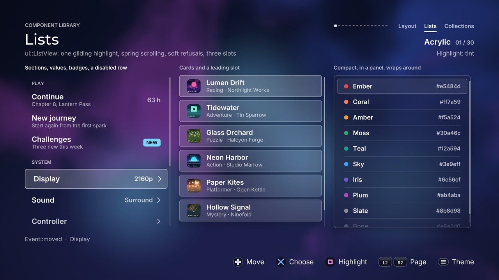

# Lists

Header: [`src/ui/components/list.hpp`](../../src/ui/components/list.hpp) &middot;
page: [`lists_page.cpp`](../../src/concepts/components/lists_page.cpp) &middot;
tests: [`components_list_test.cpp`](../../tests/unit/components_list_test.cpp)



## ListView

A vertical list for menus, settings indexes, libraries and pickers. One
highlight glides between rows, the list scrolls on a spring to keep the
focused row (and its section header) in view, rows fade where the view cuts
them, and both ends refuse softly. Section headers are skipped by the focus.

```cpp
#include "ui/components/list.hpp"

ui::ListView list;                                   // a member of your screen
list.style.theme = theme;                            // any ui::Theme
list.style.highlight.kind = ui::HighlightKind::bar;
list.set_items({{"Continue", "Chapter 8"}, {"Options"}, {"Quit"}});
list.set_bounds({96, 240, 720, 600});

// update()
switch (list.handle(input, feedback))
{
case ui::Event::activated: open(list.focus()); break;
case ui::Event::cancelled: leave(); break;
default: break;
}
list.update(dt);

// draw()
ui::Canvas canvas{frame.scene, context.fonts, frame.glass_texture, clock};
list.draw(canvas);
```

### Items (`ui::ListItem`)

| Field | Effect |
| --- | --- |
| `title` | The row's label, cut with "..." when it does not fit |
| `subtitle` | A second, quieter line; empty for a one-line row |
| `value` | Right-aligned text |
| `badge` | A small pill before the value |
| `swatch` | A leading dot in that colour (alpha above 0) |
| `chevron` | A "this opens something" arrow at the end; it nudges when focused |
| `disabled` | Dimmed; can take the focus but refuses confirm |
| `header` | A section title; never focused |
| `tag` | An integer of yours |

### Style (`ui::ListStyle`, on top of `ComponentStyle`)

| Knob | Default | Effect |
| --- | --- | --- |
| `row_height` | 76 | Height of a row |
| `header_height` | 52 | Height of a section header |
| `gap` | 6 | Space between rows |
| `padding` | 26 | Space inside a row, left and right |
| `leading_width` | 0 | Room reserved at the start of a row for the `leading` slot |
| `panel_padding` | 14 | Space between the panel and the rows when `panel` is on |
| `title_size`, `subtitle_size`, `value_size`, `header_size` | 28, 20, 24, 18 | Text sizes |
| `highlight` | tint | A `HighlightStyle`: kind (ring, fill, tint, bar, underline, glow, none), colour, radius, thickness, grow, breathe |
| `panel` | false | A themed panel behind the whole list |
| `cards` | false | Every row is a themed surface of its own |
| `dividers` | false | Hairlines between rows |
| `scroll_thumb` | true | A thin position marker, only when the list overflows |
| `wrap` | false | Past the last row comes the first (not on a held direction) |
| `focus_shift` | 8 | How far the focused row's text moves right |
| `edge_fade` | 0.8 | Rows fade over this share of a row where the view cuts them; 0 turns it off |
| `entrance_step` | 0.03 | Seconds between rows arriving after `enter()`; 0 for none |
| `pitch_by_position` | true | The move cue falls in pitch down the list |

### Slots

| Slot | Replaces |
| --- | --- |
| `leading` | Draws into the first `leading_width` pixels of a row (an icon, a cover, an avatar) |
| `trailing` | The value, badge and chevron |
| `content` | Everything inside a row; the highlight and scrolling stay |

Each receives the canvas, the row's rectangle on screen, the item, its index
and its focus amount (0..1).

### Events and cues

| Input | Event | Cue |
| --- | --- | --- |
| Up, down | `moved` | `sounds.move`, pitched by position, panned by the list's place on screen |
| Up or down at an end | `refused` | `sounds.refuse` (quiet), a short rumble, a shake; silent on a held direction |
| Confirm | `activated` | `sounds.activate`, a short rumble |
| Confirm on a disabled row | `refused` | as above |
| Back | `cancelled` | `sounds.cancel` |

Also: `set_focus(index, snap)`, `set_active(false)` to dim the highlight while
another component has the focus, `enter()` to replay the entrance,
`row_rect(index)` to anchor a menu or a tooltip to a row.
