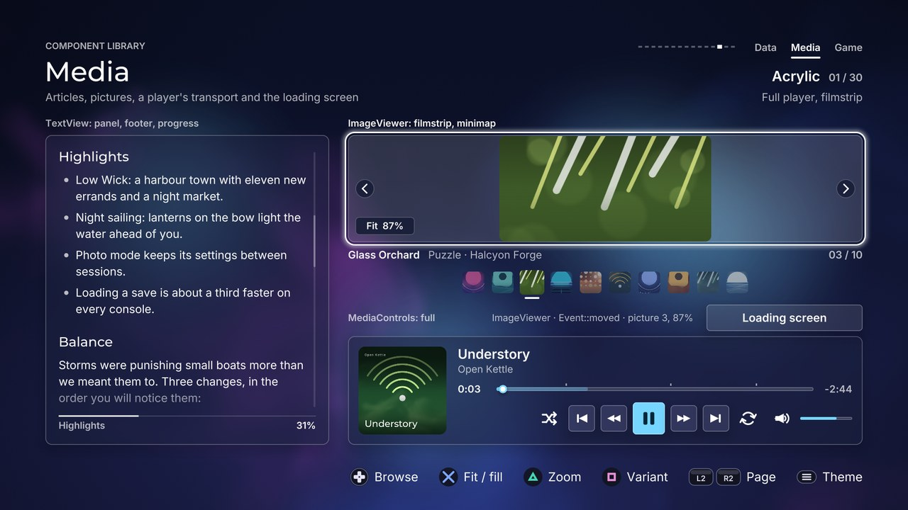

# Media: TextView, ImageViewer, MediaControls, LoadingScreen

[Back to the component guide](../COMPONENTS.md)



[Back to the component guide](../COMPONENTS.md)

Components that show content, and its playback or loading. Headers are in
`src/ui/components/`: `text_view.hpp`, `image_viewer.hpp`,
`media_controls.hpp`, `loading_screen.hpp`. The gallery page is
`src/concepts/components/media_page.cpp`.

Every style struct derives from `ui::ComponentStyle`, so each also has
`theme`, `sounds` and `reduced_motion`. With `reduced_motion` nothing travels,
bounces or stretches: positions change at once and things fade.

TextView, ImageViewer and MediaControls sit on a screen among other things,
and share three habits (LoadingScreen is modal: it takes every input while it
is open):

- **`set_active(bool)`** says whether the component has the screen's focus.
  An inactive component drops its focus ring and keeps its state. Do not call
  `handle()` on it meanwhile.
- **Analog input is read in `handle()` and spent in `update()`.** The right
  stick (TextView), the left stick and the triggers (ImageViewer) are stored
  by `handle()` and applied with the frame's `dt` by the next `update()`.
  Call `handle()` every frame while the component has the focus, also on
  frames without a press.
- **Edges that lead somewhere hand the focus on.** Each of the three styles
  has `ui::EdgeExits exits`. When an input reaches an edge the style allows,
  `handle()` returns `Event::none` and `exit()` names the direction, so the
  screen can move its focus to a neighbour. Without it the edge refuses
  softly: the `refuse` cue at low gain, a short rumble, a small nudge, and
  silence while the direction is held.

## TextView

A scrolling article for licences, patch notes and help. The content is a list
of blocks: headings in three levels, paragraphs, bullet and numbered items,
quotes, code, dividers, key-value lines and image slots. The text is wrapped
once, in the theme's own faces, when the content, the width or the theme
changes; a frame only draws the lines in view.

```cpp
ui::TextView notes;
notes.style.theme = theme;
notes.set_content({
    ui::TextBlock::heading("Update 1.4"),
    ui::TextBlock::key_value("Version", "1.4.0"),
    ui::TextBlock::paragraph("What changed in this release."),
    ui::TextBlock::heading("Fixes", 2),
    ui::TextBlock::bullet("Loading a save is a third faster."),
    ui::TextBlock::code("front \"autumn gale\"\n  wind 38 kn"),
});
notes.set_bounds({96, 240, 720, 640});
notes.layout(context.fonts);          // optional, see below

// every frame
notes.handle(input, feedback);        // up / down and the right stick
if (input.is_pressed(Action::north))
    notes.next_heading(1, feedback);  // bind the extras to buttons of your choice
notes.update(dt);
notes.draw(canvas);
```

**Blocks.** Build them with the helpers of `ui::TextBlock`:

| Helper | What it is |
| --- | --- |
| `heading(text, level)` | Level 1 and 2 use the theme's heading face (level 1 gets a short rule); level 3 is a small line in the label face and the quiet colour |
| `paragraph(text)` | Running text; `'\n'` forces a line break |
| `bullet(text)` | One item of an unordered list. The marker is round or square as the theme is |
| `numbered(text, marker)` | One item of an ordered list. It counts by itself; a run ends at the first block that is not `numbered`. `marker` replaces the number |
| `quote(text)` | Set in from a bar, in the quiet colour |
| `code(text)` | Monospaced lines on a sunken plate. `'\n'` breaks lines and leading spaces are kept; long lines wrap |
| `divider()` | A hairline |
| `key_value(key, value)` | Key on the left, value on the right, a hairline between neighbours |
| `image(caption, height, tag)` | Room for a picture, drawn by the `image` slot, and a caption under it |

**When the text is wrapped.** `draw()` wraps it when needed, so a component
that is drawn before it is used needs nothing. `handle()` and the scroll calls
need the heights: if input can arrive before the first draw (a screen built
while another one is showing), call `layout(fonts)` once. The fonts must
outlive the component. A re-wrap keeps the reader's place: the block that was
at the top of the view is put back there.

Other calls: `page(direction, feedback)` (most of a view up or down),
`next_heading(direction, feedback)` (to the next or previous heading the
contents list), `scroll_to(offset, snap)`, `scroll_to_block(index, snap)`,
`block_offset(index)`, `scroll()`, `scroll_limit()`, `content_height()`,
`progress()` (0 at the top, 1 at the end), `headings()` (block indices),
`current_heading()` (the section at the top of the view, -1 before the
first), `exit()`.

| Knob | Default | Effect |
| --- | --- | --- |
| `padding` | 28 | Between the bounds and the text |
| `max_width` | 0 | The widest a line may be (a reading measure); 0 fills the view |
| `block_gap` | 20 | Between blocks |
| `item_gap` | 10 | Between neighbouring list items and key-value lines |
| `heading_gap` | 34 | Above a level 1 or 2 heading |
| `indent` | 36 | List items and quotes |
| `image_height` | 170 | An image block with no height of its own |
| `footer_height` | 44 | The strip with the section name and the progress |
| `toc_width` | 220 | The contents column |
| `toc_row` | 44 | One of its rows |
| `toc_gap` | 26 | Between the contents and the text |
| `body_size` | 24 | Running text |
| `line_height` | 1.45 | Of running text, in body sizes |
| `heading_size` | 36 | Level 1 |
| `subheading_size` | 28 | Level 2 |
| `minor_size` | 20 | Level 3 |
| `code_size` | 21 | Code |
| `caption_size` | 20 | Image captions, the footer and the contents |
| `panel` | true | A themed panel behind the article. Without it the text takes the page's text colours |
| `focus_ring` | true | The theme's ring around the bounds while active |
| `scroll_thumb` | true | Shown only when the text overflows |
| `footer` | true | The current section on the left, "42%" on the right, and a hairline that fills as the reader goes |
| `toc` | false | A contents column built from the headings; a marker glides to the section in view |
| `toc_levels` | 2 | Headings down to this level are listed, and are what `next_heading()` jumps to |
| `heading_rule` | true | A short rule under level 1 headings |
| `edge_fade` | 72 | The text thins out over this many pixels above the lower edge while more follows; lines the upper edge cuts fade as they are cut. 0 turns both off |
| `step` | 132 | Pixels one press of up or down scrolls |
| `page_share` | 0.86 | Of the view, per `page()` |
| `stick_speed` | 900 | Pixels per second at full deflection of the right stick. The response is squared: fine near the centre |
| `stick_boost` | 2.6 | The speed is multiplied by up to this while the stick stays pushed |
| `stick_ramp` | 1.4 | Seconds of holding to reach the boost |
| `pitch_by_position` | true | Scroll ticks sound lower toward the end |
| `exits` | none | `up` / `down`: at the top or the end, hand the focus on |

Slot: `image(canvas, box, block, index)` draws an image block. Without it a
placeholder is drawn.

| Input | Event | Cue |
| --- | --- | --- |
| Up / down | `moved` | `sounds.move`, quiet |
| Up at the top, down at the end | `refused` (or `none` and `exit()`) | `sounds.refuse`; silent on a held direction |
| Right stick | `none` | none: it scrolls |
| Left / right | `none`: they are the screen's | |
| Back | `cancelled` | `sounds.cancel` |
| `page()`, `next_heading()` | `moved`, or `refused` at an end | `sounds.page` |

## ImageViewer

One picture fitted to a stage, with zoom and pan; given more than one picture
it is a gallery with a filmstrip and a counter. Only the visible part of a
picture is drawn: its uv rectangle is cropped, so a zoomed picture needs no
clip and keeps rounded corners.

```cpp
ui::ImageViewer viewer;
viewer.style.theme = theme;

std::vector<ui::ViewerImage> images;
ui::ViewerImage image;
image.title = "Low Wick at dusk";
image.texture = texture;          // 0 draws a placeholder gradient
image.uv = gfx::kCanvasUv;        // gfx::kFullUv for uploaded pixels
image.aspect = 16.0f / 9.0f;      // width / height of the picture inside uv
image.pixel_width = 1920.0f;      // enables 1:1
images.push_back(image);
viewer.set_images(std::move(images));
viewer.set_bounds({776, 290, 1048, 350});

// every frame
viewer.handle(input, feedback);
viewer.update(dt);
viewer.draw(canvas);
```

**Zoom.** A scale of 1 is "fit". Confirm cycles the modes that differ for the
picture: fit, fill (the stage covered, the picture cropped) and 1:1 (when
`pixel_width` is known). The analog triggers zoom freely between fit and the
limit; `zoom_in()`, `zoom_out()` and `cycle_zoom()` do it in steps, for a
screen that binds zoom to buttons (the gallery page uses Triangle, because L2
and R2 turn its pages; a real screen should leave the triggers to the viewer).
Back returns to fit before it cancels.

**Pan.** The left stick pans while the picture is cropped, and can pull it a
little past its edge; released, it springs back. The D-pad pans in steps on an
axis where the picture overflows and refuses at the picture's edge. Steps the
input tracker derives from the left stick are ignored while the picture is
cropped, since the stick already pans.

**Gallery.** On an axis where nothing overflows, left and right browse. The
pictures slide; fill and 1:1 carry over to the next picture, a free zoom does
not. Up and down are not the viewer's then.

Other calls: `set_index(index, snap)`, `index()`, `set_mode(mode, snap)`,
`set_zoom(scale, snap)`, `mode()`, `zoom()`, `zoomed()`, `percent()` (the
readout's number), `pan_x()`, `pan_y()`, `stage()`, `picture_rect()`, `exit()`.

| Knob | Default | Effect |
| --- | --- | --- |
| `radius` | -1 | The stage's corners; negative takes them from the theme. Themes with cut or notched corners get a square stage |
| `thumb_size` | 60 | Filmstrip thumbnails (square, cut from the middle of the picture) |
| `thumb_gap` | 10 | Between them |
| `strip_gap` | 14 | Between the caption and the filmstrip |
| `caption_size` | 22 | The title line and the counter |
| `caption_gap` | 12 | Between the stage and that line |
| `slide_gap` | 40 | Between two pictures while one replaces the other |
| `minimap_size` | 150 | The longer side of the minimap |
| `overlay_inset` | 14 | Minimap, readout and arrows from the stage's edge |
| `readout_size` | 20 | The zoom readout's text |
| `frame` | true | A sunken stage behind the picture (the letterbox) |
| `focus_ring` | true | The theme's ring around the stage while active |
| `filmstrip` | true | Thumbnails under the stage, with a marker that glides (galleries only) |
| `caption` | true | The title and caption under the stage |
| `counter` | true | "03 / 12" at the end of that line (galleries only) |
| `minimap` | true | Where the view is in the picture; appears while the picture is cropped |
| `readout` | true | "Fit 88%", "Fill 212%", "1:1 100%", "250%" |
| `arrows` | true | Chevrons at the stage's sides when there is a neighbour |
| `on_panel` | false | The viewer sits on a themed panel: the caption takes the panel's text colours |
| `thumb_dim` | 0.45 | How far thumbnails other than the current one fade |
| `max_zoom` | 4 | Times the fitted size (fill and 1:1 may exceed it) |
| `zoom_step` | 1.5 | One `zoom_in()` or `zoom_out()` |
| `zoom_rate` | 1.6 | Triggers: e-folds per second at full pull |
| `trigger_zoom` | true | Read `input.trigger_l` / `trigger_r` in `handle()` |
| `pan_speed` | 1100 | Pixels per second at full deflection of the left stick |
| `pan_step` | 0.3 | Of the stage, per D-pad press |
| `rubber` | 46 | Pixels the picture can be pulled past its edge |
| `pixel_scale` | 1 | Virtual pixels per picture pixel at 1:1 |
| `wrap` | false | Past the last picture comes the first |
| `exits` | none | `left` / `right`: at the first or last picture, or at the picture's edge while panning. `up` / `down`: whenever there is nothing to pan that way |

Slot: `picture(canvas, where, image, index, alpha)` draws a picture instead
of its texture. `where` is the whole picture on screen and may be larger than
the stage; the viewer clips to it. The stage, the thumbnails and the minimap
all use the slot.

| Input | Event | Cue |
| --- | --- | --- |
| Left / right, nothing to pan | `moved`: another picture | `sounds.move`, panned along the gallery |
| The same at either end | `refused` (or `none` and `exit()`) | `sounds.refuse` |
| D-pad on an axis that overflows | `changed`: panned a step | `sounds.step`, quiet |
| The same at the picture's edge | `refused` (or `none` and `exit()`) | `sounds.refuse` |
| Up / down, nothing to pan | `none` (and `exit()` when allowed) | |
| Left stick, triggers | `none` | none |
| Confirm | `changed`: the next mode | `sounds.change`, higher when zooming in |
| Back while zoomed | `changed`: back to fit | `sounds.cancel` |
| Back at fit | `cancelled` | `sounds.cancel` |
| `zoom_in()`, `zoom_out()`, `cycle_zoom()` | `changed`, or `refused` at the limit | `sounds.step`, pitched by the zoom |

## MediaControls

The transport of an audio or video player: play and pause, previous and next,
rewind and forward, shuffle and repeat, a volume control and a scrubber with
both times, the buffered range and chapter marks. The icons are drawn from
shapes and the buttons are the theme's own.

The component owns what is on screen: the focus, the thumb, the toggles and
the volume. It owns nothing of the playback. It reports what the player asked
for and the screen feeds it the clock:

```cpp
ui::MediaControls controls;
controls.style.theme = theme;
controls.title = "Lantern Pass";
controls.artist = "Ninefold";
controls.set_duration(234.0f);
controls.set_chapters({{0.0f, "Opening"}, {96.0f, "Open water"}});
controls.set_bounds({776, 700, 1048, controls.preferred_height()});

// every frame
if (controls.handle(input, feedback) != ui::Event::none)
{
    switch (controls.command())
    {
    case ui::MediaCommand::play:     player.play();     break;
    case ui::MediaCommand::pause:    player.pause();    break;
    case ui::MediaCommand::next:     player.next();     break;
    case ui::MediaCommand::previous: player.previous(); break;
    case ui::MediaCommand::seek:
    case ui::MediaCommand::rewind:
    case ui::MediaCommand::forward:  player.seek(controls.seek_position()); break;
    case ui::MediaCommand::volume:   player.set_volume(controls.volume());  break;
    default: break;
    }
}
controls.set_playing(player.playing());
controls.set_position(player.position());
controls.set_buffered(player.buffered());
controls.update(dt);
controls.draw(canvas);
```

**Commands.** `command()` is what the last `handle()` asked for.

| Command | Event | Meaning |
| --- | --- | --- |
| `play`, `pause` | `activated` | A request. The play button shows what `set_playing()` says, not what was pressed |
| `previous`, `next` | `activated` | A request |
| `rewind`, `forward` | `activated` | `seek_position()` is `skip_seconds` away. The thumb has already moved |
| `seek` | `changed` | The scrubber moved to `seek_position()` |
| `shuffle`, `repeat` | `changed` | Held by the component: read `shuffle()`, `repeat()` (a `MediaRepeat`: `off`, `all`, `one`) |
| `volume`, `mute` | `changed` | Read `volume()` (0..1) and `muted()` |

**Focus.** The buttons are one row: left and right move, and one ring glides
between them. Up goes to the scrubber, where left and right seek, each repeat
of a held direction going further (`seek_growth`, up to `seek_max`), and where
the ring locks onto the thumb and a bubble shows the time and the chapter.
Confirm on the scrubber is play / pause; down returns to the button it came
from. Confirm on the volume button captures left and right (up and down work
too) until confirm or back gives them back; `adjusting()` says so, for the
hint row. `toggle_mute(feedback)` is for a screen that binds mute to a button.

**Layouts.** `MediaLayout::full` has the artwork, title and artist, the
scrubber between both times, and the row of buttons with the volume at its
end. `MediaLayout::compact` is one row of buttons, "0:42 / 3:54", the title
and the toggles, under a scrubber line: a video overlay.
`preferred_height()` gives the height either needs.

**Auto-hide.** With `auto_hide` the controls fade out after that many seconds
without input while playing. The first press on hidden controls only brings
them back (`handle()` returns `Event::none`). `visibility()` is 0..1, for
dimming chrome of your own; `hidden()` and `wake()` do what they say. The
countdown runs only while playing, unless `hide_paused` is set.

Other calls: `set_shuffle()`, `set_repeat()`, `set_volume(level, muted)`,
`duration()`, `position()`, `playing()`, `chapter_at(seconds)`, `focus()`,
`set_focus(control)`, `control_rect(control)`, `exit()`.

| Knob | Default | Effect |
| --- | --- | --- |
| `layout` | `full` | `MediaLayout::full` or `compact` |
| `buttons` | `surface` | `MediaButtons::surface`: the theme's buttons, play is the primary one. `ghost`: icons only |
| `padding` | 22 | Between the bounds and the content |
| `button_size` | 56 | Every button but play |
| `play_size` | 68 | The play button |
| `button_gap` | 12 | Between buttons |
| `track_height` | 8 | The scrubber's track; themes with framed wells add their border |
| `thumb_size` | 24 | The scrubber's thumb at full focus |
| `volume_width` | 110 | The level bar beside the volume button |
| `art_gap` | 24 | Between the artwork and the rest (full) |
| `title_size` | 28 | Title |
| `artist_size` | 21 | Artist |
| `time_size` | 21 | Both times and the bubble. Digits are tabular: each sits in a cell as wide as the widest, so the clock does not jitter in a proportional face |
| `panel` | true | A themed panel behind the controls. Without it the text takes the page's colours |
| `show_art` | true | Full: the artwork square |
| `show_shuffle` | true | The shuffle toggle |
| `show_repeat` | true | The repeat toggle |
| `show_skip` | true | Rewind and forward |
| `show_tracks` | true | Previous and next |
| `show_volume` | true | The volume button and its bar |
| `remaining` | true | Full: the right-hand time counts down ("-3:12"); false shows the duration |
| `chapter_marks` | true | Ticks over the track at the chapters |
| `bubble` | true | The time above the thumb while scrubbing |
| `skip_seconds` | 10 | Rewind and forward |
| `seek_step` | 5 | One press of left or right on the scrubber, in seconds |
| `seek_growth` | 1.3 | Each repeat of a held direction seeks this much further |
| `seek_max` | 60 | The largest step, in seconds |
| `volume_step` | 0.05 | One press while the volume is being set |
| `auto_hide` | 0 | Seconds without input before the controls hide; 0 never hides |
| `hide_paused` | false | Hide while paused as well |
| `focus_scrubber` | true | False keeps the bar a read-out: the focus walks the button row and never lands on it, so the thumb always follows the clock |
| `exits` | none | `up`: from the scrubber. `down`, `left`, `right`: from the row |

Slot: `art(canvas, box, radius)` draws the artwork. Without it a placeholder
(a note on a sunken plate) is drawn.

| Input | Event | Cue |
| --- | --- | --- |
| Left / right on the row | `moved` | `sounds.move`, panned to the button |
| The same at either end; down; up from the scrubber | `refused` (or `none` and `exit()`) | `sounds.refuse` |
| Up / down between row and scrubber | `moved` | `sounds.move` |
| Left / right on the scrubber | `changed`, `seek` | `sounds.step`, panned to the thumb, pitch rising with the position |
| The same at the start or the end | `refused` | `sounds.refuse` |
| Confirm on play (or the scrubber) | `activated`, `play` or `pause` | `sounds.activate` and a short rumble |
| Confirm on previous / next | `activated` | `sounds.page` |
| Confirm on rewind / forward | `activated`; `refused` at the start or the end | `sounds.step` |
| Confirm on shuffle / repeat | `changed` | `sounds.change`, higher when on |
| Confirm on volume | `none`; `adjusting()` becomes true | `sounds.activate` |
| Left / right while adjusting | `changed`, `volume`; `refused` at 0 and 1 | `sounds.step`, pitch rising with the level |
| Confirm / back while adjusting | `none` | `sounds.activate` / `sounds.cancel` |
| Back | `cancelled` | `sounds.cancel` |
| Any press while hidden | `none`: the controls come back | |

## LoadingScreen

The screen between two screens: what is loading, how far it is, something to
read meanwhile and a prompt when it is done. The bar is a `ui::ProgressBar`
and the spinner a `ui::Spinner`. The screen is honest: the bar shows the
progress it is given, and only `set_ready(true)` brings the prompt.

```cpp
ui::LoadingScreen loader;
loader.style.theme = theme;
loader.title = "Lantern Pass";
loader.subtitle = "Chapter 8";
loader.set_stages({{"Reading save data", 1}, {"Compiling shaders", 3}, {"Building world", 2}});
loader.set_tips({"Lanterns you light stay lit.", "Hold Square to trim the sail."});
loader.show(feedback);

// every frame
loader.set_progress(job.progress());        // 0..1; negative: unknown
if (job.done())
    loader.set_ready(true);
if (loader.is_open() && loader.handle(input, feedback) == ui::Event::activated)
    start_game();
loader.update(dt);
loader.draw(canvas);                        // last: it covers the screen
```

Draw it after everything it covers: in a design into `frame.overlay`, in a
gallery page from `draw_modal()`. While `is_open()` it should receive every
input. `visible()` stays true while it fades out.

**Stages.** Each `LoadingStage` has a `name` and a `weight`, its share of the
bar. `stage()` is the stage the progress is in; `set_stage(index, share)`
sets the progress from a stage and how far that stage is. When the stage
changes, the old name leaves upward as the new one rises. A negative progress
means "unknown": the bar travels instead of filling and the percentage is
hidden.

**Tips.** They cross-fade every `tip_seconds` and can be stepped by hand
with left and right (`tips_by_hand`); `step_tip(direction)` does it from
code. A tip is wrapped when it first appears, not every frame.

**Ready.** `set_ready(true)` fills the bar, stops the spinner, replaces the
stage's name with `ready_text` and brings the prompt: the controller glyph
`prompt_button` and the word `prompt`, breathing. Its chime (`sounds.notify`)
plays at the next `handle()`, since `set_ready()` has no `Feedback`. Before
that, confirm is refused softly. Set `prompt_button` to `ui::Button::circle`
when the player swapped confirm and back.

**Backdrop.** With the `art` slot the artwork fills the screen under a veil of
the tint, heavier where the words are. Without it the tint covers the screen;
themes whose material is soft (soft, glass, gloss, glow) get two slow pools of
their own colours (`ambience`). The tint is the theme's page colour unless
`tint` is set, and the text takes the page's text colours, or black or white
on a tint of your own.

Other calls: `set_bounds()` (the area it covers; the whole canvas by
default), `hide()`, `opacity()`, `progress()`, `ready()`, `tip()`.

| Knob | Default | Effect |
| --- | --- | --- |
| `layout` | `corner` | `LoadingLayout::corner`: title at the top left, tips and a full-width bar along the bottom. `center`: one centred column |
| `indicator` | `both` | `LoadingIndicator::both`, `bar`, `spinner` or `none` |
| `spinner` | `arc` | The `ui::SpinnerKind` |
| `margin` | 96 | From the left and right edges |
| `bottom` | 96 | From the lower edge to the bar (corner) or the prompt (center). Raise it when a hint row is drawn over the screen |
| `bar_height` | 10 | The bar; themes with framed wells add their border |
| `bar_width` | 720 | Center: the bar's width. Corner fills the width |
| `spinner_size` | 30 | The spinner |
| `tip_width` | 820 | The tip wraps to this |
| `tip_lines` | 3 | ... and to this many lines |
| `title_size` | 64 | Title, in the theme's heading face |
| `subtitle_size` | 26 | Subtitle |
| `stage_size` | 22 | The stage's name and the percentage |
| `tip_size` | 26 | Tip text |
| `prompt_size` | 26 | The prompt's word |
| `glyph_size` | 40 | The prompt's controller glyph |
| `tint` | theme's page | What covers the screen; alpha 0 uses the theme's page colour |
| `veil` | 0.55 | How much of the tint lies over the artwork |
| `ambience` | true | Without artwork: soft pools of the theme's colours, where the theme's material carries them |
| `percent` | true | "64%" |
| `sheen` | true | A band of light crossing the bar's fill while loading |
| `tip_dots` | true | One dot per tip; the current one is a dash |
| `tip_label` | "Tip" | The small label over the tip |
| `ready_text` | "Ready" | Replaces the stage's name when the load is done |
| `prompt` | "Continue" | Beside the glyph |
| `prompt_button` | `cross` | The glyph |
| `tip_seconds` | 5 | A tip stays this long; 0 never rotates |
| `tips_by_hand` | true | Left and right step through the tips |
| `fade_in` | 0.35 | Seconds |
| `fade_out` | 0.3 | Seconds |
| `close_on_continue` | true | Confirm, once ready, hides the screen |

Slot: `art(canvas, screen, progress)` draws the artwork behind everything;
`progress` is the bar's eased value, for artwork that reacts to the load.

| Input | Event | Cue |
| --- | --- | --- |
| `show()` | | `sounds.open` |
| Left / right | `moved`: another tip | `sounds.page`, pitched by the tip |
| Confirm before ready | `refused` | `sounds.refuse`; the bar shakes |
| Confirm when ready | `activated` | `sounds.activate` and a short rumble |
| Back | `cancelled`; the screen decides what that means | `sounds.cancel` |
| The first `handle()` after `set_ready(true)` | | `sounds.notify` |

Motion: the screen fades in and out, its parts arrive staggered from below,
tips slide a little in the direction of travel as they cross-fade, the bar
eases with the theme's spring. With `reduced_motion` everything only fades.
