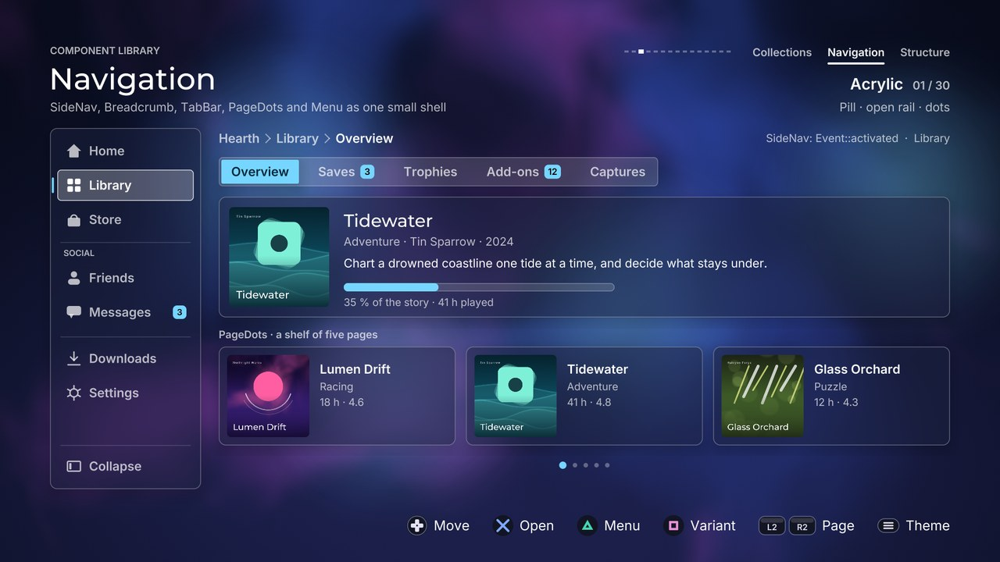

# Navigation components

[Back to the component guide](../COMPONENTS.md)



Five components that move the player between places: a row of tabs, a rail,
the path to where the player is, the position in paged content, and a context
menu. They live in `src/ui/components/` and follow the five rules in
`component.hpp`. The gallery page that uses all of them together is
`src/concepts/components/navigation_page.cpp`.

Every style struct derives from `ui::ComponentStyle`, so each one also has
`theme` (any `ui::Theme`), `sounds` (the cues, see below) and
`reduced_motion`. The tables list only what a component adds.

Names used below:

- "The page's text colours" are `Painter::page_text()` and
  `page_text_muted()`: the colours for text drawn straight on the page rather
  than on a panel.
- `set_focused(bool)` tells a component whether it has the screen's focus. It
  only changes how the component looks (its ring or highlight); a screen
  still decides which component gets `handle()`.

## TabBar

`tabs.hpp`. A row of tabs with one indicator that glides between them. Use it
to switch between views of the same thing. It changes tab on left and right;
a screen that turns tabs with L2 and R2 calls `step()`. `active_value()` is
the active tab as an animated number, so content can slide with the
indicator. When the tabs are wider than the bounds the row scrolls and keeps
the active tab in the middle.

```cpp
ui::TabBar tabs;
tabs.style.theme = theme;
tabs.style.kind = ui::TabKind::underline;
tabs.set_tabs({{"Overview"}, {"Saves", 3}, {"Trophies"}});   // label, badge
tabs.set_bounds({400, 300, 900, 56});

if (tabs.handle(input, feedback) == ui::Event::changed)
    show(tabs.active());
if (input.is_pressed(Action::jump_next))
    tabs.step(1, input, feedback);        // the same, from R2
tabs.update(dt);
tabs.draw(canvas);
content_x = -tabs.active_value() * page_width;
```

A `TabItem` has `label`, `badge` (a count; 0 shows none, over 99 shows
"99+"), `disabled` (dimmed and stepped over) and `tag`.

Other calls: `set_active(index, snap)` selects a tab without sound;
`tab_rect(fonts, index)` is where a tab is on screen, for anchoring a menu
to it.

| Knob | Default | Effect |
| --- | --- | --- |
| `kind` | `pill` | `pill`: a plate in the primary colour glides behind the active label. `underline`: text on a rule, a bar glides under the active label. `segmented`: one bordered control, a raised piece inside. `boxed`: every tab is a button surface, the active one filled |
| `width` | `fit` | `fit`: each tab as wide as its content. `equal`: all as wide as the widest. `fill`: the tabs share the width of the bounds |
| `height` | 56 | Height of a tab. The bar is centred vertically in its bounds |
| `gap` | 8 | Space between tabs. Segments touch and ignore it |
| `padding` | 24 | Space inside a tab, left and right of its content |
| `min_width` | 0 | A tab is never narrower than this |
| `glyph_width` | 0 | Room reserved before the label for the `glyph` slot |
| `glyph_gap` | 10 | Space between the glyph and the label |
| `thickness` | 4 | Thickness of the underline bar |
| `track_inset` | 5 | Space between the track and the plate (`pill` with a track, `segmented`) |
| `text_size` | 24 | Label size |
| `badge_size` | 17 | Text size of the badge count |
| `track` | true | `pill`: a well behind the whole row. `underline`: the rule across the bounds |
| `dividers` | true | `segmented`: hairlines between segments (they fade next to the piece) |
| `focus_ring` | true | The theme's focus ring while the bar is focused |
| `on_page` | false | Labels that have no surface under them (`underline`, `pill` without a track) use the page's text colours |
| `edge_fade` | 0.6 | When the row scrolls, a tab fades over this share of its width at a cut edge. 0 turns it off |
| `wrap` | false | Past the last tab comes the first |
| `pitch_by_position` | true | The cue rises in pitch from the first tab to the last |

Slot: `glyph(canvas, box, item, index, active, ink)` draws before the label
in `glyph_width` pixels. `active` is 0..1 and `ink` is the label's colour.

Events from `handle()` and `step()`: `changed` (the active tab changed),
`refused` (no tab that way). `handle()` returns `none` for everything except
left and right.

Cues: `sounds.page` on a change, panned to the tab; `sounds.refuse` at an
end (silent on a held direction).

## SideNav

`sidenav.hpp`. A vertical rail with an icon and a label per entry. It has two
widths, icons only and icons with labels, and animates between them. Two
things are shown separately: the *focus* (a `ui::Highlight` that glides while
the rail is being steered) and the *current* entry (the place the player is
in: a quiet plate and a bar on the rail's edge). Confirm makes the focused
entry the current one.

```cpp
ui::SideNav nav;
nav.style.theme = theme;
nav.style.footer = true;                       // the last entry sits at the bottom
nav.icon = [](ui::Canvas &canvas, const gfx::Rect &box, const ui::NavEntry &entry, int, float,
              gfx::Color ink) { draw_my_icon(canvas.list, entry.tag, box, ink); };
nav.set_entries({{"Home"}, {"Library"}, {"Store"}, {"Settings"}});
nav.set_bounds({96, 240, 0, 700});             // position and height; the width is its own

if (nav.handle(input, feedback) == ui::Event::activated)
    open(nav.current());
nav.update(dt);
nav.draw(canvas);
content_left = nav.rect().x + nav.rect().w + 32;   // follows the animated width
```

A `NavEntry` has `label`, `badge` (a pill at the end of the row; a dot on the
icon when collapsed), `section` (a section starts here, under this title),
`separator` (a section starts here, without a title), `action` (the entry
does something instead of going somewhere: confirm never makes it current),
`disabled` (focusable, refuses confirm) and `tag`.

Other calls: `set_expanded(bool)` (silent) and `toggle(feedback)` (with the
change cue) switch width; `rect()` and `expansion()` report the animated
width; `set_focus()`, `set_current()`, `set_focused()`; `row_rect(index)` is
where an entry is on screen; `enter()` replays the entrance.

| Knob | Default | Effect |
| --- | --- | --- |
| `collapsed_width` | 92 | Width of the rail showing icons only |
| `expanded_width` | 300 | Width of the rail showing icons and labels |
| `row_height` | 60 | Height of an entry |
| `gap` | 6 | Space between entries |
| `padding` | 14 | Space between the rail's edge and its entries |
| `icon_size` | 30 | Side of the square the `icon` slot draws in |
| `label_gap` | 14 | Space between the icon and the label |
| `section_height` | 46 | Room a titled section start takes above its first entry (an untitled one takes half) |
| `text_size` | 24 | Label size |
| `section_size` | 16 | Section title size (drawn in capitals) |
| `badge_size` | 16 | Badge text size |
| `highlight` | tint | The focus highlight: any `ui::HighlightStyle` (kind, colour, radius, ...) |
| `panel` | true | A themed panel behind the rail |
| `current_plate` | true | A quiet plate under the current entry |
| `current_marker` | true | A bar on the rail's edge beside the current entry |
| `marker_thickness` | 4 | Thickness of that bar |
| `entrance_step` | 0.035 | Seconds between entries arriving; 0 for none |
| `expanded` | true | Which width the rail goes to |
| `footer` | false | The last entry is pinned to the bottom of the rail, under a line |
| `wrap` | false | Past the last entry comes the first |
| `pitch_by_position` | true | The move cue falls in pitch from the first entry to the last |

Slot: `icon(canvas, box, entry, index, focus, ink)`. Without it an entry
shows its initial in a ring.

Events: `moved`, `activated`, `cancelled` (back), `refused` (an end, or
confirm on a disabled entry). `toggle()` returns `changed`.

Cues: `sounds.move`, `sounds.activate` (with a short rumble),
`sounds.cancel`, `sounds.refuse`, and `sounds.change` from `toggle()`.

Entries that do not fit scroll; the pinned entry stays. Without the screen's
focus the highlight fades and the focus returns to the current entry.

## Breadcrumb

`breadcrumb.hpp`. The path to where the player is, such as "Home > Library >
Saves". It takes no input: the screen sets the path and the component
animates the difference. A new segment slides in, a removed one fades where
it stood, and a path longer than the bounds folds its middle into an
ellipsis. The first and the last segment always stay.

```cpp
ui::Breadcrumb crumbs;
crumbs.style.theme = theme;
crumbs.set_bounds({400, 240, 700, 40});
crumbs.set_path({"Home", "Library"}, false);   // false: appear without animating

crumbs.push("Saves");      // the player went deeper
crumbs.pop();              // ... and came back
crumbs.set_path({"Home", "Store", "Deals"});   // keeps "Home", swaps the rest
crumbs.update(dt);
crumbs.draw(canvas);
```

Other calls: `path()`, `depth()`, `folded()` (how many segments are inside
the ellipsis).

| Knob | Default | Effect |
| --- | --- | --- |
| `gap` | 12 | Space between a segment and the separator beside it |
| `separator_size` | 16 | Height of the separator |
| `chip_height` | 40 | Height of a chip (`chips`) |
| `chip_padding` | 14 | Space inside a chip, left and right |
| `text_size` | 24 | Segment text size |
| `separator` | `chevron` | `chevron`, `slash` or `dot` |
| `chips` | false | Every segment sits on a chip; the last one is drawn selected |
| `on_page` | true | Use the page's text colours (ignored with `chips`) |
| `max_segments` | 0 | With more segments than this the middle folds, even if it would fit. 0: fold only when too long |
| `travel` | 26 | How far a new segment slides in |

Slots: none. Events: none (there is no `handle()`). Cues: none.

Labels are measured when the component is drawn. A segment that has not been
drawn yet is laid out with an estimate, so the fold is exact from the frame
after a segment first appears. If the path still does not fit with the whole
middle folded, the labels are cut with "...".

## PageDots

`page_dots.hpp`. The position in a set of pages. Give it the number of pages
and the current one, and slide the content with `value()`. It can also turn
the pages itself: on left and right through `handle()`, and by a clock
(`auto_advance`), showing the time that has run inside the active mark.

```cpp
ui::PageDots dots;
dots.style.theme = theme;
dots.style.kind = ui::PageDotsKind::dashes;
dots.style.auto_advance = 6.0f;                 // seconds per page
dots.set_count(5);
dots.set_bounds({400, 880, 900, 30});

if (dots.handle(input, feedback) == ui::Event::changed)
    show(dots.page());
dots.update(dt);
if (dots.take_advanced())                       // it turned the page itself
    show(dots.page());
strip_x = -dots.value() * page_width;
dots.draw(canvas);
```

Other calls: `set_page(page, snap)` (silent, restarts the page's time),
`set_paused(bool)` stops the clock, `set_progress(0..1)` sets the fill for
screens that keep the time themselves, `progress()`, `set_focused(bool)`.

| Knob | Default | Effect |
| --- | --- | --- |
| `kind` | `dots` | `dots`: one dot per page, the active one larger and coloured. `dashes`: short dashes, the active one a longer pill. `numbers`: "3 / 8" with the current number rolling |
| `dot_size` | 14 | Diameter of the active dot |
| `idle_scale` | 0.62 | Size of the other dots, as a share of `dot_size` |
| `dash_width` | 20 | Width of a resting dash |
| `active_width` | 44 | Width of the active dash, and of the active dot while it shows progress |
| `dash_thickness` | 6 | Thickness of every dash |
| `gap` | 12 | Space between marks |
| `max_visible` | 9 | With more pages than this, a window of marks follows the active one and the marks at its ends shrink |
| `align` | `center` | Where the marks sit in the bounds: `left`, `center`, `right` |
| `text_size` | 24 | Text size of `numbers` |
| `on_page` | true | Use the page's text colours |
| `focus_ring` | true | The theme's focus ring around the marks while focused |
| `show_progress` | true | The active mark fills as the page's time runs (a thin bar under `numbers`) |
| `auto_advance` | 0 | Seconds a page stays before the next one; 0 for never |
| `wrap` | true | Past the last page comes the first (input and clock) |
| `pitch_by_position` | true | The cue rises in pitch from the first page to the last |

Slots: none.

Events from `handle()`: `changed`, `refused` (an end without `wrap`), `none`
for anything but left and right. A page turned by the clock is reported once
by `take_advanced()`.

Cues: `sounds.page` on a change, `sounds.refuse` at an end.

Marks are square in themes with square corners. With `reduced_motion` the
current number cross-fades instead of rolling.

## Menu

`menu.hpp`. A context menu anchored to a rectangle: a row, a card, a tab. It
opens with a spring from the anchor, points at it, and flips or moves to stay
inside its bounds. `set_bounds()` gives the part of the screen it may use
(the default is the screen with a 48 px margin). Draw it last so it is on
top; it draws nothing when closed.

```cpp
ui::Menu menu;
menu.style.theme = theme;
ui::MenuItem pin{"Pin to home"};
pin.checkable = true;
ui::MenuItem line;
line.separator = true;
ui::MenuItem remove{"Remove", "Hold"};      // label, shortcut text
remove.danger = true;
menu.set_items({{"Open"}, pin, line, remove});

if (input.is_pressed(Action::north))
    menu.open(card_rect, feedback);
if (menu.is_open())
{
    const ui::Event event = menu.handle(input, feedback);
    if (event == ui::Event::activated)
        run(menu.items()[menu.focus()].tag);
}
menu.update(dt);
menu.draw(canvas);
```

A `MenuItem` has `label`, `shortcut` (quiet text at the end of the row),
`separator` (a line between groups, skipped by the focus), `disabled`
(focusable, refuses confirm), `danger` (drawn in `theme.danger`; the
highlight takes that colour while it rests on the item), `checkable` and
`checked` (confirm flips the check instead of activating), and `tag`.

Other calls: `open(anchor, feedback)`, `close(feedback)`, `dismiss()`
(closes without a sound), `is_open()` (it takes input), `visible()` (it is
still fading out), `focus()`, `set_focus()`, `panel_rect()`, `side()` (the
side it ended up on).

| Knob | Default | Effect |
| --- | --- | --- |
| `width` | 380 | Width of the panel |
| `row_height` | 56 | Height of an item |
| `separator_height` | 18 | Room a separator takes |
| `padding` | 8 | Space between the panel and its rows |
| `row_padding` | 18 | Space inside a row, left and right |
| `glyph_width` | 0 | Room reserved before the label for the `glyph` slot |
| `pointer_size` | 14 | Length of the pointer toward the anchor; 0 for none |
| `offset` | 10 | Space between the anchor and the pointer's tip |
| `text_size` | 24 | Label size |
| `shortcut_size` | 19 | Shortcut text size |
| `highlight` | tint | The focus highlight: any `ui::HighlightStyle` |
| `elevation` | 1 | Scales the soft shadow the menu floats on; 0 for none. Themes with their own depth (hard shadows, bevels, neumorphic) ignore it |
| `scrim` | 0 | Darkens everything behind the menu by this much, 0..1 |
| `backing` | 0.8 | Glass themes only: opacity of a page-coloured layer under the translucent panel, so rows stay readable over busy content |
| `side` | `automatic` | `automatic` (below, or above when there is no room), `below`, `above`, `right`, `left`. Any of them flips to the opposite side when it does not fit |
| `wrap` | true | Past the last item comes the first |
| `close_on_activate` | true | Confirm on an ordinary item closes the menu |
| `close_on_check` | false | Flipping a checkable item closes it too |
| `entrance_step` | 0.018 | Seconds between rows arriving; 0 for none |
| `pitch_by_position` | true | The move cue falls in pitch from the first item to the last |

Slot: `glyph(canvas, box, item, index, focus, ink)` draws before the label
in `glyph_width` pixels. When any item is checkable, a column for the check
mark is reserved before the glyph.

Events from `handle()`: `moved`, `activated` (read `focus()` for the item),
`changed` (a checkable item was flipped; read its `checked`), `cancelled`
(back; the menu closes), `refused` (confirm on a disabled item, or an end
without `wrap`). A closed menu returns `none`.

Cues: `sounds.open` and `sounds.close`, panned to the anchor;
`sounds.move`; `sounds.activate` (with a short rumble); `sounds.change` for
a check (higher when it turns on); `sounds.refuse`.

With `reduced_motion` the menu fades in without growing from the pointer.
