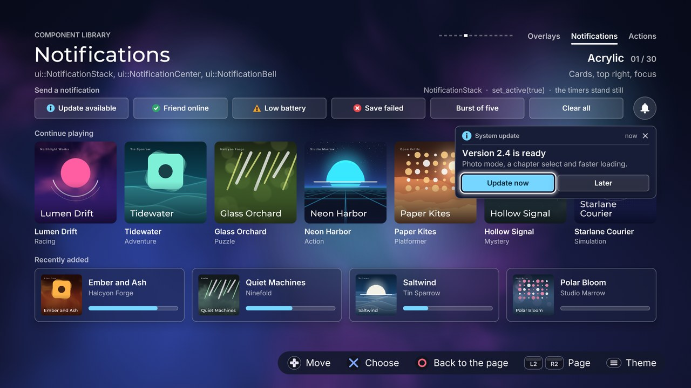

# Notifications

[Back to the component guide](../COMPONENTS.md)



[Back to the component guide](../COMPONENTS.md)

Messages the player can answer, the history of what was missed and the bell
that counts it. Headers are in `src/ui/components/`: `notification.hpp`
(NotificationStack), `notification_center.hpp` (NotificationCenter) and
`notification_bell.hpp` (NotificationBell). The gallery page is
`src/concepts/components/notifications_page.cpp`.

A `ui::ToastStack` ([overlays](overlays.md)) says something and leaves; it
never takes the focus. A notification can be answered: it carries up to two
actions and a close control, it may stay until someone deals with it, and it
can change in place. Use toasts for "Saved"; use notifications for "an update
is available".

Three things are the same for all three components:

- **Every style struct derives from `ui::ComponentStyle`**, so each also has
  `theme`, `sounds` and `reduced_motion`. With `reduced_motion` nothing
  slides, scales or swings: things fade.
- **Draw the stack last**, after the screen it floats over (in a design, into
  `frame.overlay`). Its bounds are the screen it is anchored in, not its own
  size.
- **A console has no pointer.** The stack offers two ways to reach a
  notification with a controller, a shortcut button and the focus. A screen
  may use either or both; they are described under NotificationStack.

## NotificationStack

A stack of notifications anchored to a corner or an edge. New ones slide in
from the anchored edge and open their own room with a spring; when one
leaves, the others close the gap. More than `max_visible` (or more than the
bounds have room for) wait in a queue, and a "+N more" marker says so.

```cpp
ui::NotificationStack stack;
stack.style.theme = theme;

ui::Notification note;
note.kind = ui::StatusKind::info;
note.source = "System update";
note.time = "now";
note.title = "Version 2.4 is ready";
note.body = "Photo mode, a chapter select and faster loading.";
note.actions = {"Update now", "Later"};   // the first is the main one
note.seconds = -1.0f;                     // stays until it is answered
const int id = stack.push(note);

// every frame
if (stack.active())
{
    const ui::Event event = stack.handle(input, feedback);
    if (event == ui::Event::activated)
        run(stack.event_id(), stack.event_action());
    else if (event == ui::Event::cancelled)
        focus = Focus::screen;            // the stack gave the focus back
}
stack.update(dt, feedback);
stack.draw(canvas);                       // after everything else
```

**A `ui::Notification`** is plain data:

| Field | Default | Meaning |
| --- | --- | --- |
| `kind` | `info` | `ui::StatusKind`: the icon and the status colour. `none` draws no icon |
| `source` | empty | Who says it, as a small label: "System update" |
| `time` | empty | When, as text: "now", "2 min" |
| `title` | empty | One line, cut with "..." |
| `body` | empty | Wraps to `style.body_lines` lines |
| `actions` | none | Up to two button labels; the first is the main action. More are dropped |
| `closable` | true | It has a close control |
| `seconds` | 0 | 0 uses `style.duration`; a negative value keeps it until it is closed |
| `progress` | -1 | 0..1 draws a `ui::ProgressBar`; negative draws none |
| `icon` | none | A slot, `icon(canvas, box)`: replaces the status icon (an avatar, a cover) |
| `tag` | 0 | Yours: what the notification is about |

**Lifetime.** `push()` queues a notification and returns its id (ids start at
1). A timed one shows a thin bar with the time it has left and leaves by
itself; a sticky one stays. While the stack has the focus every timer stands
still (`pause_when_active`), the way a pointer resting on a web toast holds
it, and the bars dim. `dismiss(id)` sends one away, `clear()` all of them;
`clear(true)` skips the exit animations.

**Changing one in place.** `update_notification(id, notification)` replaces
the content under the same id: the old content fades out, the new fades in,
the panel's height eases and the notification flashes once in its status
colour. `set_title()`, `set_body()` and `set_progress()` change one field
quietly (running text and a filling bar must not flash); `set_actions()` and
`set_kind()` flash by default. All return false when the id has left the
stack. One rule makes the common case simple: **calling
`update_notification()` for the notification whose action was just chosen
keeps it on screen**, although `close_on_action` would have closed it. That
is how "Update now" turns into a download (see the recipes below).

**Looks** (`style.look`):

| Look | Shape |
| --- | --- |
| `card` | A header row with the icon, the source, the time and the close control, a hairline, then title and body, then the buttons. Without a source and a time the header is left out and the icon leads the text |
| `compact` | One row: icon, title, the main action, close. The body and a second action are not shown; a progress bar goes under the row |
| `accent` | A bar in the status colour on the leading edge and a panel washed with that colour; the icon leads, source and time share a line above the title |

The panel is frosted when `frosted` is on and the canvas has a glass texture
(`canvas.glass != 0`) and the theme can frost; otherwise it is the theme's
own panel, made opaque. See "Frosted or solid" in [overlays](overlays.md).

**Reaching it with a controller.**

- *Shortcut.* Set `style.shortcut` to an `Action` (for example
  `Action::north`). The newest notification that has a main action shows that
  button's glyph inside it, and `handle_shortcut(input, feedback)` fires the
  action when the button is pressed. Call it every frame, whoever has the
  focus. `style.dismiss_shortcut` does the same for the close control of the
  newest closable notification. When nothing can take the press,
  `handle_shortcut()` returns `Event::none` and the button is the screen's.
- *Focus.* `set_active(true)` (the screen decides when: on a button press,
  from a status bar) puts one focus ring on the newest notification's main
  control. `handle()` then moves it: up and down between notifications, left
  and right between one notification's controls (the actions in order, then
  the close control). From a close control, up and down go to the next close
  control, so several can be closed in a row. Back returns `cancelled`. If
  the focused notification leaves, the focus goes to the neighbour that
  slides into its place; if nothing with a control is left, the next
  `handle()` returns `cancelled`. In both cases the stack has made itself
  inactive: the screen only has to take the focus.

Other calls: `set_bounds()`, `visible_count()`, `queued_count()`, `empty()`,
`find(id)` (the notification while it is waiting or on screen, also while it
leaves, so the answer to an action can read its `tag`), `newest()`,
`remaining(id)` (time left, 0..1; -1 when it is not on screen), `active()`,
`focusable()` (something on screen has a control), `focus_id()`,
`focus_control()`, `set_focus(id, control)`, `controls(id)`, `event_id()`,
`event_action()`, `card_rect(fonts, id)` and `control_rect(fonts, id, i)`
(where one rests on screen).

| Knob | Default | Effect |
| --- | --- | --- |
| `look` | `card` | `NotificationLook::card`, `compact` or `accent` |
| `anchor` | `top_right` | `ui::ToastAnchor`: the four corners, `top_center`, `bottom_center`. Corner stacks slide in from their side, centre stacks drop in or rise |
| `width` | 560 | Width of a notification |
| `margin` | 48 | Distance from the edges of the bounds |
| `gap` | 14 | Between notifications |
| `padding` | 20 | Inside a notification |
| `icon_size` | 40 | The leading icon (accent, and cards without a header); 0 for none |
| `header_icon` | 26 | The icon in a card's header and in a compact row; 0 for none |
| `close_size` | 36 | The close control's box |
| `bar_width` | 6 | Accent: the bar on the leading edge |
| `button_height` | 46 | Height of the action buttons |
| `button_padding` | 18 | Left and right of a label, where buttons hug their labels |
| `button_min_width` | 96 | A hugging button is never narrower |
| `button_gap` | 10 | Between buttons (a hard-shadow theme adds its shadow) |
| `stretch_actions` | true | Card and accent: the buttons share the row. False: they hug their labels |
| `glyph_size` | 26 | The shortcut glyphs |
| `meta_size` | 17 | Source, time and the percentage |
| `title_size` | 24 | Title size |
| `body_size` | 20 | Body size |
| `button_text` | 20 | Button label size |
| `body_lines` | 3 | The body wraps to this many lines; 0 hides bodies |
| `frosted` | true | Frosted panel when possible, else solid |
| `frost` | 0.6 | How much surface colour covers the frost |
| `tint` | 0.12 | Accent: how much status colour washes the panel |
| `divider` | true | Card: a hairline under the header |
| `time_bar` | true | A thin bar in the status colour showing the time a timed one has left |
| `time_bar_height` | 4 | Its thickness |
| `progress_height` | 8 | The progress bar of `Notification::progress` |
| `progress_percent` | true | The value as "64%" beside the bar (not in compact) |
| `more_marker` | true | "+N more" after the stack while some are waiting |
| `more_prefix`, `more_suffix` | "+", " more" | The marker reads prefix, count, suffix |
| `max_visible` | 3 | More than this wait their turn |
| `fit_bounds` | true | One that would push the stack past its bounds waits as well (an empty stack always takes one) |
| `duration` | 6 | Seconds on screen when a notification names none |
| `newest_first` | true | The newest sits at the anchored edge and pushes the others along. False: it joins at the far end |
| `pause_when_active` | true | Timers stand still while the stack has the focus |
| `close_on_action` | true | Choosing an action sends the notification away |
| `pitch_by_kind` | true | Success chimes a little higher, warning and danger lower |
| `shortcut` | `Action::count` | The button that fires the newest main action; `count` for none |
| `dismiss_shortcut` | `Action::count` | The button that closes the newest closable one; `count` for none |
| `swap_confirm` | false | The player swapped Cross and Circle: the glyphs follow |

Slots:

- `Notification::icon(canvas, box)` replaces the status icon of one
  notification.
- `on_action(id, action)` is called when an action is chosen, from `handle()`
  or `handle_shortcut()`.
- `on_close(id, reason)` is called from `update()` when one has left the
  stack, with a `ui::CloseReason`: `timed_out`, `closed` (by the player),
  `action` (an action was chosen) or `dismissed` (by `dismiss()` or
  `clear()`).
- `on_leave(id, notification, reason, action)` is the same with the content;
  `NotificationCenter::attach()` takes this slot.

| Input | Event | Cue |
| --- | --- | --- |
| Left / right | `moved` | `sounds.move` |
| Up / down | `moved` | `sounds.move`, a little lower further down |
| Any direction at an end | `refused` | `sounds.refuse` and a short rumble; silent on a held direction |
| Confirm on an action | `activated`; read `event_id()`, `event_action()` | `sounds.activate` and a short rumble |
| Confirm on the close control | `changed`; read `event_id()` | `sounds.close` |
| Back | `cancelled`; the stack is inactive again | `sounds.cancel` |
| Nothing left to focus | `cancelled`; the stack is inactive again | |
| `shortcut` pressed (`handle_shortcut`) | `activated` | `sounds.activate` and a short rumble |
| `dismiss_shortcut` pressed (`handle_shortcut`) | `changed` | `sounds.close` |
| A notification appears | | `sounds.notify`, pitched by kind, panned to the side the stack is on |

A notification that times out or is dismissed leaves without a sound. The
notify cue is played when a notification appears, which for a queued one is
later than `push()`; that is why `update()` takes the feedback.

`event_id()` and `event_action()` describe the last call of `handle()` or
`handle_shortcut()`: read them right after the call.

Motion: a notification slides in from its side (centre stacks drop in or
rise) while its room opens with the theme's spring, so the others are pushed
along; leaving is quicker and the gap closes behind it. The focus ring glides
between controls and across notifications. A change flashes the panel's
outside in the status colour and cross-fades the content. The marker pops
when its count changes.

## NotificationCenter

The history. It records every notification that left a stack, newest first,
with how it ended, and lists them under "New" (not seen yet) and "Earlier",
with a summary line and a "Clear all" button above the list. It draws inside
any rectangle: put it in a `ui::Sheet` through the sheet's content slot, in a
panel, or on a page of its own. The list inside is a `ui::ListView`, the
empty state a `ui::EmptyState`.

```cpp
ui::NotificationCenter center;
center.style.theme = theme;
center.attach(stack);                      // records what leaves the stack

ui::Sheet sheet;
sheet.set_title("Notifications");
sheet.content = [&](ui::Canvas &canvas, const gfx::Rect &, float) { center.draw(canvas); };
center.set_bounds(sheet.content_rect());

// opening it
center.enter();
sheet.open(feedback);

// every frame
if (sheet.is_open())
{
    if (sheet.handle(input, feedback) == ui::Event::cancelled)
        center.mark_all_read();            // seen: listed under "Earlier" next time
    else if (center.handle(input, feedback) == ui::Event::activated)
        run(*center.event_record());       // its main action, chosen again
}
center.update(dt);
sheet.update(dt);
sheet.draw(canvas);
```

**Recording.** `attach(stack)` takes the stack's `on_leave` slot; `detach(stack)`
gives it back. The centre is captured by address and cannot be copied: keep
it where it is while it is attached, and declare it after the stack so it
goes away first. `record(notification, reason, id, action)` records one by
hand. Each `ui::NotificationRecord` holds the `notification`, the `reason`
(`ui::CloseReason`), the `action` that ended it (or -1), the `id` it had in
the stack, `unread` and its `age` in seconds.

**Unread.** With `missed_only` (the default) only what timed out or was
dismissed counts as unread: what the player closed or answered has been seen.
`unread()` is the number for a bell; `mark_all_read()` moves everything to
"Earlier".

**Rows.** A row shows the icon (or the notification's icon slot), the title,
the body (or the source when there is no body), the time and, when the
notification has an action, that action's label in a pill that fills under
the focus. Confirm on such a row returns `activated`: the main action is
chosen again and the record stays. Confirm on a row without an action is
refused softly.

Other calls: `records()`, `count()`, `clear()`, `set_bounds()`,
`set_active(bool)`, `enter()` (focus on the newest record, rows arrive one
after the other), `focus()` (the focused record's index, or -1 on the button
and when the history is empty), `event_record()`.

| Knob | Default | Effect |
| --- | --- | --- |
| `row_height` | 84 | Height of a row |
| `header_height` | 46 | Height of the "New" and "Earlier" titles |
| `gap` | 6 | Between rows |
| `padding` | 16 | Inside a row, left and right |
| `icon_size` | 36 | The icon of a row; 0 for none |
| `button_height` | 44 | The "Clear all" button and its summary line |
| `button_padding` | 18 | Left and right of the button's label |
| `title_size` | 23 | Title size |
| `body_size` | 19 | Second line |
| `meta_size` | 17 | The time, the action pill and the summary |
| `header_size` | 17 | The section titles |
| `button_text` | 19 | The button's label |
| `highlight` | tint | `ui::HighlightStyle` of the focused row |
| `on_panel` | true | It sits on a sheet or a panel (the theme's panel text colours). False: straight on the page |
| `unread_dot` | true | A dot in the primary colour before a row not seen yet |
| `action_hints` | true | A row that has an action shows its label |
| `new_label`, `earlier_label` | "New", "Earlier" | The section titles |
| `clear_label` | "Clear all" | The button |
| `unread_suffix` | " unread" | The summary: the count, then this |
| `read_label` | "All read" | The summary when nothing is unread |
| `empty_title`, `empty_body` | "No notifications", a sentence | The empty state |
| `clear_button` | true | The summary line and the button above the list |
| `relative_time` | true | "now", "5 min", "2 h", "3 d" from the record's age. False: the notification's own `time` text |
| `missed_only` | true | Only what timed out or was dismissed is unread. False: everything is |
| `max_records` | 50 | The oldest are dropped |
| `entrance_step` | 0.03 | Seconds between rows arriving; 0 for none |

Slot: `on_action(record, action)`, called when a record's main action is
chosen again.

| Input | Event | Cue |
| --- | --- | --- |
| Up / down | `moved` | `sounds.move` |
| Up on the first row | `moved`: the focus is on "Clear all" | `sounds.move` |
| Down at the last row, any direction but down on the button | `refused` | `sounds.refuse`; silent on a held direction |
| Confirm on a row with an action | `activated`; read `event_record()` | `sounds.activate` |
| Confirm on a row without one | `refused` | `sounds.refuse` |
| Confirm on "Clear all" | `changed`; the history is empty | `sounds.activate` |
| Back | `cancelled` | `sounds.cancel` |

Inside a sheet, give the sheet the input first: it closes on back, and the
centre takes the rest.

## NotificationBell

A small indicator for a status bar: a bell drawn from shapes on a button,
with the unread count in a `ui::Badge` on its corner. The badge pops when the
count changes and the bell swings for a moment when the count grows, so a
notification the player did not look at still leaves a trace.

```cpp
ui::NotificationBell bell;
bell.style.theme = theme;
bell.set_bounds({1760, 60, 64, 64});

// every frame
bell.set_count(center.unread());           // pops; rings when it grew
bell.set_active(focus == Focus::bell);
if (bell.active() && bell.handle(input, feedback) == ui::Event::activated)
    open_center();
bell.update(dt);
bell.draw(canvas);
```

Other calls: `count()`, `ring()` (swing now), `ringing()`, `rect()` (the
square it is drawn in, centred in the bounds), `active()`.
`ui::draw_bell(canvas, box, ink, swing, waves)` draws the bell alone, for an
icon elsewhere (the centre's empty state uses it).

| Knob | Default | Effect |
| --- | --- | --- |
| `role` | `secondary` | `ui::ButtonRole` of the button under the bell; `ghost` for a bare bell |
| `shape` | `round` | `ui::IconButtonShape`: a circle where the theme can draw one, or the theme's own corners |
| `size` | 0 | 0 uses the smaller side of the bounds |
| `icon_scale` | 0.52 | The bell, as a share of the size |
| `on_page` | true | A ghost bell sits on the page, not on a panel |
| `badge_kind` | `danger` | `ui::Status` of the count |
| `badge_height`, `badge_text` | 26, 16 | The badge |
| `badge_max` | 99 | Above it the badge shows "99+" |
| `badge_cutout` | 2 | A rim around the badge in the surface colour |
| `ring_on_increase` | true | `set_count()` with a higher count rings by itself |
| `ring_seconds` | 0.9 | How long the bell swings |
| `swing` | 0.42 | The widest angle, in radians |
| `swing_hz` | 3.4 | Swings per second |
| `waves` | true | Sound lines beside the bell while it rings |
| `press_scale` | 0.05 | How far a press shrinks it |
| `rumble` | 0.3 | Strength of the pulse on activation |

Slots: none.

| Input | Event | Cue |
| --- | --- | --- |
| Confirm | `activated` | `sounds.activate` and a short rumble |
| Anything else | `none`: it is the screen's | |

The ring itself is silent: the stack already played `sounds.notify` when the
notification appeared.

### Recipes

**An update is available.** The notification shows up, stays for a while or
until it is answered, and choosing "Update now" turns it into a download that
ends in "Restart".

```cpp
enum Tag { tag_update = 1, tag_download, tag_installed };

ui::NotificationStack stack;
int download_id = 0;

// 1. Tell the player. Timed or sticky is one field.
void announce_update(bool sticky)
{
    ui::Notification note;
    note.kind = ui::StatusKind::info;
    note.source = "System update";
    note.time = "now";
    note.title = "Version 2.4 is ready";
    note.body = "Photo mode, a chapter select and faster loading.";
    note.actions = {"Update now", "Later"};
    note.seconds = sticky ? -1.0f : 10.0f;   // until answered, or ten seconds
    note.tag = tag_update;
    stack.push(note);
}

// 2. React to the answer. Works for the focus path and the shortcut path.
void answer(ui::Event event)
{
    if (event != ui::Event::activated)
        return;
    const int id = stack.event_id();
    const ui::Notification *note = stack.find(id);
    if (note == nullptr)
        return;
    if (note->tag == tag_update && stack.event_action() == 0)
    {
        // "Update now": the same notification becomes the download. Updating
        // it here keeps it on screen although its action was chosen.
        ui::Notification download;
        download.kind = ui::StatusKind::info;
        download.source = "System update";
        download.title = "Downloading version 2.4";
        download.body = "0 of 120 MB";
        download.progress = 0.0f;
        download.seconds = -1.0f;
        download.closable = false;
        download.tag = tag_download;
        stack.update_notification(id, download);
        download_id = id;
        start_download();
    }
    else if (note->tag == tag_installed)
    {
        restart();                           // "Restart": it closes by itself
    }
    // "Later" needs nothing: close_on_action sends the notification away.
}

// 3. Report progress as it is measured, then finish.
void on_download_progress(float done, const std::string &text)
{
    if (download_id == 0)
        return;
    stack.set_progress(download_id, done);   // the bar eases there
    stack.set_body(download_id, text);       // "54 of 120 MB"
    if (done < 1.0f)
        return;
    ui::Notification installed;
    installed.kind = ui::StatusKind::success;
    installed.source = "System update";
    installed.title = "Update installed";
    installed.body = "Restart to finish.";
    installed.actions = {"Restart"};
    installed.seconds = -1.0f;
    installed.tag = tag_installed;
    stack.update_notification(download_id, installed);
    download_id = 0;
}

// 4. Every frame.
void update(const InputFrame &input, float dt, ui::Feedback &feedback)
{
    if (stack.active())
    {
        const ui::Event event = stack.handle(input, feedback);
        if (event == ui::Event::cancelled)
            take_focus_back();
        answer(event);
    }
    else if (input.is_pressed(Action::north) && stack.focusable())
    {
        stack.set_active(true);              // Triangle: answer a notification
    }
    answer(stack.handle_shortcut(input, feedback));   // only if style.shortcut is set
    stack.update(dt, feedback);
}
```

**A notification that was missed.** Attach a centre and show its count on a
bell:

```cpp
center.attach(stack);
...
bell.set_count(center.unread());   // every frame
```

**Closing from code.** `stack.dismiss(id)` when the reason for a notification
is gone (the controller was plugged in, the download was cancelled
elsewhere). It is recorded as `CloseReason::dismissed`.

**Knowing how one ended.**

```cpp
stack.on_close = [&](int id, ui::CloseReason reason)
{
    if (reason == ui::CloseReason::timed_out)
        remind_later(id);
};
```

### The gallery page

A home screen that is not listening (covers and a shelf of recent titles),
a row of triggers above it and the bell at the top right. The stack is drawn
in `draw_modal`, over the page; the bell opens the centre in a right-edge
`ui::Sheet`.

| Trigger | What it sends |
| --- | --- |
| Update available | Sticky, info, "Update now" / "Later". "Update now" turns it into a download that fills in about four seconds and then into "Update installed" with "Restart" |
| Friend online | Timed (5 s), closable, an avatar in the icon slot |
| Low battery | Warning, timed (8 s), "Dismiss" |
| Save failed | Danger, sticky, "Retry" / "Details". "Retry" turns it into a timed "Save synced" |
| Burst of five | Five at once: what does not fit waits, with the "+N more" marker |
| Clear all | `clear()`: everything goes to the history |

The focus rule: the D-pad moves along the triggers and the bell; Triangle
gives the stack the focus when something on it can take it, and Circle gives
it back. In the shortcut variant Triangle fires the newest notification's
main action directly. The hint row says which.

| Variant | Look | Anchor | Way in |
| --- | --- | --- | --- |
| Cards, top right, focus | `card` | `top_right` | Triangle gives the stack the focus |
| Compact, bottom centre, shortcut | `compact`, 720 wide | `bottom_center` | `shortcut = Action::north` |
| Accent, bottom right, two at a time | `accent`, 620 wide, hugging buttons, no time bar, `max_visible` 2 | `bottom_right` | Triangle gives the stack the focus |
