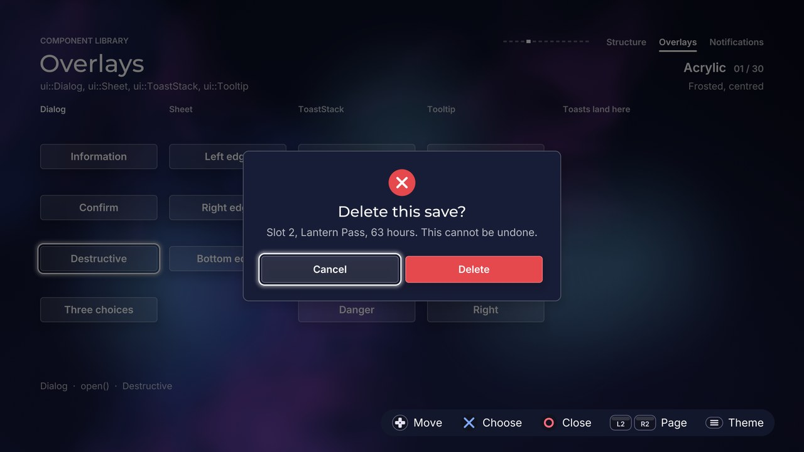

# Overlays: Dialog, Sheet, ToastStack, Tooltip

[Back to the component guide](../COMPONENTS.md)



Components that appear above a screen. Headers are in `src/ui/components/`:
`dialog.hpp`, `sheet.hpp`, `toast.hpp`, `tooltip.hpp`, and `overlay.hpp` for
what the four share. The gallery page is
`src/concepts/components/overlays_page.cpp`.

Three things are the same for all of them:

- **Draw them last**, after the screen they cover. In a design, draw them into
  `frame.overlay`.
- **Bounds are the screen, not the component.** `set_bounds()` names the area
  an overlay lives in (the whole 1920 x 1080 canvas by default). The component
  places itself inside it.
- **Every style struct derives from `ui::ComponentStyle`**, so each also has
  `theme`, `sounds` and `reduced_motion`. With `reduced_motion` nothing
  travels, scales or bounces: overlays only fade.

Opening and closing make a sound, and those calls happen outside `handle()`,
so `open()`, `close()` and `ToastStack::update()` take the `ui::Feedback`.

## Shared pieces (`overlay.hpp`)

| Name | What it is |
| --- | --- |
| `StatusKind` | `none`, `info`, `success`, `warning`, `danger`, `question`. Used for dialog icons and toast kinds |
| `status_color(theme, kind)` | `theme.success`, `theme.warning`, `theme.danger`; `theme.primary` for info and question |
| `draw_status_icon(canvas, theme, kind, cx, cy, size)` | The symbol, drawn from shapes. Stroke-only themes get an outlined symbol, square themes a square plate, warning is always a triangle |
| `draw_overlay_panel(canvas, theme, rect, frosted, tint, radius)` | The panel of anything that floats, frosted or solid (see below) |
| `wrap_body`, `wrap_heading`, `heading_width` | Word wrap and measuring in the faces `Painter::body` and `Painter::heading` use |
| `opaque_over(base, color)` | A translucent colour as it looks on a base colour, made opaque |

**Frosted or solid.** A frosted panel shows the blurred screen behind it
(`canvas.glass`) under a tint of the surface colour. It needs a glass texture
that was captured this frame (`frame.glass = true`), a theme with round
corners and a surface style that is a plain fill (glass, flat, soft, outline,
glow). In every other case the panel is solid: the theme's own panel, made
opaque, so a theme with translucent surfaces still hides what is under it.
Pass `0` as the canvas' glass texture when your frame did not ask for the
blur: a stale texture would be drawn as if it were the screen.

## Dialog

A modal question with an optional icon, a title, wrapped body text and one to
three buttons. A scrim dims the screen, the panel springs in, and the dialog
should receive every input while it is open. Use it for anything the player
must answer before going on.

```cpp
ui::Dialog dialog;
dialog.style.theme = theme;

ui::DialogContent content;
content.icon = ui::StatusKind::danger;
content.title = "Delete this save?";
content.body = "Slot 2, Lantern Pass, 63 hours. This cannot be undone.";
content.buttons = {{"Cancel"}, {"Delete", ui::ButtonKind::primary, true}};
dialog.open(content, feedback);

// every frame
if (dialog.is_open())
{
    const ui::Event event = dialog.handle(input, feedback);
    if (event == ui::Event::activated && dialog.choice() == 1)
        erase_save();
}
dialog.update(dt);
dialog.draw(canvas);
```

`DialogContent`: `icon`, `title`, `body` (`'\n'` forces a line break),
`buttons` (each a `label`, a `ui::ButtonKind` and `destructive`) and
`default_button`. An empty button list gets one "OK" button; more than three
are cut to three.

**Default focus.** The focus opens on `default_button`. If that button is
destructive and another one is not, it opens on the first button that is not:
a destructive dialog never opens on the destructive answer. A destructive
button is drawn filled in `theme.danger`.

Other calls: `set_content()`, `open(feedback)` (reopens the last content),
`close(feedback)`, `dismiss()` (closes at once, no sound, for screen changes),
`is_open()`, `visible()` (true while it is still animating out), `focus()`,
`set_focus()`, `choice()`, `panel_rect(canvas)`.

| Knob | Default | Effect |
| --- | --- | --- |
| `width` | 760 | Panel width (never wider than the bounds minus 96) |
| `padding` | 44 | Between the panel's edge and its content |
| `icon_size` | 64 | Icon diameter; 0 hides the icon |
| `gap` | 18 | Between icon, title and body |
| `button_height` | 64 | Button height. The label is set at 24 by `Painter::button` |
| `button_gap` | 16 | Between buttons |
| `button_width` | 0 | Row: 0 shares the width equally, a value caps each button. Stacked: 0 is the full width |
| `bottom_margin` | 72 | `DialogAlign::bottom`: distance from the lower edge of the bounds |
| `title_size` | 36 | Title size |
| `body_size` | 25 | Body size |
| `body_line` | 1.45 | Body line height, in body sizes |
| `title_lines` | 2 | The title wraps to this many lines, then ends in "..." |
| `body_lines` | 6 | The same for the body |
| `buttons` | `row` | `DialogButtons::row` or `stacked` |
| `align` | `center` | `DialogAlign::center` or `bottom` (near the lower edge, like a sheet) |
| `centered` | true | Icon on top and text centred; false puts the icon before the text, left aligned, and ends a row of buttons on the right |
| `frosted` | true | Frosted panel when possible, else solid |
| `frost` | 0.55 | How much surface colour covers the frost (themes that are not glass themselves) |
| `scrim` | 0.55 | Opacity of the veil over the bounds |
| `scrim_color` | black | Its colour |
| `enter_scale` | 0.9 | The panel grows from this size |
| `enter_rise` | 28 | ... and rises this many pixels |
| `exit_speed` | 1.8 | Leaving is this many times quicker than arriving |
| `close_on_activate` | true | Confirm closes the dialog |
| `dismissable` | true | Back closes it; false makes back refuse softly |

Slots: none.

| Input | Event | Cue |
| --- | --- | --- |
| Left / right (row) or up / down (stacked) | `moved` | `sounds.move`, panned to the button |
| The same at either end | `refused` | `sounds.refuse` and a short rumble; silent on a held direction |
| Confirm | `activated`; read `choice()` | `sounds.activate` and a short rumble |
| Back | `cancelled`; `choice()` is -1 | `sounds.close` |
| Back with `dismissable = false` | `refused` | `sounds.refuse` |
| `open()` / `close()` | | `sounds.open` / `sounds.close` |

Confirm plays only `sounds.activate`: the answer's own cue is the goodbye.

Motion: the scrim fades, the panel scales and rises with the theme's spring
(`theme.omega`, `theme.damping`), the icon lands with the same bounce, and one
focus ring glides between the buttons. The exit never bounces.

## Sheet

A drawer that slides in from the left, right or bottom edge over a scrim. It
has a title and a content slot, so any other component can live inside: a
list of options, a filter form, a detail view.

```cpp
ui::Sheet sheet;
ui::ListView list;
sheet.style.theme = theme;
sheet.style.edge = ui::SheetEdge::right;
sheet.set_title("Up next");
sheet.content = [&](ui::Canvas &canvas, const gfx::Rect &, float) { list.draw(canvas); };
list.set_bounds(sheet.content_rect());
sheet.open(feedback);

// every frame
if (sheet.is_open() && sheet.handle(input, feedback) == ui::Event::none)
    list.handle(input, feedback); // the sheet only wants back
sheet.update(dt);
list.update(dt);
sheet.draw(canvas);
```

The kit rounds all four corners of a shape or none. An attached sheet
(`margin` 0) is therefore a whole themed panel pushed partly off screen: only
its inner edge shows, and a spring that overshoots never opens a gap at the
screen's edge. With `margin` above 0 the sheet floats, fully rounded. The
panel never draws outside its bounds.

Other calls: `set_title()`, `set_bounds()`, `open(feedback)`,
`close(feedback)`, `dismiss()`, `is_open()`, `visible()`, `panel_rect()` (the
part on screen once settled) and `content_rect()` (where the slot draws: give
it to the component inside).

| Knob | Default | Effect |
| --- | --- | --- |
| `edge` | `right` | `SheetEdge::left`, `right` or `bottom` |
| `size` | 560 | Width of a side sheet, height of a bottom sheet |
| `margin` | 0 | Above 0 the sheet floats this far from the edges, fully rounded |
| `padding` | 36 | Between the panel's edge and the title and content |
| `overhang` | 96 | Attached sheets: how far the panel continues off screen |
| `footer` | 0 | Room left free at the bottom of the bounds, for a hint row. The panel stops above it, the scrim still covers it |
| `title_size` | 34 | Title size |
| `handle` | true | A short grab bar on the inner edge |
| `divider` | true | A hairline under the title |
| `frosted` | true | Frosted panel when possible, else solid |
| `frost` | 0.55 | How much surface colour covers the frost |
| `scrim` | 0.5 | Opacity of the veil over the bounds |
| `scrim_color` | black | Its colour |
| `exit_speed` | 1.6 | Leaving is this many times quicker than arriving |
| `dismissable` | true | Back closes it; false makes back refuse softly |

Slot: `content(canvas, area, opacity)`. `area` is where the content rests
(the same as `content_rect()`). The sheet has already applied its slide and
fade to the draw list, so draw as if the sheet were still; `opacity` is that
fade, for content that wants to know.

| Input | Event | Cue |
| --- | --- | --- |
| Back | `cancelled` | `sounds.close` |
| Back with `dismissable = false` | `refused` | `sounds.refuse` |
| Anything else | `none`: forward it to the content | |
| `open()` / `close()` | | `sounds.open` / `sounds.close` |

## ToastStack

Timed notifications in a corner: "Saved", "Connection lost". They slide in,
wait, slide out, and the ones behind close the gap with a spring. Toasts
never take the focus, so there is no `handle()`.

For notifications the player can answer (action buttons, a close control,
sticky ones, a history), use `ui::NotificationStack`: see
[notifications.md](notifications.md).

```cpp
ui::ToastStack toasts;
toasts.style.theme = theme;
toasts.style.anchor = ui::ToastAnchor::bottom_right;

toasts.push(ui::StatusKind::success, "Progress saved", "Slot 2, chapter 8");
const int id = toasts.push(ui::StatusKind::danger, "Connection lost", "", -1.0f); // stays
...
toasts.dismiss(id);

// every frame
toasts.update(dt, feedback);
toasts.draw(canvas);
```

`push(kind, title, body, seconds)` returns an id. `seconds` 0 uses
`style.duration`; a negative value keeps the toast until `dismiss(id)`. Only
`max_visible` toasts are on screen; the rest wait and appear as room is made.
The newest is added at the far end of the stack and the oldest leaves first.

Other calls: `dismiss(id)`, `clear(now)`, `visible_count()`,
`queued_count()`, `empty()`, `remaining(id)` (time left, 0..1; -1 when the
toast is not on screen).

| Knob | Default | Effect |
| --- | --- | --- |
| `anchor` | `top_right` | `ToastAnchor`: the four corners, `top_center`, `bottom_center`. Corner stacks slide in from their side, centre stacks drop in or rise |
| `width` | 520 | Width of a toast |
| `margin` | 48 | Distance from the edges of the bounds |
| `gap` | 14 | Between toasts |
| `padding` | 20 | Inside a toast |
| `icon_size` | 40 | Icon diameter; 0 for no icon |
| `title_size` | 24 | Title size (one line, cut with "...") |
| `body_size` | 20 | Body size |
| `body_lines` | 2 | The body wraps to this many lines; 0 hides bodies |
| `progress` | true | A thin bar in the status colour showing the time left |
| `progress_height` | 4 | Its thickness |
| `frosted` | false | Frosted panel when possible, else solid |
| `frost` | 0.6 | How much surface colour covers the frost |
| `max_visible` | 3 | More than this wait their turn |
| `duration` | 4 | Seconds on screen when `push()` names none |
| `pitch_by_kind` | true | Success chimes a little higher, warning and danger lower |

Slots: none. Events: none.

Cue: `sounds.notify`, once per toast, at the moment it appears (for a queued
toast that is later than `push()`), panned to the side the stack is on. That
is why `update()` takes the feedback.

## Tooltip

A small label bubble with a pointer, anchored to a rectangle: what the
focused control does. It takes no input and makes no sound.

```cpp
ui::Tooltip tip;
tip.style.theme = theme;
tip.style.delay = 0.35f;

// whenever you like, also every frame
tip.show(focused_rect, "Opens the save menu");
...
tip.hide();

// every frame
tip.update(dt);
tip.draw(canvas);
```

`show()` with the text it already shows only moves the anchor, so it may be
called every frame. With other text the old bubble fades where it was and the
new one arrives after `delay`, which lets one tooltip follow the focus.

**Placement.** The bubble takes `style.placement` if it fits inside the
bounds (minus `screen_margin`), else the opposite side, else one of the other
two. Along the other axis it slides to stay inside, and the pointer keeps
aiming at the anchor. `place(canvas)` returns the box, the side taken and the
pointer's tip.

Other calls: `set_bounds()`, `is_shown()` (asked to show, maybe still
waiting), `visible()`, `text()`.

| Knob | Default | Effect |
| --- | --- | --- |
| `placement` | `above` | Preferred side: `above`, `below`, `left`, `right` |
| `gap` | 8 | Between the anchor and the pointer's tip |
| `pointer` | 10 | Length of the pointer; 0 for none. Pixel themes get a stepped pointer |
| `padding_x` | 18 | Inside the bubble, left and right |
| `padding_y` | 11 | Inside the bubble, top and bottom |
| `max_width` | 440 | Longer text wraps |
| `screen_margin` | 24 | Kept free at the edges of the bounds |
| `text_size` | 20 | Text size |
| `max_lines` | 3 | Then the text ends in "..." |
| `inverted` | true | A bubble in the text colour, which reads on any page. False: a themed surface (`surface_high` with the theme's border and shadow) |
| `delay` | 0 | Seconds between `show()` and the bubble appearing |
| `slide` | 10 | It arrives from this many pixels nearer the anchor |

Slots: none. Events: none. Cues: none.

## The gallery page

A board of triggers, one column per component, and a lane for toasts beside
it. Cross fires the focused trigger; a tooltip follows the focus. Square
changes the knobs of all four components together:

| Variant | Dialog | Sheet | Toasts | Tooltip |
| --- | --- | --- | --- | --- |
| Frosted, centred | defaults | attached, 560 | top of the lane, with time bars | above, inverted |
| Compact toasts, top-centre | narrow, small type, light scrim | 460, small title | top centre of the screen, title only, small icons | below, small, no pointer |
| Solid, stacked buttons, bottom | solid, stacked, bottom, leading icon | floating (`margin` 28), no handle | bottom of the lane, no bars | below, themed surface |

The gallery draws its hint row over the page, so the page's sheets use
`footer` to stop above it, and the page asks for frost only in glass themes
(the gallery captures the blurred screen only for those).
