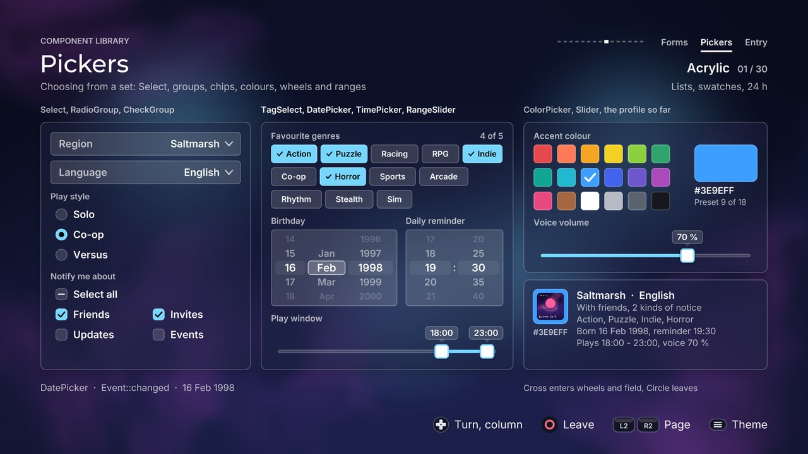

# Pickers

[Back to the component guide](../COMPONENTS.md)



[Back to the component guide](../COMPONENTS.md)

Components that choose a value from a set: an option from a long list, some
of a few, a handful of tags, a colour, a date, a time, a number or a range.

| Component | Header | What it is |
| --- | --- | --- |
| `ui::Select` | `ui/components/select.hpp` | A field that opens a scrolling list of options |
| `ui::CheckGroup` | `ui/components/choice_group.hpp` | A labelled set of check boxes, with an optional "select all" |
| `ui::RadioGroup` | `ui/components/choice_group.hpp` | A labelled set of radio buttons |
| `ui::TagSelect` | `ui/components/tag_select.hpp` | A wrapping cloud of chips to switch on and off |
| `ui::ColorPicker` | `ui/components/color_picker.hpp` | Preset swatches, or a saturation / value field and a hue strip |
| `ui::WheelPicker` | `ui/components/wheel_picker.hpp` | Columns of values that spin |
| `ui::DatePicker` | `ui/components/wheel_picker.hpp` | Day, month and year on three wheels |
| `ui::TimePicker` | `ui/components/wheel_picker.hpp` | Hours and minutes on wheels, 12 or 24 hour |
| `ui::Slider` | `ui/components/range_slider.hpp` | One value on a track, with a bubble, ticks and labels |
| `ui::RangeSlider` | `ui/components/range_slider.hpp` | A low and a high value on one track |

All follow the five rules of `ui/components/component.hpp`: a public `style`,
`set_bounds`, `handle` returning an `Event`, `update(dt)` and a const
`draw(canvas)`. Every style derives from `ComponentStyle`, so each also has
`theme`, `sounds` and `reduced_motion`. "Has the screen's focus" is
`set_active(bool)` on all of them.

The gallery page is `src/concepts/components/pickers_page.cpp`; it is also the
usage example for a board on which the D-pad has to serve ten components.

**Leaving a component.** Pickers use the directions themselves, so each one
says how the focus gets out:

| Component | Uses | How the focus leaves |
| --- | --- | --- |
| `Select` (closed) | confirm | every direction is the screen's (`handle` returns `none`) |
| `Select` (open) | up, down, confirm, back | it is modal until it closes |
| `CheckGroup`, `RadioGroup`, `TagSelect`, `ColorPicker` swatches | the directions that lead to another item | through an edge: `style.exits` (`ui::EdgeExits`), then `exit()` names it |
| `Slider`, `RangeSlider` | left, right (and confirm on the range) | up and down return `none` |
| `WheelPicker`, `DatePicker`, `TimePicker` | all four | left and right edges can exit; a screen with things above and below "enters" it (see `set_engaged`) |
| `ColorPicker` hsv | all four, both sticks | `style.exits` at the limits of the field, or "entering" as above |

## Select

The dropdown for long lists. Closed, it is a field that shows a label and the
current value with a chevron. Confirm opens a list anchored to the field: a
`ui::ListView` on a themed panel, as wide as the field, at most `max_rows`
rows tall and scrolling beyond that. The list opens below the field, or above
it when there is more room there; with little room on both sides it shows
fewer rows. It starts on the current option, which carries a check. Confirm
picks, back closes without a change. An option can have a description (a
second line), a colour swatch or a slot of your own in front, and can be
disabled: it takes the focus and refuses confirm.

The list is drawn by `draw_popover`, separately from the field, so a screen
can put it in its modal layer above everything else.

```cpp
ui::Select region;
region.style.theme = theme;
region.set_label("Region");
region.set_options({{"Northern Isles"}, {"Amber Coast", "Warm and crowded"}});
region.set_index(0);
region.set_bounds({96, 300, 480, region.preferred_height()});
region.set_limits(page_area);            // what the list may cover

// every frame; while is_open() the list is modal
region.set_active(focused);
if ((focused || region.is_open()) && region.handle(input, feedback) == ui::Event::changed)
    apply(region.index());
region.update(dt);
region.draw(canvas);                     // the field
region.draw_popover(overlay);            // the list, drawn last
```

API: `set_label`, `set_placeholder` (shown while the index is -1),
`set_options`, `options()`, `set_index(i)` (silent; -1 for none), `index()`,
`value()`, `set_limits(rect)`, `preferred_height()`, `field_rect()`,
`popover_rect()`, `opens_above()`, `open(feedback)`, `close(feedback)`,
`dismiss()` (silent), `is_open()`, `visible()` (still fading out), `focus()`
(the option under the list's highlight).

### Style: `SelectStyle`

| Knob | Default | Effect |
| --- | --- | --- |
| `label` | above | `SelectLabel::above` (a line over the field), `inside` (label left, value right) or `none` |
| `field_height` | 60 | Height of the field |
| `padding` | 20 | Space inside the field, left and right |
| `label_size` | 20 | The label above the field |
| `label_gap` | 10 | Space between that label and the field |
| `value_size` | 24 | The value, and an inside label |
| `chevron_size`, `chevron_width` | 8, 3 | Half the chevron's width, and its stroke |
| `focus_ring` | true | The theme's focus ring around the field |
| `on_page` | false | The label above sits on the page, not on a panel |
| `step_closed` | false | Left and right change the value without opening the list (disabled options are skipped) |
| `max_rows` | 6 | Rows shown at once; more scroll |
| `row_height` | 54 | A row without a description |
| `described_height` | 70 | Rows when any option has a description |
| `row_gap` | 2 | Space between rows |
| `row_padding` | 16 | Space inside a row, left and right |
| `option_size`, `description_size` | 24, 19 | The option's text and its second line |
| `leading_width` | 0 | Room reserved for the `leading` slot in every row |
| `popover_padding` | 10 | Space between the panel and the rows |
| `popover_gap` | 8 | Space between the field and the panel |
| `popover_width` | 0 | Width of the panel; 0 is the field's width |
| `highlight` | tint | The list's gliding highlight (`HighlightStyle`) |
| `check` | true | A check mark on the current option |
| `frosted` | true | Glass themes blur what is behind the panel (other themes use a solid panel) |
| `backing` | 0.8 | Glass themes: a layer of the page colour under the panel, this opaque |
| `elevation` | 1 | Scales the shadow the panel floats on; 0 for none |
| `scrim` | 0 | Darkens everything behind the list by this much (0..1) |
| `wrap` | false | Past the last option comes the first |
| `entrance_step` | 0.012 | Seconds between rows arriving; 0 for none |

### Slots

| Slot | Draws |
| --- | --- |
| `leading(canvas, box, option, index, focus)` | The first `leading_width` pixels of every row (a flag, an icon) |

### Events

| Event | When |
| --- | --- |
| `activated` | Confirm on the closed field: the list opened |
| `moved` | Up or down moved the list's highlight |
| `changed` | An option was picked (or left / right with `step_closed`); the list closed |
| `cancelled` | The list closed without a change: back, or confirm on the current option |
| `refused` | An end of the list, a disabled option, confirm with no options |
| `none` | Closed: every direction and back |

### Cues

| Cue | When | Pitch |
| --- | --- | --- |
| `sounds.open` | The list opened | 1 |
| `sounds.move` | The highlight moved | 1.05 at the top to 0.95 at the bottom |
| `sounds.activate` | An option was picked (with a short rumble) | 1 |
| `sounds.close` | The list closed without a change | 1 |
| `sounds.change` | A step on the closed field (`step_closed`) | 1.05 forward, 0.95 back |
| `sounds.refuse` | Any refusal; silent on a held direction | 1 |

## CheckGroup

A set of check boxes as one component: a title, the items in a column, a row
or a grid, one focus that glides between them and values that ease. Each item
can have a description and can be disabled. With `select_all` the group gets
a first row that checks or clears every item that is not disabled; while only
some are on it shows a dash.

```cpp
ui::CheckGroup notify;
notify.style.theme = theme;
notify.style.layout = ui::ChoiceLayout::grid;
notify.style.select_all = true;
notify.set_title("Notify me about");
notify.set_items({{"Friends"}, {"Invites"}, {"Updates", "About once a month"}});
notify.set_checked(0, true);
notify.set_bounds({96, 300, 480, notify.preferred_height()});

notify.set_active(focused);
if (focused)
{
    const ui::Event event = notify.handle(input, feedback);
    if (notify.exit() != Direction::none) move_focus(notify.exit());
    else if (event == ui::Event::changed) store(notify);
}
notify.update(dt);
notify.draw(canvas);
```

API: `set_title`, `set_items`, `items()`, `item(i)`, `set_checked(i, on)`
(silent), `checked(i)`, `checked_count()`, `set_all(on)`, `focus()` (-1 is the
"select all" row), `set_focus(i, snap)`, `exit()`, `changed_index()` (-1 for
"select all"), `preferred_height()` (at the bounds' width), `item_rect(i)`.

### Style: `ChoiceGroupStyle`

`CheckGroup` and `RadioGroup` share it.

| Knob | Default | Effect |
| --- | --- | --- |
| `layout` | vertical | `ChoiceLayout::vertical`, `horizontal` (one row of equal cells) or `grid` |
| `columns` | 2 | Cells per row of a grid |
| `row_height` | 48 | An item without a description |
| `described_height` | 70 | Items when any of them has a description |
| `gap` | 4 | Space between rows |
| `column_gap` | 10 | Space between cells of a row |
| `padding` | 12 | Space inside an item, left and right |
| `box_size` | 28 | The check box or radio button |
| `box_gap` | 14 | Space between it and the label |
| `title_size`, `title_gap` | 20, 10 | The title, and the space under it |
| `label_size`, `description_size` | 24, 19 | An item's label and its second line |
| `highlight` | tint | The gliding focus (`HighlightStyle`) |
| `idle_highlight` | 0 | How much of the highlight stays when the group lost the focus |
| `on_page` | false | Drawn straight on the page: the page's text colours |
| `wrap` | false | Past the last item comes the first, along the layout's axis |
| `exits` | none | Edges that hand the focus back instead of refusing (`ui::EdgeExits`) |
| `pitch_by_state` | true | The change cue is higher for on than for off |
| `select_all` | false | `CheckGroup`: the "select all" row |
| `select_all_label` | "Select all" | Its words |
| `select_on_move` | false | `RadioGroup`: moving the focus selects |
| `allow_none` | false | `RadioGroup`: confirm on the selected item clears the selection |

Slots: none.

Events: `moved`, `changed` (confirm flipped an item, or "select all"),
`refused` (an edge that is no exit, a disabled item), `cancelled` (back),
`none` (the focus left through an exit: read `exit()`).

Cues: `sounds.move` (pitch 1.05 at the first item to 0.95 at the last),
`sounds.change` (1.06 on, 0.94 off), `sounds.refuse`, `sounds.cancel`.

## RadioGroup

Radio buttons: the same layouts, focus and style as `CheckGroup`
(`ChoiceGroupStyle` above), with exactly one item on. Confirm selects the
focused item; with `select_on_move` moving the focus selects, as desktop radio
buttons do, and with `allow_none` confirm on the selected item clears it.

```cpp
ui::RadioGroup mode;
mode.style.theme = theme;
mode.style.layout = ui::ChoiceLayout::horizontal;
mode.set_title("Play style");
mode.set_items({{"Solo"}, {"Co-op"}, {"Versus"}});
mode.set_selected(1);
mode.set_bounds({96, 300, 480, mode.preferred_height()});
if (mode.handle(input, feedback) == ui::Event::changed) apply(mode.selected());
```

API: as `CheckGroup`, with `set_selected(i)` (silent; -1 for none) and
`selected()` in place of the check calls.

Events: `moved`, `changed` (the selection changed), `refused`, `cancelled`,
`none` (an exit; also confirm on the item that is already selected).

Cues: `sounds.move`, `sounds.change` (1.06 selecting, 0.94 clearing; with
`select_on_move` it replaces the move cue), `sounds.refuse`, `sounds.cancel`.

## TagSelect

Chips that wrap into rows; confirm switches the focused one on or off. A chip
that is switched on eases to the accent colour while a check draws itself and
the label slides aside, so the chip never changes width. The focus is one ring
that glides, and it moves by position: up and down go to the chip nearest to
where the focus was horizontally and keep that position across rows of other
widths, so down and back up returns to the same chip. `max_selected` limits
how many can be on: one more is refused softly and the counter flashes.

```cpp
ui::TagSelect genres;
genres.style.theme = theme;
genres.style.max_selected = 5;
genres.set_title("Favourite genres");
genres.set_options({{"Action"}, {"Puzzle"}, {"Racing"}, {"Strategy"}});
genres.set_selected(1, true);
genres.set_bounds({96, 300, 560, 200});

genres.set_active(focused);
if (focused && genres.handle(input, feedback) == ui::Event::changed)
    store(genres.selection());
genres.update(dt);
genres.draw(canvas);
```

The chips are measured with the fonts of the first draw and laid out again
whenever needed. Call `layout(fonts)` to have real rectangles before the first
draw; until then widths are estimated from the number of letters.

API: `set_title`, `set_options`, `options()`, `set_selected(i, on)` (silent),
`selected(i)`, `selected_count()`, `selection()` (indices), `layout(fonts)`,
`chip_rect(i)`, `row_of(i)`, `rows()`, `preferred_height()`, `focus()`,
`set_focus(i, snap)`, `exit()`.

### Style: `TagSelectStyle`

| Knob | Default | Effect |
| --- | --- | --- |
| `chip_height` | 44 | Height of a chip |
| `chip_padding` | 18 | Space left and right of a chip's content |
| `gap`, `row_gap` | 10, 10 | Space between chips, and between rows |
| `check_size` | 16 | The mark of a selected chip |
| `align` | left | How a row sits in the bounds (`left`, `center`, `right`) |
| `text_size` | 20 | The chips' labels |
| `title_size`, `title_gap` | 20, 10 | The title line, and the space under it |
| `shape` | theme | `TagShape::theme` (what the theme gives chips), `pill` or `square` |
| `check` | true | A selected chip shows a check before its label |
| `counter` | true | "3 of 5" (or "3 selected") at the end of the title line |
| `on_page` | false | Title and counter sit on the page |
| `max_selected` | 0 | More than this many are refused; 0 for no limit |
| `single` | false | Picking one clears the others |
| `flow` | false | Right at a row's end goes on to the next row, and left goes back |
| `exits` | none | Edges that hand the focus back instead of refusing |
| `pitch_by_state` | true | The change cue is higher for on than for off |

### Slots

| Slot | Replaces |
| --- | --- |
| `counter_text(selected, limit)` | The words of the counter |

Events: `moved`, `changed`, `refused` (an edge, a disabled chip, the limit),
`cancelled` (back), `none` (an exit: read `exit()`).

Cues: `sounds.move` (pitch 1.05 in the first row to 0.95 in the last),
`sounds.change` (1.06 on, 0.94 off), `sounds.refuse`, `sounds.cancel`.

## ColorPicker

Picks a colour in one of two ways, chosen by `style.kind`. The colour is kept
across both, so the kind can change at any time.

- **`swatches`**: a grid of presets (eighteen by default, or `set_palette`).
  Directions move a gliding ring and confirm picks the colour under it; the
  picked swatch carries a check.
- **`hsv`**: a saturation / value field over a hue strip. The field is two
  gradients (white to the hue, and a veil of black), the strip six: both are
  exact. The D-pad steps the zone that is active (left / right saturation, up
  / down value; on the strip left / right turn the hue, which goes round) and
  confirm switches zone. The left stick moves the marker smoothly, the right
  stick turns the hue whichever zone is active.

A preview swatch with the hex value sits beside either.

```cpp
ui::ColorPicker accent;
accent.style.theme = theme;
accent.style.kind = ui::ColorPickerKind::hsv;
accent.set_title("Accent colour");
accent.set_color(gfx::Color::rgb(0x3e9eff));
accent.set_bounds({96, 300, 560, 220});

accent.set_active(focused);
if (focused && accent.handle(input, feedback) == ui::Event::changed)
    apply(accent.color());
accent.update(dt);
accent.draw(canvas);
```

Stick movement is applied in `update(dt)` (it needs the time step) and
reported as `changed` by the next `handle`. Direction steps that the input
layer made from the stick (`input.nav_from_stick`) are ignored in the hsv
kind, since the same tilt already moves the marker.

`set_engaged(false)` is for screens where the player enters the picker before
the D-pad edits it: the ring then surrounds the whole picker instead of one
swatch or zone. The screen simply does not call `handle` until then.

API: `set_title`, `set_palette(colors)`, `palette()`, `set_color(c)` (silent;
a colour of the palette also becomes the picked swatch), `color()`, `hex()`,
`index()` (-1 when the colour is no preset), `set_index(i)`, `hue()` (0..360),
`saturation()`, `value()`, `zone()` (0 field, 1 strip), `focus()`,
`set_focus(i)`, `set_engaged(bool)`, `exit()`, `preferred_height()`; static
`from_hsv(h, s, v)`, `to_hsv(color, &h, &s, &v)`, `hex_of(color)`.

### Style: `ColorPickerStyle`

| Knob | Default | Effect |
| --- | --- | --- |
| `kind` | swatches | `ColorPickerKind::swatches` or `hsv` |
| `columns` | 6 | Swatches per row |
| `swatch_size` | 44 | Size of a swatch, capped by what the width allows; 0 fills the width |
| `swatch_gap` | 12 | Space between swatches |
| `swatch_radius` | -1 | Corner of a swatch; negative is the theme's control radius, large makes circles |
| `select_on_move` | false | Moving the ring picks the colour at once |
| `sv_height` | 150 | The field's height in `preferred_height()` (the field fills the bounds) |
| `hue_height` | 24 | Height of the hue strip |
| `hue_gap` | 14 | Space between the field and the strip |
| `cursor_size` | 20 | The marker on the field |
| `sv_step` | 0.05 | One D-pad step of saturation or value |
| `hue_step` | 10 | One D-pad step of hue, in degrees |
| `stick_speed` | 0.9 | Share of the range a full stick tilt crosses per second |
| `fast_after`, `fast_factor` | 8, 3 | Held repeats before D-pad steps grow, and by how much |
| `tick` | `Cue::tick` | The cue of the stick moving the marker |
| `preview` | true | A swatch of the current colour beside the picker |
| `preview_width`, `preview_gap` | 150, 20 | Its width, and the space before it |
| `hex` | true | "#3E9EFF" and a second line under the preview |
| `hex_size` | 22 | The hex text |
| `title_size`, `title_gap` | 20, 10 | The title, and the space under it |
| `focus_ring` | true | The theme's ring around the focused swatch or zone |
| `on_page` | false | Title and hex text sit on the page |
| `exits` | none | Edges (swatches) or limits (hsv) that hand the focus back |
| `pitch_by_value` | true | Cues rise along the palette, the hue and the value |

Slots: none.

Events, swatches: `moved`, `changed` (a swatch was picked), `refused` (an
edge), `cancelled` (back), `none` (an exit, or confirm on the picked swatch).
Events, hsv: `changed` (D-pad step, or stick movement of the frame before),
`moved` (the zone changed), `refused` (a limit of the field), `cancelled`.

Cues: `sounds.move` (swatches: pitch 0.95 at the first to 1.1 at the last;
hsv: the zone changed), `sounds.change` (a swatch picked, 0.92 to 1.14 along
the palette), `sounds.step` (a D-pad step: 0.9 to 1.2 with the hue on the
strip, with saturation and value on the field), `style.tick` (the stick, every
twentieth of the range, quiet), `sounds.refuse`, `sounds.cancel`.

## WheelPicker

Columns of values that spin. Up and down turn the active column by one value,
and by `fast_factor` values after a direction was held for a moment; left and
right change column. Values fade and shrink away from the middle row. The
wheel is a spring: it overshoots a little and settles, and at an end it bulges
against the stop and comes back instead of doing nothing. With `wrap` a column
goes round (columns shorter than the window never do, and a column can opt out:
`WheelColumn::wrap`).

```cpp
ui::WheelPicker size;
size.style.theme = theme;
ui::WheelColumn letters{{"XS", "S", "M", "L", "XL"}};
ui::WheelColumn fits{{"Slim", "Regular", "Loose"}, 1.6f};   // values, weight
size.set_columns({letters, fits});
size.set_index(0, 2);
size.set_bounds({96, 300, 360, size.preferred_height()});

size.set_active(focused);
if (focused && size.handle(input, feedback) == ui::Event::changed)
    apply(size.changed_column(), size.index(size.changed_column()));
size.update(dt);
size.draw(canvas);
```

A `WheelColumn` has `values`, a `weight` (its share of the width), a
`separator` drawn before it on the middle row (":" in a time) and `wrap`.

`set_engaged(false)` is for screens where the player enters the picker before
the D-pad turns it: the focus is then a ring around the whole picker instead
of the highlight on one column.

API: `set_title`, `set_columns`, `column_count()`, `column_at(c)`,
`set_values(c, values)` (keeps the index, clamped; the wheel turns to it),
`set_index(c, i)` (silent), `index(c)`, `value(c)`, `column()`,
`set_column(c)`, `changed_column()`, `preferred_height()`, `set_engaged(bool)`,
`exit()`.

### Style: `WheelStyle`

`DatePickerStyle` and `TimePickerStyle` derive from it.

| Knob | Default | Effect |
| --- | --- | --- |
| `visible` | 5 | Rows shown; the middle one is the value |
| `row_height` | 36 | Height of a row |
| `padding` | 10 | Space inside the well, left and right |
| `column_gap` | 6 | Space between columns |
| `separator_width` | 16 | The room a column's separator takes |
| `value_size` | 25 | The values (the middle row; the others shrink) |
| `title_size`, `title_gap` | 20, 10 | The title, and the space under it |
| `fade` | 0.8 | How far rows fade toward the top and bottom (0..1) |
| `shrink` | 0.22 | How far they shrink (0..1) |
| `boxed` | true | A sunken well behind the wheels |
| `band` | true | A quiet band across the middle row of every column |
| `highlight` | tint | The focus on the active column's middle row (`HighlightStyle`); it glides between columns |
| `focus_ring` | true | The theme's ring around the well while active but not engaged |
| `on_page` | false | Drawn straight on the page (with `boxed` off): the page's text colours |
| `wrap` | false | Past the last value comes the first |
| `fast_after`, `fast_factor` | 6, 3 | Held repeats before the strides grow, and by how much |
| `exits` | none | Left and right edges that hand the focus back |
| `pitch_by_direction` | true | The tick is higher going down the list than up |
| `tick` | `Cue::tick` | The cue of one value passing the middle row |

### Slots

| Slot | Replaces |
| --- | --- |
| `item(canvas, cell, column, index, emphasis)` | The text of a value (emphasis is 1 on the middle row, 0 at the edges) |

Events: `changed` (a column turned; `changed_column()`), `moved` (another
column), `refused` (an end of a column, a side edge), `activated` (confirm),
`cancelled` (back), `none` (a side exit: read `exit()`).

Cues: `style.tick` per turn (pitch 1.05 down, 0.95 up), `sounds.move`,
`sounds.activate`, `sounds.cancel`, `sounds.refuse` (silent on a held
direction).

## DatePicker

A date on three wheels, built on `WheelPicker`. The day wheel always has as
many days as the month has in that year: turning to February, or from a leap
year to an ordinary one, turns the day back to the last one that exists.

```cpp
ui::DatePicker born;
born.style.theme = theme;
born.style.order = ui::DateOrder::month_day_year;
born.set_title("Birthday");
born.set_years(1950, 2030);
born.set_date(1998, 3, 14);
born.set_bounds({96, 300, 320, born.preferred_height()});
if (born.handle(input, feedback) == ui::Event::changed)
    store(born.year(), born.month(), born.day());
```

API: `set_title`, `set_years(first, last)`, `set_date(y, m, d)` (silent,
clamped), `year()`, `month()` (1..12), `day()`, `text()` ("14 Mar 1998",
"Mar 14, 1998" or "1998-03-14" by the order), `preferred_height()`,
`set_engaged`, `exit()`, `wheel()` (the wheels, for reading); static
`is_leap_year(y)`, `days_in_month(y, m)`.

`DatePickerStyle` is `WheelStyle` plus:

| Knob | Default | Effect |
| --- | --- | --- |
| `order` | day_month_year | `DateOrder::day_month_year`, `month_day_year` or `year_month_day` |
| `months` | short_name | `MonthStyle::number` (03), `short_name` (Mar) or `full_name` (March) |

Changing either rebuilds the wheels; the date and the active part are kept.
The year wheel never wraps.

Events and cues: those of `WheelPicker`.

## TimePicker

A time of day on two wheels, or three with AM / PM. The hour is always kept
as 0..23, whatever the wheels show.

```cpp
ui::TimePicker alarm;
alarm.style.theme = theme;
alarm.style.twelve_hour = true;
alarm.style.minute_step = 5;
alarm.set_title("Daily reminder");
alarm.set_time(19, 30);
alarm.set_bounds({440, 300, 240, alarm.preferred_height()});
if (alarm.handle(input, feedback) == ui::Event::changed)
    store(alarm.hour(), alarm.minute());
```

API: `set_title`, `set_time(hour, minute)` (silent), `hour()` (0..23),
`minute()`, `text()` ("19:30" or "7:30 PM"), `preferred_height()`,
`set_engaged`, `exit()`, `wheel()`.

`TimePickerStyle` is `WheelStyle` plus:

| Knob | Default | Effect |
| --- | --- | --- |
| `twelve_hour` | false | 12, 1..11 and an AM / PM wheel instead of 00..23 |
| `minute_step` | 1 | 5 gives 00, 05, 10, ... |
| `am`, `pm` | "AM", "PM" | The words of the third wheel |

Events and cues: those of `WheelPicker`.

## Slider

One value on a track, with what the slider row of a `Form` leaves out: a
label, a bubble with the value that follows the thumb, tick marks and end
labels. Left and right step; a held direction takes longer strides. The track
and thumb are `Painter::slider`, so they look like every other slider of the
theme.

```cpp
ui::Slider volume;
volume.style.theme = theme;
volume.style.ticks = 11;
volume.set_label("Voice volume");
volume.set_range(0, 100, 5);
volume.set_unit(" %");
volume.set_value(70);
volume.set_bounds({96, 300, 480, volume.preferred_height()});

volume.set_active(focused);
if (focused && volume.handle(input, feedback) == ui::Event::changed)
    apply(volume.value());
volume.update(dt);
volume.draw(canvas);
```

API: `set_label`, `set_range(min, max, step)` (step 0 is continuous),
`set_unit`, `set_value(v)` (silent; the thumb eases), `value()`, `fraction()`
(0..1), `text()`, `preferred_height()`.

### Style: `SliderStyle`

`Slider` and `RangeSlider` share it.

| Knob | Default | Effect |
| --- | --- | --- |
| `track_height` | 34 | The thumb's size; the bar itself is the theme's |
| `label_gap` | 8 | Space between the label line and what is under it |
| `bubble_height` | 32 | Height of the value bubble |
| `bubble_padding` | 12 | Space left and right of the bubble's text |
| `pointer_size` | 7 | The bubble's pointer |
| `bubble_gap` | 4 | Space between the pointer's tip and the thumb |
| `tick_height` | 8 | Height of a tick mark |
| `label_size` | 20 | The label |
| `value_size` | 20 | The value, in the bubble and on the label line |
| `end_label_size` | 18 | The minimum and maximum under the track |
| `bubble` | always | `BubbleMode::always`, `focused` (it pops up with the focus) or `never` |
| `value_in_label` | true | With no bubble, the value at the end of the label line |
| `ticks` | 0 | Marks under the track, both ends included; 0 for none |
| `end_labels` | false | The minimum and the maximum under the track's ends |
| `on_page` | false | Labels sit on the page |
| `continuous_steps` | 50 | Presses from one end to the other when the step is 0 |
| `fast_after`, `fast_factor` | 6, 4 | Held repeats before the stride grows, and by how much |
| `pitch_by_value` | true | The step cue rises with the value |
| `confirm_switches` | true | `RangeSlider`: confirm changes which thumb left and right move |
| `vertical_switches` | false | `RangeSlider`: and so do up and down |
| `merge_bubbles` | true | `RangeSlider`: thumbs too close for two bubbles share one ("18 - 23") |

The bubble is quiet (the theme's well colour) at rest and takes the primary
colour while its thumb has the focus.

### Slots

| Slot | Replaces |
| --- | --- |
| `format(value)` | The text of a value: bubble, label line and end labels |

Events: `changed`, `refused` (a limit), `cancelled` (back), `none` (up, down
and confirm: they are the screen's).

Cues: `sounds.step` (pitch 0.9 at the minimum to 1.2 at the maximum),
`sounds.refuse`, `sounds.cancel`.

## RangeSlider

Two thumbs on one track: a low and a high value, with the range between them
filled. Left and right move the active thumb, confirm switches thumb (and up
or down, with `vertical_switches`). A thumb stops at the other one, less the
minimum gap, with a soft refusal. Each thumb has a bubble; when they come too
close the two become one over the middle of the range.

```cpp
ui::RangeSlider hours;
hours.style.theme = theme;
hours.set_label("Play window");
hours.set_range(0, 24, 1);
hours.set_min_gap(1);
hours.set_values(18, 23);
hours.format = [](float v) { return std::to_string(static_cast<int>(v)) + ":00"; };
hours.set_bounds({96, 300, 480, hours.preferred_height()});
if (hours.handle(input, feedback) == ui::Event::changed)
    apply(hours.low(), hours.high());
```

API: `set_label`, `set_range(min, max, step)`, `set_unit`, `set_min_gap(g)`,
`set_values(low, high)` (silent; put in order and kept the gap apart),
`low()`, `high()`, `text()` ("18 - 23"), `thumb()` (0 low, 1 high),
`set_thumb(i)`, `preferred_height()`.

Style: `SliderStyle` (above). Slot: `format(value)`.

Events: `changed` (the active thumb moved), `moved` (the other thumb became
active), `refused` (a limit, or the other thumb), `cancelled` (back), `none`
(up and down without `vertical_switches`).

Cues: `sounds.step` (pitch 0.9 to 1.2 with the moved value), `sounds.move`
(1.05 to the high thumb, 0.95 to the low one), `sounds.refuse`,
`sounds.cancel`.

The track and the thumbs repeat the construction of `Painter::slider` theme by
theme, since the painter draws a track with one thumb in a single call.

### The gallery page

`make_pickers_page` builds a "create your profile" board in three columns:

- left: two `Select`s (a region with 22 options, one disabled; a language
  with 24), a `RadioGroup` (play style) and a `CheckGroup` with "select all";
- middle: a `TagSelect` of twelve genres (five at most), a `DatePicker` and a
  `TimePicker` side by side, and a `RangeSlider` (the hours of play);
- right: a `ColorPicker`, a `Slider`, and a card that sums the profile up as
  it is edited (the tile takes the colour, the lines every other value).

Moving on the board: the D-pad moves between components, except where the
focused one uses a direction itself.

- Groups, chips and swatches use the directions inside and let the focus out
  through their edges.
- Sliders use left and right; up and down move on.
- The wheels and the colour field use all four with no edge to leave by, so
  they are entered with Cross and left with Circle (Cross on the wheels also
  leaves). Until then the D-pad passes over them.
- An open `Select` is modal: Cross picks, Circle closes.

The hint row always names the rule that applies to the focused component, and
a line under the board repeats the one about entering.

Square cycles three variants:

| Variant | Knobs |
| --- | --- |
| Lists, swatches, 24 h | `SelectLabel::inside`, a scrim behind the list; vertical radio buttons; a check grid with `select_all`; theme chips, `max_selected` 5; swatches; day / month / year; 24 hour, `minute_step` 5; bubbles always |
| Rows, pills, HSV, 12 h, wrap | `SelectLabel::above`, `max_rows` 8; `ChoiceLayout::horizontal` radio buttons and a vertical check group, both with `HighlightKind::bar`; `TagShape::pill`, centred rows, no limit; `ColorPickerKind::hsv`; wheels that `wrap`, month / day / year, `twelve_hour`; `BubbleMode::focused` and `ticks` |
| Compact, fill, square chips | `step_closed`, options with descriptions, `max_rows` 5, `HighlightKind::fill` in the list; `select_on_move` with `HighlightKind::fill`; a check group with `HighlightKind::ring`; `TagShape::square` without checks, `flow`, `max_selected` 4; round swatches in nine columns; three-row wheels with `HighlightKind::fill`, year-month-day in numbers, `minute_step` 1; `BubbleMode::never` with `end_labels` |

Tour pictures: `pickers-select`, `pickers`, `pickers-hsv`, `pickers-compact`.
