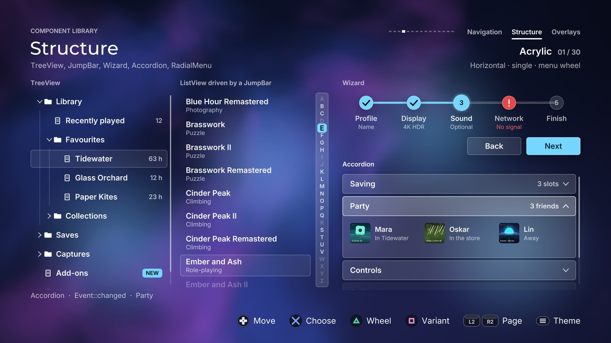

# Structure

[Back to the component guide](../COMPONENTS.md)



[Back to the component guide](../COMPONENTS.md)

Five components that organise content and get the player to it: a wheel of
choices, the steps of a flow, sections that fold, a hierarchy, and a letter
index for a long list. Headers are in `src/ui/components/`: `radial.hpp`,
`wizard.hpp`, `accordion.hpp`, `tree.hpp` and `jump_bar.hpp`. The gallery page
that uses all of them together is
`src/concepts/components/structure_page.cpp`.

Every style struct derives from `ui::ComponentStyle`, so each one also has
`theme` (any `ui::Theme`), `sounds` (the cues, see below) and
`reduced_motion`. The tables list only what a component adds.

Names used below:

- "The page's text colours" are `Painter::page_text()` and
  `page_text_muted()`: the colours for text drawn straight on the page rather
  than on a panel.
- **Exits.** `Wizard`, `Accordion`, `TreeView` and `JumpBar` have an
  `exits` knob (`ui::EdgeExits`: `up`, `down`, `left`, `right`). An edge that
  is an exit does not refuse: `handle()` returns `Event::none` and `exit()`
  names the direction, so the screen can move the focus to its neighbour.
  `exit()` is `Direction::none` after every other input.
- `set_active(bool)` (accordion, tree) and `set_focused(bool)` (wizard, jump
  bar) tell a component whether it has the screen's focus. They only change
  how it looks; the screen still decides which component gets `handle()`.

## RadialMenu

`radial.hpp`. A ring of 2 to 12 wedges around a hub: the fastest way to pick
one of a few things with a thumb. The left stick's angle picks the wedge and
the D-pad steps round the same ring. The pointed wedge springs outward and
takes the primary colour (or its own `accent`), a bracket in the focus colour
glides round the rim, and the hub says what the wedge is. It is an overlay:
draw it last, and give it every input while it is open.

```cpp
ui::RadialMenu wheel;
wheel.style.theme = theme;
wheel.set_items({{"Map", "The charted valley"},
                 {"Camera", "Photo mode", "12 shots"},     // label, description, value
                 {"Rope"}, {"Flare"}});
wheel.set_bounds({0, 0, 1920, 1080});                       // what the veil covers
wheel.icon = [](ui::Canvas &canvas, const gfx::Rect &box, const ui::RadialItem &item, int, float,
                gfx::Color ink) { draw_my_icon(canvas.list, item.tag, box, ink); };

// every frame
if (wheel.is_open())
{
    if (wheel.handle(input, feedback) == ui::Event::activated)
        use(wheel.items()[wheel.choice()].tag);
}
else if (input.is_pressed(Action::north))
{
    wheel.open(feedback);
}
wheel.update(dt);
wheel.draw(canvas);            // draws nothing when closed
```

**Two modes.** `RadialMode::menu` opens and stays until confirm or back.
`RadialMode::quick` is a "weapon wheel": the screen opens it when a button
goes down and tells it every frame whether the button is still down; letting
go activates the pointed wedge.

```cpp
wheel.style.mode = ui::RadialMode::quick;
if (input.is_pressed(Action::north))
    wheel.open(feedback);
if (wheel.is_open())
{
    wheel.set_held(input.is_held(Action::north));          // before handle()
    const ui::Event event = wheel.handle(input, feedback); // activated on release
}
```

A `RadialItem` has `label`, `description` (one or two lines in the hub),
`value` (a short note under it; on a disabled wedge it is drawn in the danger
colour, so use it to say why), `accent` (the wedge's colour while pointed at;
alpha 0 uses the theme's primary), `disabled` (can be pointed at, refuses
confirm) and `tag`.

**Aiming.** The stick starts to aim at `stick_engage` and lets go at
`stick_release`. The pointed wedge keeps the focus until the direction is
`hysteresis` radians inside a neighbour, so a thumb resting on a boundary
never makes the focus flicker. While the stick aims, the navigation steps the
shell derives from it (`input.nav_from_stick`) are ignored. On the D-pad,
right and left go one wedge round and wrap; up and down head for the top and
the bottom wedge by the shorter side and refuse once there.

**The veil.** `scrim` covers the bounds in the theme's page colour, so a
light theme gets a light veil and the labels outside the ring (and the
screen's own hint row) keep the contrast the theme was designed with. Over a
game world, set `scrim_color` to a dark colour; the labels then take
whichever of black and white reads on it. In a glass theme (a canvas with a
glass texture) the screen behind is blurred as well and the hub is frosted.

Other calls: `open(feedback)` (keeps the last focus, so a wheel reopens on
the last choice), `close(feedback)`, `dismiss()` (no sound), `is_open()`,
`visible()` (true while it still fades out), `focus()`, `set_focus(index)`,
`choice()` (the wedge of the last `activated`, or -1),
`wedge_center(index, &x, &y)`.

| Knob | Default | Effect |
| --- | --- | --- |
| `radius` | 300 | Outer edge of a resting wedge |
| `thickness` | 110 | Thickness of the ring |
| `gap` | 8 | Pixels between two wedges, measured at the middle of the ring |
| `start_angle` | 0 | Centre of the first wedge, in radians clockwise from 12 o'clock |
| `push` | 16 | How far the pointed wedge springs out |
| `hub_radius` | 150 | The centre plate; 0 for none. Themes with square controls get a square plate that fits in the ring |
| `icon_size` | 46 | Side of the square the `icon` slot draws in |
| `labels` | `outside` | `outside`: beyond the wedge, growing away from the wheel. `inside`: in the wedge, under its icon, cut to the wedge's width. `none`: icons only |
| `label_size` | 23 | Label size |
| `label_gap` | 50 | Outside labels: distance beyond the ring |
| `title_size` | 30 | The hub's title |
| `description_size` | 20 | The hub's description and value |
| `scrim` | 0.9 | Opacity of the veil over the bounds; 0 for none |
| `scrim_color` | alpha 0 | The veil's colour; alpha 0 uses the theme's page colour |
| `frosted` | true | With a glass texture: blur the screen behind the veil and frost the hub |
| `rim` | true | The bracket in the focus colour that glides round the ring |
| `needle` | true | An arrow between hub and ring that follows the stick exactly (hidden when there is no room for it) |
| `light` | -1 | 0..1: coloured light around the pointed wedge. Negative: full in glow themes, soft in dark themes, none in light ones |
| `mode` | `menu` | `menu` or `quick` (see above) |
| `close_on_activate` | true | `menu`: confirm closes the wheel |
| `stick_engage` | 0.35 | Deflection at which the stick starts to aim |
| `stick_release` | 0.22 | Deflection below which it lets go |
| `hysteresis` | 0.1 | Radians past a boundary before the focus leaves a wedge |
| `entrance_step` | 0.028 | Seconds between wedges fanning out; 0 for none |
| `pitch_by_position` | true | Each wedge ticks at its own pitch |

Slots: `icon(canvas, box, item, index, focus, ink)` draws a wedge's symbol in
a square of `icon_size`; `ink` is the colour that reads on the wedge right
now. Without it a wedge shows a dot (or only its label, with
`labels = inside`). `hub(canvas, area, item, index, opacity)` replaces the
title, description and value in the hub.

| Input | Event | Cue |
| --- | --- | --- |
| Stick or D-pad onto another wedge | `moved` | `sounds.move`, pitched by the wedge and panned to it |
| Up or down on the top or bottom wedge | `refused` | `sounds.refuse`; silent on a held direction |
| Confirm | `activated`; read `choice()` | `sounds.activate` and a short rumble |
| Confirm on a disabled wedge | `refused` (the wheel stays) | `sounds.refuse`, the wedge rattles |
| Back | `cancelled` | `sounds.cancel` |
| `quick`: the button is released | `activated`, or `refused` on a disabled wedge; the wheel closes either way | as above |
| `open()` / `close()` | | `sounds.open` / `sounds.close` |

## Wizard

`wizard.hpp`. The step indicator of a multi-step flow: numbered markers
joined by a track that fills as steps complete. A step is upcoming, current
(larger, lit), done (the number gives way to a check mark that draws itself)
or in error (the danger colour and an exclamation mark). Drive it yourself
with `next()` and `back()`, or set `style.buttons`: it then draws a
Back / Next row, takes input and steps by itself.

```cpp
ui::Wizard wizard;
wizard.style.theme = theme;
wizard.style.buttons = true;
wizard.set_steps({{"Profile"}, {"Display", "4K HDR"}, {"Sound", "Optional"}, {"Finish"}});
wizard.set_bounds({400, 300, 900, 200});

const ui::Event event = wizard.handle(input, feedback);
if (event == ui::Event::changed)
    show_step(wizard.step());
if (event == ui::Event::activated)
    finish();                               // Next on the last step
wizard.update(dt);
wizard.draw(canvas);
```

A `WizardStep` has `label`, `caption` (a quiet second line; drawn in the
danger colour when the step is in error), `error` and `tag`.

`step()` is the current step, 0-based; it equals `count()` once every step is
done (`finished()`). Other calls: `set_step(index, snap)` (silent),
`next(feedback)`, `back(feedback)`, `set_error(index, bool)`,
`step_at(index)`, `set_focused(bool)`, `button()` / `set_button()` (0 is
Back, 1 is Next), `marker_rect(index)`, `button_rect(button)`, `exit()`.

| Knob | Default | Effect |
| --- | --- | --- |
| `kind` | `horizontal` | `horizontal`: markers in a row, labels under them. `vertical`: markers in a column, labels beside them. `compact`: a row of dots under "Step 2 of 5" and the step's name |
| `marker_size` | 44 | A step's marker. Round in round themes, square, cut or notched in the others |
| `current_scale` | 1.16 | The current step's marker is this much larger |
| `track` | 6 | Thickness of the line that joins the markers |
| `label_gap` | 14 | Between a marker and its label |
| `step_height` | 84 | `vertical`: distance between steps (less when they do not fit the bounds) |
| `dot_size` | 12 | `compact`: a dot |
| `dot_gap` | 10 | `compact`: between dots |
| `active_width` | 36 | `compact`: the current step's dot is a pill this long |
| `label_size` | 22 | Label size |
| `caption_size` | 18 | Caption size |
| `number_size` | 20 | The number in a marker |
| `numbers` | true | Numbers in the markers; false leaves them empty until done |
| `on_page` | true | Labels have no panel under them: use the page's text colours |
| `step_word`, `of_word` | "Step", "of" | `compact`: the words of "Step 2 of 5" |
| `done_text` | "All done" | `compact`: shown when every step is done |
| `buttons` | false | Draw the Back / Next row and take input |
| `button_width` | 170 | Width of each button |
| `button_height` | 56 | Their height |
| `button_gap` | 16 | Between the two |
| `back_label`, `next_label` | "Back", "Next" | Their labels |
| `finish_label` | "Finish" | The Next button's label on the last step |
| `exits` | none | With buttons: edges that hand the focus back to the screen |
| `pitch_by_position` | true | The step cue rises in pitch along the flow |

The button row sits under the markers, right aligned (beside the dots in
`compact`). A button with nowhere to go (Back on the first step, Next when
all is done) is dimmed and refuses.

Slots: none.

| Input | Event | Cue |
| --- | --- | --- |
| `next()`, or confirm on Next | `changed` | `sounds.page`, higher with every step |
| The same on the last step | `activated`; `finished()` is true | `sounds.activate` and a short rumble |
| `next()` when all is done, `back()` on the first step | `refused` | `sounds.refuse` |
| `back()`, confirm on Back, or back | `changed` | `sounds.page` |
| Back on the first step | `cancelled` (leave the flow) | `sounds.cancel` |
| Left / right between the buttons | `moved` | `sounds.move` |
| Left on Back, right on Next | `refused`, or `none` with `exit()` set | `sounds.refuse` |
| Up / down | `none`; `exit()` set if that edge is an exit | |

Without `buttons`, `handle()` returns `none` for everything.

## Accordion

`accordion.hpp`. A vertical list of sections, each a header row over content
that opens and closes with a height spring while the chevron turns. One
highlight glides between the headers and rides along when a section above it
changes height. Use it for settings groups, FAQs and details that would
crowd a screen if they were all open. Taller than its bounds, it scrolls.

```cpp
ui::Accordion faq;
faq.style.theme = theme;
faq.set_sections({{"Saving", "3 slots", "The game saves at every lantern you light."},
                  {"Party", "3 friends", "", 132.0f},    // no body: drawn by the slot
                  {"Controls", "", "Every action can be moved to another button."}});
faq.content = [](ui::Canvas &canvas, const gfx::Rect &area, const ui::AccordionSection &section,
                 int index, float opacity) { draw_friends(canvas, area); };
faq.set_bounds({96, 240, 720, 600});
faq.measure(context.fonts);                 // fits the text bodies

if (faq.handle(input, feedback) == ui::Event::changed)
    on_toggle(faq.focus(), faq.is_open(faq.focus()));
faq.update(dt);
faq.draw(canvas);
```

An `AccordionSection` has `title`, `value` (quiet text at the end of the
header), `body` (wrapped text), `height` (content height in pixels; 0 fits
the body), `disabled` (focusable, does not open) and `tag`.

**Measuring.** A text body's height depends on the theme's face, and a
component has no fonts outside `draw()`. Call `measure(fonts)` after
`set_sections()`, `set_bounds()` or a change of theme; until then a body's
height is estimated from its length. A section whose content comes from the
slot says how tall it is with `height`.

Other calls: `set_focus(index, snap)`, `is_open(index)`,
`set_open(index, open, snap)` (silent; honours `single`), `set_active(bool)`,
`enter()` (replays the entrance), `header_rect(index)`,
`content_rect(index)`, `exit()`.

| Knob | Default | Effect |
| --- | --- | --- |
| `header_height` | 68 | Height of a header row |
| `gap` | 10 | Between sections |
| `padding` | 24 | Inside a header, left and right; the content is inset by the same |
| `body_padding` | 18 | Above and below the content |
| `panel_padding` | 14 | Between the panel and the sections (`panel = true`) |
| `title_size` | 26 | Header title size |
| `value_size` | 21 | Header value size |
| `body_size` | 22 | Body text size |
| `body_line` | 1.42 | Body line height, in text sizes |
| `body_lines` | 8 | The body is cut after this many lines |
| `highlight` | tint | The focus highlight: any `ui::HighlightStyle` (kind, colour, radius, ...) |
| `chevron` | `trailing` | `trailing`: at the end of the header, down when closed, up when open. `leading`: before the title, right when closed, down when open. `none` |
| `cards` | true | Every section is a themed surface of its own (header and content together) |
| `dividers` | false | Hairlines between sections (without `cards`) |
| `panel` | false | A themed panel behind the whole accordion |
| `scroll_thumb` | true | Shown beside the bounds, only when the sections overflow |
| `single` | true | Opening a section closes the others |
| `wrap` | false | Past the last header comes the first |
| `exits` | none | Edges that hand the focus back instead of refusing |
| `edge_fade` | 0.8 | A section fades over this share of a header at the clip edges; 0 turns it off |
| `entrance_step` | 0.04 | Seconds between sections arriving; 0 for none |
| `pitch_by_position` | true | The move cue falls in pitch from the first header to the last |

Slot: `content(canvas, area, section, index, opacity)` draws the content of
every section that has no `body`. `area` is the content at its full height
(a clip reveals it while the section opens), already inset by `padding` and
`body_padding`.

| Input | Event | Cue |
| --- | --- | --- |
| Up / down | `moved` | `sounds.move`, pitched by position |
| Up / down at an end | `refused`, or `none` with `exit()` set; `wrap` goes round | `sounds.refuse`; silent on a held direction |
| Confirm | `changed`: the section opened or closed | `sounds.change`, higher for open than for close |
| Right on a closed section, left on an open one | `changed` | `sounds.change` |
| Right on an open section, left on a closed one | `refused`, or `none` with `exit()` set | `sounds.refuse` |
| Confirm on a disabled section, or one with no content | `refused` | `sounds.refuse` |
| Back | `cancelled` | `sounds.cancel` |

## TreeView

`tree.hpp`. A hierarchical list: folders, categories, a skill tree's
branches. Right opens a branch, or steps into its first child when it is
open; left closes it, or steps out to its parent; up and down walk the rows
that are showing; confirm activates. Rows appear and disappear with a height
animation, the chevron turns, and one highlight glides between rows.

```cpp
ui::TreeView tree;
tree.style.theme = theme;
ui::TreeNode saves{"Saves"};
saves.children = {{"Slot 1", "63 h"}, {"Slot 2", "4 h"}};   // label, value
ui::TreeNode library{"Library"};
library.expanded = true;
library.children = {{"Recently played", "12"}, saves};
tree.set_nodes({library, {"Settings"}});
tree.set_bounds({96, 240, 520, 600});

if (tree.handle(input, feedback) == ui::Event::activated)
    open(tree.node(tree.focus()).tag);
tree.update(dt);
tree.draw(canvas);
```

A `TreeNode` has `label`, `value` (quiet text at the end of the row),
`badge` (a pill before the value), `expanded` (a branch that starts open),
`disabled` (focusable, refuses confirm), `tag` and `children`.

**Indices.** Nodes are numbered in reading order with every branch open
(depth first). That index is what `focus()` returns and what `node(index)`,
`parent(index)`, `depth(index)`, `child_count(index)`, `is_expanded(index)`
and `is_showing(index)` take. `node(index).children` is empty: the tree
keeps the structure itself.

Other calls: `count()`, `set_expanded(index, expanded, snap)` (silent; the
focus moves to the branch if it was inside it), `expand_all(snap)`,
`collapse_all(snap)`, `set_focus(index, snap)` (opens the branches above the
node), `set_active(bool)`, `enter()`, `row_rect(index)`, `exit()`.

| Knob | Default | Effect |
| --- | --- | --- |
| `row_height` | 56 | Height of a row |
| `gap` | 4 | Between rows |
| `padding` | 16 | Inside a row, left and right |
| `indent` | 30 | Per level of depth |
| `chevron_width` | 26 | Room for the expand chevron (kept on leaves, so labels align) |
| `icon_width` | 0 | Room reserved for the `icon` slot |
| `panel_padding` | 12 | Between the panel and the rows (`panel = true`) |
| `label_size` | 24 | Label size |
| `value_size` | 20 | Value size |
| `badge_size` | 17 | Badge text size |
| `highlight` | tint | The focus highlight: any `ui::HighlightStyle` |
| `guides` | true | A vertical line per level of depth, joined from row to row |
| `panel` | false | A themed panel behind the tree |
| `scroll_thumb` | true | Shown beside the rows, only when they overflow |
| `confirm_toggles` | true | Confirm on a branch opens or closes it; false activates it like a leaf |
| `wrap` | false | Past the last row comes the first |
| `exits` | none | Edges that hand the focus back instead of refusing |
| `edge_fade` | 0.8 | Rows fade over this share of a row at the clip edges; 0 turns it off |
| `entrance_step` | 0.03 | Seconds between rows arriving; 0 for none |
| `pitch_by_depth` | true | Deeper rows sound lower |

Slot: `icon(canvas, box, node, index, focus, ink)` draws before the label in
`icon_width` pixels; `ink` is the label's colour. Ask
`tree.child_count(index)` to tell a branch from a leaf.

| Input | Event | Cue |
| --- | --- | --- |
| Up / down | `moved` | `sounds.move`, pitched by depth |
| Up / down at an end | `refused`, or `none` with `exit()` set; `wrap` goes round | `sounds.refuse`; silent on a held direction |
| Right on a closed branch, left on an open one | `changed` | `sounds.change`, higher for open than for close |
| Right on an open branch | `moved` (to its first child) | `sounds.move` |
| Left on a leaf or a closed branch that has a parent | `moved` (to its parent) | `sounds.move` |
| Right on a leaf; left on a root with nothing to close | `refused`, or `none` with `exit()` set | `sounds.refuse` |
| Confirm on a leaf | `activated` | `sounds.activate` and a short rumble |
| Confirm on a branch | `changed` (or `activated` with `confirm_toggles = false`) | `sounds.change` |
| Confirm on a disabled row | `refused` | `sounds.refuse` |
| Back | `cancelled` | `sounds.cancel` |

## JumpBar

`jump_bar.hpp`. An alphabet index for a long list (any short labels work):
a strip of letters, the current one on a marker that glides and shown
enlarged in a bubble beside the strip. Letters that have no entries are
dimmed and stepped over. It reports the chosen label; scrolling the list
there is the screen's job, and so is telling the bar when the list moved by
itself.

```cpp
ui::JumpBar index;
index.style.theme = theme;
index.set_entries(ui::JumpBar::alphabet());            // "A" to "Z"
index.set_enabled(index.find("Q"), false);             // nothing under Q
index.set_bounds({1700, 240, 44, 700});

if (index.handle(input, feedback) == ui::Event::changed)        // it has the focus
    list.set_focus(first_row_of(index.label()), false);
if (input.is_pressed(Action::jump_next))                         // or a shortcut button
    index.step(1, input, feedback);
index.set_current(index.find(letter_of(list.focus())));          // follow the list
index.update(dt);
index.draw(canvas);                                               // after the list
```

A `JumpEntry` has `label`, `enabled` and `tag`.

The labels share the bounds: each gets `item_size` along the strip, or less
when they do not all fit. The strip is centred in the bounds. The bubble
shows while the bar is focused, and for `bubble_hold` seconds after a
`step()` when it is not, so a shortcut button still shows where it went.

Other calls: `entries()`, `set_enabled(index, bool)`, `find(label)`,
`current()`, `label()`, `set_current(index, snap)` (silent),
`set_focused(bool)`, `strip_rect()`, `item_rect(index)`, `exit()`.

| Knob | Default | Effect |
| --- | --- | --- |
| `vertical` | true | A column of labels; false lays them out in a row |
| `item_size` | 30 | Room per label along the strip |
| `thickness` | 44 | Thickness of the strip |
| `magnify` | 1.3 | The current label is drawn this much larger |
| `text_size` | 18 | Label size |
| `bubble` | `before` | Where the bubble is: `before` (left of a column, above a row), `after`, or `none` |
| `bubble_size` | 76 | Its side; it widens for a long label |
| `bubble_text` | 36 | Its text size |
| `bubble_gap` | 16 | Between the strip and the bubble |
| `bubble_hold` | 0.9 | Seconds it stays after a `step()` while the bar is not focused |
| `track` | true | A well behind the labels |
| `focus_ring` | true | The theme's ring round the strip while focused |
| `on_page` | false | Without a track: labels use the page's text colours |
| `wrap` | false | Past the last label comes the first |
| `exits` | none | Edges that hand the focus back instead of refusing |
| `pitch_by_position` | true | The step cue falls in pitch along the strip |

Slots: none.

| Input | Event | Cue |
| --- | --- | --- |
| Along the strip (up / down, or left / right when it lies down); `step()` | `changed`; read `label()` | `sounds.step`, pitched by position |
| The same at an end | `refused`, or `none` with `exit()` set; `wrap` goes round | `sounds.refuse`; silent on a held direction |
| Across the strip | `none`; `exit()` set if that edge is an exit | |
| Confirm | `activated` | `sounds.activate` |
| Back | `cancelled` | `sounds.cancel` |

### The gallery page

`structure_page.cpp` shows the five together in three columns: the tree; a
long `ui::ListView` of the catalogue's titles driven by the jump bar; the
wizard with its button row over the accordion (one of its sections is drawn
by the page through the content slot). Triangle opens the wheel over
everything. The page only moves the focus between the components, through
the edges they are told to hand it back on.

Square cycles three variants:

| Variant | Wizard | Accordion | Tree | Jump bar | Wheel |
| --- | --- | --- | --- | --- | --- |
| Horizontal, single, menu wheel | horizontal | cards, one open at a time | guides, tint | upright, with a track | 8 wedges, labels outside |
| Vertical, multiple, icon wheel | vertical | dividers, leading chevron, several open | panel, no guides, bar | lying above the list | 6 wedges, icons only |
| Compact, panels, hold for wheel | compact | in a panel, fill | panel, guides, fill | upright, no track, wraps | 4 wedges, labels inside, quick mode: hold Triangle |

### Checklist for a screen

- Draw the wheel last (in a design, into `frame.overlay`) and route every
  input to it while `is_open()`.
- In quick mode call `set_held()` every frame before `handle()`.
- Call `Accordion::measure(fonts)` again when the theme changes.
- Draw the jump bar after its list: the bubble floats over the rows.
- Mirror the player's reduced-motion setting into every
  `style.reduced_motion`.
